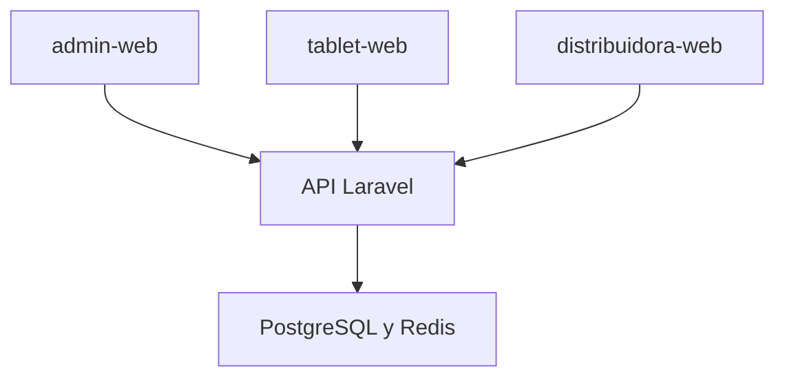

# MisVales Frontend

Frontend oficial de **MisVales**, desarrollado con Angular como un workspace que contiene las tres aplicaciones web confirmadas para el sistema.

La especificación funcional oficial se encuentra en el repositorio `misvales-documentation`, dentro del archivo `MisValesInfo.md`. El frontend debe representar únicamente procesos y reglas previamente definidos.

## Responsables

| Función | Integrantes |
|---|---|
| Frontend | Jesús y Saúl |
| Líder y QA | Alberto |
| Backend | Daniel y Jorge |
| Infraestructura en DigitalOcean | Azael |

## Tecnologías

- Angular.
- TypeScript.
- TSDoc para documentación dentro del código.
- Laravel Sanctum mediante cookies para autenticación.

## Aplicaciones

El workspace contiene tres aplicaciones web:

| Aplicación | Usuarios | Características confirmadas |
|---|---|---|
| `admin-web` | Gerente general, gerente de sucursal, cajera y administrador | Aplicación administrativa. Las interfaces de cajera y administrador deben ser responsivas. |
| `tablet-web` | Coordinador y verificador | Aplicación adaptada para tableta. |
| `distribuidora-web` | Distribuidora | Aplicación web móvil para teléfono; no es una adaptación de la aplicación administrativa. |

La cajera y el administrador acceden mediante roles dentro de `admin-web`; no existe una cuarta aplicación.

## Estructura prevista

```text
misvales-frontend/
├── projects/
│   ├── admin-web/
│   ├── tablet-web/
│   ├── distribuidora-web/
│   └── shared/
├── angular.json
├── package.json
└── README.md
```

`shared` concentra únicamente componentes, servicios, modelos y utilidades realmente compartidos entre las aplicaciones.

## Comunicación general



Las aplicaciones Angular no deben conectarse directamente a PostgreSQL ni Redis. Toda operación se realiza mediante la API Laravel.

## Autenticación

El frontend utiliza Laravel Sanctum en modo stateful:

- Cookie de sesión `HttpOnly` administrada por el navegador.
- Protección CSRF.
- Envío de credenciales en las solicitudes autorizadas.
- Sin JWT en `localStorage` o `sessionStorage`.
- Sin acceso de JavaScript al valor de la cookie de sesión.

Los guards de Angular sirven para navegación y experiencia de usuario, pero no representan una autorización de seguridad. El backend debe volver a validar cada permiso, rol y alcance de sucursal.

## Reglas de implementación

- No duplicar reglas financieras en el frontend.
- No hardcodear fechas, porcentajes, puntos, categorías, recargos ni importes configurables.
- No asumir permisos por ocultar botones o rutas.
- No mostrar información de otras sucursales sin autorización.
- No guardar contraseñas, tokens, cookies ni datos sensibles en almacenamiento del navegador.
- No exponer secretos en variables incluidas en el build.
- No registrar datos personales sensibles en la consola.
- Validar formularios sin sustituir las validaciones obligatorias del backend.
- Mantener interfaces utilizables en los dispositivos definidos para cada aplicación.

## Configuración local

Requisitos:

- Node.js.
- npm.
- Angular CLI.

Después de clonar el repositorio:

```bash
npm install
```

Ejecución de cada aplicación:

```bash
ng serve admin-web
ng serve tablet-web
ng serve distribuidora-web
```

Las direcciones de la API y demás valores dependientes del ambiente deben configurarse sin incluir credenciales ni secretos.

## Ambientes

Las aplicaciones se manejarán en tres ambientes separados:

- Desarrollo.
- QA.
- Producción.

Cada aplicación debe poder compilarse y desplegarse de forma independiente desde el mismo workspace. Azael administra los servidores y despliegues en DigitalOcean Droplets.

## Pruebas

Las pruebas de componentes, servicios e integración frontend deben mantenerse dentro de este repositorio.

Ejemplos de ejecución por proyecto:

```bash
ng test admin-web
ng test tablet-web
ng test distribuidora-web
```

La aprobación funcional final corresponde a Alberto como líder y QA.

## Documentación del código

- Utilizar TSDoc cuando una clase, interfaz, servicio, función o comportamiento público requiera explicación.
- Mantener nombres claros y consistentes.
- Documentar entradas, salidas y errores relevantes.
- Evitar comentarios que repitan literalmente lo que ya expresa el código.

## Flujo Git

Ramas autorizadas:

- `main`: código estable de producción.
- `develop`: integración del trabajo aprobado.
- `feature/*`: nuevas funcionalidades.
- `bugfix/*`: correcciones normales.
- `release/*`: preparación de versiones.
- `hotfix/*`: correcciones urgentes de producción.

Reglas obligatorias:

1. Toda tarea debe tener una rama propia.
2. No se permite trabajar directamente en `main` o `develop`.
3. Todo cambio debe ingresar mediante Pull Request.
4. El autor no puede aprobar ni fusionar su propio Pull Request.
5. Los nuevos commits invalidan las aprobaciones anteriores.
6. Todas las conversaciones deben resolverse antes del merge.
7. Solo Alberto, un QA autorizado o el responsable de versión puede realizar el merge.
8. No se permite push directo ni force push sobre ramas protegidas.

## Versionado

El proyecto utiliza versionado semántico:

```text
vMAJOR.MINOR.PATCH
```

- `MAJOR`: cambios incompatibles.
- `MINOR`: funcionalidades compatibles.
- `PATCH`: correcciones compatibles y ajustes menores.
