# MisVales — Planeación, análisis y diseño

Este archivo unifica la planeación, el análisis, el diseño y la especificación funcional y de negocio de MisVales. Es la fuente integral para organizar, diseñar, desarrollar, probar, aceptar y operar el proyecto.

## 0. Reglas de interpretación y autoridad

- Las indicaciones directas y más recientes del líder del proyecto tienen prioridad.
- La **Parte IV** es la fuente canónica para alcance funcional, procesos, cálculos, permisos, configuraciones y reglas de negocio.
- La **Parte II** conserva identificadores de requisitos, reglas, eventos y requisitos no funcionales para trazabilidad.
- La **Parte III** define la implementación técnica. No puede modificar una regla de negocio de la Parte IV.
- La **Parte I** define propósito, alcance del proyecto, equipo, tecnología, estrategia, riesgos y gobierno.
- Cuando una materia no esté definida, debe marcarse como **no especificada**; no se debe completar mediante suposiciones.
- Si dos secciones parecen contradecirse, debe aplicarse la decisión consolidada de esta sección y documentarse el conflicto antes de desarrollar.

### 0.1 Decisiones consolidadas transversales

| Tema | Decisión vigente |
| --- | --- |
| Frontend | Una sola aplicación web Angular. |
| Experiencias | Tres layouts adaptativos dentro de la misma aplicación: escritorio administrativo, tableta operativa y móvil para distribuidoras. |
| Despliegue y acceso | Un inicio de sesión, un despliegue frontend y una conexión a la API Laravel. |
| Seguridad | Los layouts no conceden permisos; Laravel valida rol, permiso, sucursal, jerarquía, estado y acción. |
| Perfiles | Siete perfiles operativos: gerente general, gerente de sucursal, coordinador, verificador, administrador, distribuidora y cajera. |
| Cliente final | Es únicamente un registro interno asociado a una distribuidora. No tiene cuenta, credenciales ni acceso a MisVales y no ejecuta acciones dentro del sistema. |
| Cartera del cliente final | Es un apartado complementario, opcional e informativo para la distribuidora. Puede utilizarse para consultar y registrar saldos estimados, pagos, abonos, estados informativos y notas de seguimiento. |
| Adeudo del cliente final | No crea morosidad, elegibilidad, bloqueo, desbloqueo ni restricciones para nuevos vales, prevales o acciones de la distribuidora. La distribuidora decide si continúa prestándole con su propia línea de crédito y conserva la obligación de pagar sus relaciones a MisVales. Únicamente la transferencia del cliente a otra distribuidora exige saldo en cero. |
| Diagrama de infraestructura | El archivo visual oficial se referencia como `infra-diagram.png`. |
| Flujos funcionales externos | El análisis recibido contiene una referencia de Notion en la sección 2.8, pero no incluye el contenido de ese documento. El vínculo se conserva y no se inventan flujos ausentes. |

### 0.2 Documentos integrados

- Planeación de MisVales.
- Análisis de MisVales.
- Diseño de MisVales.
- Especificación funcional y reglas de negocio de MisVales.

---

## Parte I. Planeación

| Campo | Definición |
| --- | --- |
| Proyecto | MisVales |
| Responsable del proyecto | Alberto - líder y QA |
| Equipo | Daniel y Jorge - backend; Jesús y Saúl - frontend; Azael - infraestructura |
| Fase documental | Planeación |
| Zona horaria operativa | `America/Monterrey` |
| Aplicación | Una aplicación web Angular con tres experiencias adaptativas |
| Perfiles operativos | Gerente general, gerente de sucursal, coordinador, verificador, administrador, distribuidora y cajera |

### 1.1 Objetivo de la planeación

Establecer el propósito, alcance, organización, recursos, restricciones, riesgos, responsabilidades y orden de construcción de MisVales. La planeación dirige el trabajo del equipo y delimita el producto sin convertir decisiones funcionales en valores escritos directamente en el código.

### 1.2 Propósito del producto

MisVales administrará un negocio que asigna líneas de crédito a distribuidoras para que otorguen productos denominados vales a clientes finales.

La plataforma permitirá que cada distribuidora:

- Pertenezca a una sucursal y a un coordinador responsable.
- Reciba una línea de crédito autorizada.
- Registre clientes finales.
- Otorgue prevales y vales digitales.
- Consulte su línea, relaciones, pagos y puntos.
- Solicite incrementos de línea, transferencias, aclaraciones y canjes.
- Pague a MisVales las relaciones generadas en cada corte.
- Conserve la ganancia correspondiente a su categoría.

La distribuidora será responsable de pagar a MisVales aun cuando uno de sus clientes finales no le pague. El cliente final no tendrá cuenta, credenciales ni acceso a la aplicación.

El núcleo financiero del producto será el cálculo exacto de los vales, las relaciones, los pagos, los recargos, la recuperación de línea y los puntos. Cada operación utilizará la configuración vigente que le corresponda y conservará sus valores históricos.

### 1.3 Objetivo general

Desarrollar una plataforma web segura, auditable y configurable que centralice la operación de sucursales, distribuidoras, clientes finales, vales, líneas de crédito, relaciones, pagos, conciliaciones y puntos, con separación de permisos por rol y alcance.

### 1.4 Objetivos específicos

- Administrar solicitudes, verificaciones y autorizaciones de distribuidoras.
- Asignar e incrementar líneas de crédito mediante autorización gerencial.
- Registrar clientes finales sin duplicar CURP ni domicilio.
- Operar prevales, vales digitales, validaciones y feriado de vales.
- Calcular préstamos y relaciones con precisión monetaria y parámetros configurables.
- Generar relaciones en la fecha y hora globales establecidas.
- Conciliar pagos bancarios de forma automática y manual autorizada.
- Identificar abonos, liquidaciones, pagos duplicados, pagos no conciliados y excedentes.
- Recuperar línea únicamente por el capital efectivamente cubierto.
- Administrar categorías, ganancias, puntos y canjes.
- Detectar riesgo por relaciones pendientes y someter la morosidad de la distribuidora a decisión gerencial.
- Gestionar transferencias de clientes y reasignaciones operativas.
- Proporcionar notificaciones, reportes, auditoría y logs.
- Proteger datos personales, documentos, fotografías y movimientos financieros.
- Mantener ambientes separados y respaldos verificables.

### 1.5 Alcance funcional

El proyecto incluye:

#### Gestión organizacional

- Sucursal matriz en Torreón y múltiples sucursales adicionales.
- Alta de sucursales por el gerente general.
- Asignación de personal, coordinadores y distribuidoras.
- Control de acceso por rol, sucursal y relación jerárquica.
- Alcance global del gerente general y alcance limitado para los demás perfiles.

#### Distribuidoras

- Captura de solicitud con información personal, familiar, domiciliaria, patrimonial, vehicular, laboral, comercial y crediticia.
- Revisión del coordinador.
- Visita física, fotografías y evidencias del verificador.
- Conservación de datos originales y correcciones.
- Resultado favorable o desfavorable.
- Autorización final del gerente general o del gerente de sucursal.
- Definición manual y autorizada de la línea de crédito inicial.
- Creación y activación del acceso de la distribuidora.

#### Clientes y vales

- Alta interna de clientes finales.
- Validación de unicidad por CURP y domicilio.
- Generación de prevales para el primer vale dentro de MisVales.
- Generación de vales digitales para clientes existentes.
- Folios únicos.
- Validación documental en sucursal.
- Corrección autorizada mediante token.
- Depósito manual fuera del sistema.
- Captura del número de transacción y feriado del vale.
- Cartera complementaria, opcional e informativa para el seguimiento que decida realizar la distribuidora.
- El adeudo del cliente final no impide generar nuevos vales ni ejecutar acciones de la distribuidora.
- La transferencia del cliente a otra distribuidora requiere saldo en cero.

#### Crédito y cálculos

- Línea total autorizada, saldo utilizado y saldo disponible.
- Regla del 50 % para el primer vale con la línea inicial.
- Tolerancia global configurable de más o menos $500.00.
- Solicitudes e incrementos de línea.
- Regla del 50 % para el primer vale posterior a cada incremento.
- Catálogo de productos con importes múltiplos de 100.
- Comisión del préstamo, interés, seguro, número de quincenas y ganancia de categoría.
- Precisión interna de cuatro decimales y redondeo monetario final a dos decimales.

#### Relaciones y pagos

- Fecha global de corte.
- Fecha límite calculada mediante días posteriores al corte.
- Periodo configurable de pago anticipado.
- Generación idempotente de relaciones.
- Referencia única de pago por relación.
- Desglose financiero y totales.
- Abonos, liquidaciones, vencimiento y recargo.
- Clasificación de pago anticipado, puntual o fuera de tiempo.
- Recuperación de línea por capital cubierto.

#### Conciliación

- Carga y validación del archivo bancario en Excel.
- Conciliación automática por folio bancario, referencia y monto.
- Identificación de abonos, liquidaciones, duplicados y pagos no conciliados.
- Aclaraciones con comprobante.
- Conciliación manual autorizada y ejecutada por la cajera.
- Tratamiento de pagos mayores al saldo.
- Saldo a favor o devolución del excedente.

#### Incentivos y control de riesgo

- Categorías configurables y ganancia por categoría.
- Puntos por liquidación anticipada.
- Reducción de puntos por pago fuera de tiempo.
- Periodos de canje y valor monetario por punto.
- Alertas por tres relaciones consecutivas con saldo pendiente.
- Aplicación y retiro manual de morosidad de la distribuidora.
- Reporte informativo y opcional del adeudo de clientes finales para seguimiento de la distribuidora.

#### Operación complementaria

- Transferencia de clientes finales con saldo en cero.
- Reasignación administrativa de clientes.
- Cambio de sucursal de una distribuidora.
- Reasignación de distribuidoras por cambio de coordinador.
- Configuraciones y catálogos globales.
- Matriz de autorizaciones.
- Notificaciones dentro de la aplicación y correos para eventos críticos.
- Reportes operativos y financieros.
- Auditoría, logs, seguridad, respaldos y observabilidad.

### 1.6 Exclusiones

MisVales no incluye:

- Aplicación, portal, usuario o contraseña para el cliente final.
- Acciones ejecutadas directamente por el cliente final dentro del sistema.
- Integración o API bancaria para realizar depósitos.
- Ejecución automática del depósito al feriar un vale.
- Generación o firma digital de contratos para distribuidoras.
- Una cuarta aplicación exclusiva para cajera o administrador.
- Configuraciones globales diferentes por sucursal.
- Eliminación física de relaciones, pagos, vales, conciliaciones, auditorías o movimientos históricos.
- Aplicación o retiro automático de morosidad de la distribuidora.
- Un proceso de morosidad o desbloqueo propio para el cliente final.
- Bloqueos automáticos de vales, prevales, registros o acciones de la distribuidora por adeudos del cliente final.
- Recalcular operaciones históricas cuando cambie una configuración, producto o categoría.

La entrega de documentos físicos y la aceptación de condiciones de la solicitante se realizan fuera de MisVales.

### 1.7 Aplicación y experiencias

| Experiencia o layout | Usuarios | Uso principal |
| --- | --- | --- |
| Layout administrativo de escritorio | Gerente general, gerente de sucursal, cajera y administrador | Administración, autorizaciones, operación de caja, conciliación, reportes y consulta. Las vistas de cajera y administrador serán responsivas. |
| Layout adaptado para tableta | Coordinador y verificador | Revisión de solicitudes, visitas, fotografías, evidencias, validación y seguimiento. |
| Layout móvil para distribuidoras | Distribuidora | Clientes, vales, línea, relaciones, puntos, transferencias y aclaraciones. Se diseña específicamente para teléfono dentro de la misma aplicación y no reutiliza sin adaptación la presentación administrativa. |

MisVales será una sola aplicación web Angular y utilizará el mismo núcleo de reglas de negocio y seguridad del backend para sus tres experiencias.

### 1.8 Interesados funcionales

| Interesado | Responsabilidad en el producto |
| --- | --- |
| Gerente general | Gobierno global, sucursales, configuraciones, catálogos, autorizaciones, supervisión y consulta. |
| Gerente de sucursal | Operación y autorizaciones dentro de su sucursal. |
| Coordinador | Revisión de solicitudes, seguimiento de distribuidoras, preautorizaciones y autorizaciones limitadas. |
| Verificador | Visita física, fotografías, evidencias y resultado de validación. |
| Administrador | Consulta global de solo lectura y apoyo informativo. |
| Distribuidora | Operación de clientes, vales, relaciones, crédito, puntos, transferencias y aclaraciones. |
| Cajera | Validación, feriado, depósito manual, modificaciones autorizadas, carga bancaria y conciliación. |
| Cliente final | Persona registrada internamente que recibe el vale; no utiliza el sistema. |

### 1.9 Equipo y responsabilidades

| Integrante | Responsabilidad principal |
| --- | --- |
| Alberto | Liderazgo, control de alcance, coordinación, aceptación funcional y QA. |
| Daniel y Jorge | Backend Laravel, reglas de negocio, PostgreSQL, Redis, workers y pruebas backend. |
| Jesús y Saúl | Frontend de la aplicación Angular única, sus tres experiencias adaptativas y las pruebas frontend. |
| Azael | Infraestructura, seguridad, despliegues, respaldos y observabilidad. |

La responsabilidad sobre un módulo no elimina la revisión cruzada. Todo cambio funcional debe ser revisado por QA y todo cambio sensible debe incluir validación de permisos, auditoría y pruebas.

### 1.10 Línea tecnológica

| Capa | Tecnología o decisión |
| --- | --- |
| Frontend | Angular |
| Backend | Laravel |
| Base de datos | PostgreSQL |
| Colas, sesiones y controles temporales | Redis privado |
| Procesamiento en segundo plano | Laravel Workers |
| Autenticación del backend | Laravel Sanctum |
| Entrada y publicación | Cloudflare y Nginx |
| Infraestructura | DigitalOcean Droplets |
| Almacenamiento de respaldos | Storage |
| Observabilidad | OpenTelemetry, Grafana Alloy, Loki, Prometheus, Tempo y Grafana |
| Gestión de código | GitHub con Pull Requests y ramas protegidas |
| Gestión del trabajo | GitHub Projects |
| Ambientes | Desarrollo, pruebas y producción separados |

### 1.11 Repositorios

| Repositorio | Contenido y responsabilidad |
| --- | --- |
| `misvales-backend` | API Laravel, autenticación, permisos, reglas financieras, persistencia, procesos programados, workers y pruebas backend. |
| `misvales-frontend` | Aplicación Angular única con layouts de escritorio administrativo, tableta operativa y móvil para distribuidoras. |
| `misvales-documentation` | Planeación, análisis, documentación funcional, contratos de API, pruebas, operación y decisiones controladas. |

La infraestructura se administra en DigitalOcean y no se considera un repositorio independiente.

### 1.12 Estrategia de trabajo

El proyecto seguirá un ciclo SSDLC. Cada incremento funcional deberá contemplar, desde su planeación, reglas de negocio, permisos, protección de datos, auditoría, pruebas y operación.

La construcción se organizará en entregas verticales que produzcan una capacidad verificable de principio a fin:

| Orden | Capacidad |
| --- | --- |
| 1 | Base transversal de autenticación, usuarios, roles, sucursales, configuraciones, auditoría y logs. |
| 2 | Solicitud, revisión, visita, evidencias y autorización de distribuidoras. |
| 3 | Línea inicial, categorías, productos y acceso de la distribuidora. |
| 4 | Clientes finales, prevención de duplicados, prevales, token y feriado. |
| 5 | Vales digitales, línea disponible, regla del 50 % e incrementos. |
| 6 | Motor financiero, cortes, relaciones y referencias de pago. |
| 7 | Archivo bancario, conciliación automática, aclaraciones y conciliación manual. |
| 8 | Abonos, liquidaciones, recuperación de línea, recargos y excedentes. |
| 9 | Puntos, canjes, alertas de riesgo y morosidad de distribuidoras. |
| 10 | Transferencias, cambios de sucursal y reasignaciones. |
| 11 | Notificaciones, correos críticos, reportes y cierre operativo. |
| 12 | Verificación integral, liberación y preparación de operación. |

### 1.13 Gobierno de cambios

- Se utilizará GitFlow con ramas `main`, `develop`, `feature`, `bugfix`, `release` y `hotfix`.
- `main` y `develop` permanecerán protegidas.
- Todo cambio se integrará mediante Pull Request.
- No se permitirá envío directo ni reescritura forzada en ramas protegidas.
- El autor no aprobará ni fusionará su propio Pull Request.
- Cualquier cambio posterior a una aprobación requerirá una nueva revisión.
- Las conversaciones de revisión deberán quedar resueltas antes de fusionar.
- Alberto, QA autorizado o el responsable de versión realizará la fusión.
- Los cambios funcionales deberán actualizar la documentación y las pruebas relacionadas.
- Los cambios de reglas financieras deberán incluir casos de comprobación y revisión de regresión.

### 1.14 Gobierno de configuraciones

- El gerente general administrará las configuraciones y catálogos globales.
- El gerente de sucursal solo consultará y operará con los valores vigentes.
- Ninguna fecha, porcentaje, monto, quincena, recargo, tolerancia o parámetro de puntos se escribirá directamente en el código.
- Toda configuración tendrá versión, estado, vigencia, responsable, fecha, hora y motivo.
- Los cambios se aplicarán únicamente a operaciones futuras.
- Cada vale y relación conservará los valores exactos que utilizó.
- Las categorías y productos utilizados se desactivarán sin eliminar su historial.
- El sistema no permitirá operar un producto incompleto o no publicado.

### 1.15 Condiciones iniciales de operación

| Elemento | Condición inicial |
| --- | --- |
| Categorías | Catálogo vacío; el gerente general crea y publica las necesarias. |
| Productos | Catálogo vacío; el gerente general crea y publica los necesarios. |
| Comisión, interés, seguro y quincenas | Sin valores precargados; se definen por producto. |
| Día global de corte | Día 25 de cada mes, configurable globalmente. |
| Días para la fecha límite | 20 días posteriores al corte, configurables globalmente. |
| Zona horaria | `America/Monterrey`. |
| Ejecución del corte | 00:05 de la fecha de corte. |
| Cierre de la fecha límite | 23:59:59 del día calculado. |
| Carga bancaria final | Antes de las 08:00 del día siguiente al vencimiento. |
| Alertas posteriores al vencimiento | 08:30, después de procesar el archivo bancario. |
| Tolerancia del 50 % | Más o menos $500.00, configurable globalmente. |
| Divisor de puntos | 1,200.00 MXN, configurable globalmente. |
| Multiplicador de puntos | 3, configurable globalmente. |
| Valor por punto | $2.00, configurable globalmente. |
| Reducción por pago tardío | 20 % del saldo acumulado, configurable globalmente. |
| Recargo por falta de pago | $300.00 por relación, configurable globalmente. |
| Periodos de canje | Sin periodo precargado; el canje permanece cerrado hasta su publicación. |

Antes de iniciar operación deberán existir al menos los usuarios, sucursales, permisos, configuraciones obligatorias, categorías y productos necesarios para los procesos habilitados.

### 1.16 Riesgos y tratamiento

| ID | Riesgo | Impacto | Tratamiento |
| --- | --- | --- | --- |
| R-01 | Interpretación incorrecta de las fórmulas | Relaciones, saldos o ganancias incorrectos | Centralizar el cálculo en backend y comprobarlo con casos numéricos controlados. |
| R-02 | Valores de negocio escritos en código | Imposibilidad de ajustar la operación y pérdida de historial | Utilizar configuraciones versionadas y congelar sus valores en cada operación. |
| R-03 | Permisos sin alcance de sucursal | Consulta o autorización indebida | Validar rol, sucursal, jerarquía y estado en backend. |
| R-04 | Duplicación de operaciones financieras | Vales, pagos, referencias, recargos o canjes duplicados | Aplicar unicidad, idempotencia, transacciones y reintentos controlados. |
| R-05 | Archivo bancario inválido, incompleto o tardío | Conciliación y alertas incorrectas | Validar esquema, impedir procesamiento incompleto y auditar reintentos. |
| R-06 | Recuperación incorrecta de línea | Crédito disponible superior o inferior al real | Aplicar primero cargos y recuperar únicamente el capital cubierto. |
| R-07 | Exposición de datos personales o bancarios | Incidente de privacidad y seguridad | Cifrar comunicaciones, limitar acceso y registrar consultas sensibles. |
| R-08 | Token reutilizado o fuera de alcance | Modificación no autorizada | Vigencia de cinco minutos, un solo uso y vínculo con usuario, registro, campos y sucursal. |
| R-09 | Morosidad aplicada automáticamente | Bloqueo contrario al proceso autorizado | Generar alerta y exigir decisión manual del gerente. |
| R-10 | Errores de hora o zona | Cortes, vencimientos y alertas fuera de momento | Utilizar exclusivamente `America/Monterrey` y probar cambios de fecha. |
| R-11 | Eliminación o alteración de historial | Pérdida de trazabilidad financiera | Usar registros inmutables, versiones y correcciones auditadas. |
| R-12 | Respaldo no recuperable | Pérdida de operación | Almacenar respaldos en Storage y verificar periódicamente la restauración. |
| R-13 | Cliente duplicado por CURP o domicilio | Cobertura indebida con varias distribuidoras | Aplicar restricciones de unicidad y validaciones previas al alta. |
| R-14 | Ganancia de categoría confundida con comisión del préstamo | Cobro o conciliación incorrectos | Nombrar y calcular ambos conceptos por separado en código, interfaz, relación y reportes. |
| R-15 | Recargo aplicado por cada vale | Deuda inflada | Aplicar una sola multa fija al adeudo total de la relación vencida. |

### 1.17 Restricciones del proyecto

- Existe exactamente una aplicación web Angular con tres experiencias adaptativas por rol y dispositivo.
- Existen siete perfiles operativos con permisos propios.
- El cliente final no es usuario del sistema.
- La configuración financiera es global para todas las sucursales.
- La fecha de corte es global y configurable.
- La única zona horaria operativa es `America/Monterrey`.
- El administrador es de solo lectura.
- El verificador registra evidencias y resultado, pero no realiza la autorización final.
- El coordinador preautoriza incrementos; no modifica la línea por sí mismo.
- La cajera no autoriza sus propias modificaciones ni conciliaciones manuales.
- La morosidad de la distribuidora se aplica y se retira manualmente.
- Los datos y movimientos históricos no se eliminan.
- Los cálculos monetarios no utilizan punto flotante binario.
- Desarrollo, pruebas y producción permanecen separados.
- Los respaldos se almacenan en Storage.

### 1.18 Entregables de Planeación y Análisis

| Entregable | Contenido |
| --- | --- |
| `Planeacion-MisVales.md` | Propósito, alcance, organización, equipo, tecnología, estrategia, riesgos y restricciones. |
| `Analisis-MisVales.md` | Requisitos, reglas de negocio, configuraciones, cálculos, procesos, autorizaciones, notificaciones, reportes, auditoría y seguridad. |
| `2.8-Flujos-funcionales-de-analisis-MisVales.md` | Flujos funcionales en Mermaid. |

### 1.19 Condiciones de cierre de la planeación

La fase podrá cerrarse cuando:

- El alcance y las exclusiones sean aceptados por el líder del proyecto.
- La aplicación única, sus tres experiencias y sus usuarios estén delimitados.
- Las responsabilidades del equipo estén asignadas.
- La línea tecnológica y los repositorios estén establecidos.
- Los valores iniciales y la autoridad de configuración estén identificados.
- Los riesgos tengan tratamiento definido.
- El análisis y los flujos cubran todas las capacidades incluidas.
- Las reglas financieras puedan comprobarse con resultados exactos.
- No existan notas editoriales, decisiones provisionales ni definiciones pendientes dentro de los entregables finales.

---

## Parte II. Análisis

| Campo | Definición |
| --- | --- |
| Proyecto | MisVales |
| Fase documental | Análisis funcional |
| Responsable del proyecto | Alberto - líder y QA |
| Zona horaria operativa | `America/Monterrey` |
| Aplicación | Una aplicación web Angular con tres experiencias adaptativas |
| Perfiles operativos | Gerente general, gerente de sucursal, coordinador, verificador, administrador, distribuidora y cajera |

### 2.1 Objetivo del análisis

Definir de manera verificable el comportamiento de MisVales: actores, permisos, conceptos, datos, configuraciones, cálculos, estados, procesos, autorizaciones, notificaciones, reportes, auditoría, seguridad y reglas de negocio.

Los nombres, personas, fechas, categorías, montos y porcentajes incluidos en casos de comprobación no son valores de operación, salvo cuando se indiquen expresamente como valores iniciales configurables.

En este documento:

- **Debe** identifica una obligación.
- **Puede** identifica una acción permitida dentro del alcance del rol.
- **No puede** identifica una restricción obligatoria.
- Todo valor financiero configurable debe conservar versión y vigencia.
- Una regla posterior y específica prevalece sobre una expresión general del mismo proceso.

### 2.2 Modelo operativo

#### 2.2.1 Organización por sucursales

- Existe una sucursal matriz en Torreón.
- Pueden existir múltiples sucursales adicionales.
- El gerente general opera desde la matriz y tiene alcance global.
- Cada gerente de sucursal opera únicamente sobre su sucursal.
- Cada distribuidora pertenece a una sola sucursal.
- Cada distribuidora debe tener un coordinador responsable.
- Los clientes finales se atienden en la sucursal de su distribuidora.
- La matriz y las demás sucursales pueden tener coordinadores, verificadores, distribuidoras y cajeras.
- El gerente general crea las sucursales y administra la estructura global.

#### 2.2.2 Responsabilidad financiera

- El cliente final recibe el vale y paga a la distribuidora.
- La distribuidora paga a MisVales la relación correspondiente.
- La distribuidora responde por el pago aun cuando su cliente final no le pague.
- La falta de pago del cliente final no elimina ni reduce la obligación de la distribuidora.
- La distribuidora puede cubrir con recursos propios el importe que no haya recuperado de sus clientes.
- La ganancia de categoría pertenece a la distribuidora y no forma parte del importe que entrega a MisVales.

#### 2.2.3 Validación de alcance

Antes de permitir una consulta, cambio o autorización, el sistema debe validar:

- Identidad y sesión del usuario.
- Rol.
- Permiso específico.
- Sucursal del usuario.
- Sucursal del registro.
- Relación jerárquica aplicable.
- Estado actual del proceso.
- Separación entre solicitante, autorizador y ejecutor cuando corresponda.

El gerente general puede operar globalmente. Los demás perfiles quedan limitados a su sucursal y, cuando aplique, a sus solicitudes, distribuidoras o registros asignados.

### 2.3 Glosario funcional

| Término | Definición |
| --- | --- |
| Producto | Vale perteneciente a un catálogo. Su importe debe ser múltiplo de 100. |
| Distribuidora | Persona autorizada para utilizar una línea de crédito y otorgar vales. Pertenece a una sucursal y a un coordinador. |
| Cliente final | Persona registrada internamente que recibe un vale mediante una distribuidora. No es usuario del sistema. |
| Prevale | Primer vale de un cliente final dentro de todo MisVales. |
| Vale digital | Vale de un cliente final que ya existe en MisVales. |
| Feriado | Estado del vale después de que la cajera valida, libera, deposita manualmente fuera del sistema y registra la transacción. |
| Línea total autorizada | Importe máximo vigente que la distribuidora puede utilizar. |
| Saldo utilizado | Capital de vales vigente que todavía no se ha recuperado. |
| Saldo disponible | Línea total autorizada menos saldo utilizado. |
| Línea recuperada | Capital cubierto por pagos conciliados, limitado al capital pendiente. |
| Relación | Estado de cuenta generado para una distribuidora en un corte. |
| Referencia de pago | Identificador único usado para asociar un movimiento bancario con una relación. |
| Conciliación | Proceso que asocia movimientos bancarios con relaciones. |
| Comisión del préstamo | Cargo financiero del producto, representado por C, que corresponde a MisVales. |
| Ganancia de categoría | Beneficio de la distribuidora según el porcentaje G de su categoría. |
| Recargo | Multa fija aplicada una sola vez a la relación que conserva saldo al terminar su fecha límite. |
| Abono | Pago conciliado menor que el saldo pendiente de la relación. |
| Liquidación | Pago o suma de pagos conciliados que deja el saldo exigible de la relación en cero. |
| Pago no conciliado | Movimiento bancario que no puede asociarse automáticamente con una relación. |
| Saldo a favor | Excedente elegido por la distribuidora para aplicarse a relaciones posteriores. |
| Regularización de distribuidora | Saldo vencido de relaciones igual a cero. No retira automáticamente la morosidad. |
| Morosidad de distribuidora | Estado aplicado manualmente por un gerente después de revisar la alerta y la evidencia. |
| Token | Autorización de un solo uso, válida cinco minutos y limitada a una modificación específica. |

#### 2.3.1 Condición del cliente final

El cliente final:

- No inicia sesión.
- No recibe credenciales.
- No accede a la aplicación.
- No ejecuta solicitudes ni autorizaciones dentro de MisVales.
- Solo puede estar asociado a una distribuidora a la vez.
- No puede compartir CURP ni domicilio registrado con otro cliente final.
- Puede recibir vales digitales después de su primer registro.
- Puede aparecer en el apartado complementario de cartera cuando la distribuidora decida utilizarlo.
- No tiene estado de morosidad, elegibilidad, bloqueo ni proceso de desbloqueo.
- Puede recibir nuevos vales aunque tenga adeudo pendiente; la distribuidora decide si continúa prestándole con su propia línea de crédito.
- No se registra nuevamente cuando ya existe; esta restricción deriva de la unicidad de CURP y domicilio, no de su adeudo.
- Solo puede transferirse cuando su saldo registrado esté completamente en cero.

### 2.4 Aplicación, perfiles y responsabilidades

#### 2.4.1 Aplicación y experiencias

| Experiencia o layout | Usuarios | Alcance |
| --- | --- | --- |
| Layout administrativo de escritorio | Gerente general, gerente de sucursal, cajera y administrador | Administración, autorizaciones, caja, conciliación, reportes y consulta. Las interfaces de cajera y administrador son responsivas. |
| Layout adaptado para tableta | Coordinador y verificador | Solicitudes, visitas, fotografías, evidencias, validación y seguimiento. |
| Layout móvil para distribuidoras | Distribuidora | Clientes, vales, línea, relaciones, puntos, transferencias y aclaraciones. Es una experiencia específica para teléfono dentro de la misma aplicación. |

#### 2.4.2 Gerente general

Tiene alcance global y puede:

- Consultar todas las sucursales.
- Crear sucursales.
- Administrar configuraciones y catálogos globales.
- Crear, publicar y desactivar categorías y productos.
- Administrar la definición global de roles y permisos.
- Asignar personal con alcance global.
- Autorizar altas de distribuidoras.
- Autorizar líneas iniciales e incrementos.
- Autorizar un importe de incremento menor al solicitado.
- Autorizar modificaciones y conciliaciones manuales.
- Asignar una categoría activa a una distribuidora.
- Supervisar transferencias y ejecutar reasignaciones globales.
- Aplicar y retirar morosidad de distribuidoras.
- Autorizar canjes de puntos.
- Autorizar devoluciones de excedentes.
- Consultar relaciones, pagos, reportes, auditoría y logs.

#### 2.4.3 Gerente de sucursal

Tiene alcance sobre una sola sucursal y puede:

- Consultar y operar con la configuración global vigente.
- Autorizar altas de distribuidoras de su sucursal.
- Autorizar líneas iniciales e incrementos de su sucursal.
- Autorizar un importe de incremento menor al solicitado.
- Autorizar modificaciones y conciliaciones manuales de su sucursal.
- Asignar a una distribuidora una categoría activa ya publicada.
- Reasignar clientes entre distribuidoras de su sucursal.
- Reasignar distribuidoras entre coordinadores de su sucursal.
- Asignar personal operativo conforme a los roles globales.
- Revisar alertas.
- Aplicar y retirar morosidad de distribuidoras.
- Autorizar canjes de puntos.
- Autorizar devoluciones de excedentes de su sucursal.
- Consultar relaciones, pagos y reportes de su sucursal.

No puede crear, modificar, publicar ni desactivar configuraciones o catálogos globales.

#### 2.4.4 Coordinador

Puede:

- Tener varias distribuidoras asignadas.
- Revisar solicitudes de distribuidoras.
- Corregir información cuando el verificador registra diferencias.
- Conservar en auditoría la información original y la corregida.
- Determinar si una solicitud cumple.
- Revisar historial, reportes, pagos y atrasos.
- Preautorizar solicitudes de incremento.
- Autorizar modificaciones de datos dentro de su misma sucursal.
- Autorizar conciliaciones manuales de sus distribuidoras.
- Autorizar la salida de un cliente en una transferencia.
- Preparar solicitudes para retirar morosidad de distribuidoras.
- Recibir alertas y notificaciones de sus casos.

No autoriza finalmente el alta de una distribuidora, la línea inicial, el incremento, la morosidad ni el canje.

#### 2.4.5 Verificador

Puede:

- Consultar solicitudes asignadas.
- Acudir al domicilio.
- Tomar fotografías.
- Verificar la información capturada.
- Registrar diferencias y evidencias.
- Registrar resultado favorable o desfavorable de la visita.

No corrige la solicitud, no asigna línea y no realiza la autorización final.

#### 2.4.6 Administrador

Tiene consulta global de solo lectura.

Puede:

- Consultar historiales, movimientos, logs y auditorías.
- Consultar distribuidoras, clientes, pagos y autorizaciones.
- Consultar reportes.
- Apoyar a los gerentes con información.

No puede:

- Autorizar.
- Crear o modificar información.
- Asignar roles.
- Transferir o reasignar.
- Aplicar o retirar morosidad de distribuidoras.
- Descargar relaciones.

#### 2.4.7 Distribuidora

Puede:

- Consultar su línea, saldo disponible, relaciones y puntos.
- Registrar clientes finales.
- Generar prevales y vales digitales.
- Utilizar opcionalmente la cartera informativa para registrar pagos, abonos, estados y notas de seguimiento de sus clientes.
- Solicitar incrementos.
- Iniciar transferencias.
- Aceptar previa o definitivamente una transferencia.
- Presentar aclaraciones.
- Adjuntar comprobantes.
- Solicitar canjes de puntos.
- Elegir si un excedente se conserva como saldo a favor o se solicita en devolución.

Decide si continúa prestándole a un cliente final con adeudo, utiliza para ello su propia línea de crédito disponible y debe pagar sus relaciones aun cuando dicho cliente no le pague.

#### 2.4.8 Cajera

Puede:

- Buscar vales por folio y nombre.
- Validar identificación y comprobante de domicilio.
- Liberar un vale.
- Realizar el depósito manual fuera de MisVales.
- Capturar el número de transacción.
- Solicitar autorización para corregir datos.
- Ejecutar una modificación con token válido.
- Descargar el archivo bancario.
- Cargar el archivo bancario a MisVales.
- Revisar aclaraciones.
- Ejecutar conciliaciones manuales autorizadas.
- Registrar la ejecución de devoluciones autorizadas.

No puede autorizar sus propias modificaciones ni conciliaciones manuales.

### 2.5 Catálogo de requisitos funcionales

#### 2.5.1 Plataforma y organización

| ID | Requisito |
| --- | --- |
| RF-001 | MisVales tendrá exactamente una aplicación web Angular con un solo inicio de sesión, despliegue y conexión a la API Laravel. |
| RF-002 | El layout administrativo atenderá a gerente general, gerente de sucursal, cajera y administrador. |
| RF-003 | Las interfaces de cajera y administrador serán responsivas. |
| RF-004 | El layout para tableta atenderá a coordinador y verificador dentro de la misma aplicación. |
| RF-005 | El layout móvil atenderá exclusivamente a distribuidoras y tendrá una experiencia específica para teléfono dentro de la misma aplicación. |
| RF-006 | El cliente final no tendrá aplicación, cuenta ni credenciales. |
| RF-007 | El sistema administrará una matriz y múltiples sucursales. |
| RF-008 | Cada distribuidora pertenecerá a una sucursal y tendrá un coordinador. |
| RF-009 | El acceso se limitará por rol, permiso, sucursal, jerarquía y estado del proceso. |
| RF-010 | El gerente general tendrá alcance global y los demás perfiles respetarán su alcance asignado. |

#### 2.5.2 Usuarios y permisos

| ID | Requisito |
| --- | --- |
| RF-011 | El gerente general administrará sucursales, catálogos, configuraciones y autorizaciones globales. |
| RF-012 | El gerente de sucursal operará y autorizará únicamente dentro de su sucursal. |
| RF-013 | El coordinador revisará solicitudes, administrará sus distribuidoras y preautorizará incrementos. |
| RF-014 | El verificador registrará visita, fotografías, evidencias, diferencias y resultado sin autorizar el alta final. |
| RF-015 | El administrador tendrá consulta global de solo lectura. |
| RF-016 | La distribuidora operará clientes, vales, crédito, relaciones, puntos, transferencias y aclaraciones. |
| RF-017 | La cajera operará validación, feriado, depósito manual, carga bancaria y conciliación. |
| RF-018 | Nadie autorizará su propia acción cuando el proceso exija separación de funciones. |

#### 2.5.3 Solicitud y alta de distribuidora

| ID | Requisito |
| --- | --- |
| RF-019 | El sistema capturará información personal, familiar, domiciliaria, vehicular, patrimonial, laboral, comercial y crediticia de la solicitante. |
| RF-020 | El coordinador revisará la solicitud antes de la visita. |
| RF-021 | El verificador realizará la visita y registrará evidencias y resultado. |
| RF-022 | El coordinador realizará las correcciones necesarias y el sistema conservará datos anteriores y nuevos. |
| RF-023 | La solicitud solo avanzará si la revisión del coordinador y la validación física son favorables. |
| RF-024 | Una solicitud desfavorable terminará sin revisión, apelación ni autorización posterior. |
| RF-025 | El gerente general o de sucursal realizará la autorización final conforme a su alcance. |
| RF-026 | El gerente determinará e introducirá la línea inicial después de analizar la información de la solicitante. |
| RF-027 | El sistema registrará la decisión, importe, autoridad, fecha, hora y motivo. |
| RF-028 | El sistema creará y activará el acceso de la distribuidora autorizada. |
| RF-029 | MisVales no generará contrato ni firma digital. |

#### 2.5.4 Clientes, prevales y vales

| ID | Requisito |
| --- | --- |
| RF-030 | El sistema registrará al cliente final como entidad interna sin acceso. |
| RF-031 | El alta validará que la CURP no exista. |
| RF-032 | El alta validará que el domicilio no esté registrado para otro cliente final. |
| RF-033 | El sistema rechazará el alta cuando la CURP o el domicilio ya existan. |
| RF-034 | El primer vale del cliente dentro de MisVales será un prevale. |
| RF-035 | Los vales posteriores de un cliente existente serán vales digitales. |
| RF-036 | La transferencia no creará un cliente nuevo ni convertirá su siguiente vale en prevale. |
| RF-037 | El sistema generará un folio único para cada prevale o vale digital. |
| RF-038 | La cajera validará identidad y domicilio antes de liberar el vale. |
| RF-039 | La cajera realizará el depósito fuera del sistema y registrará un número de transacción único. |
| RF-040 | El sistema marcará el vale como feriado después de liberar, depositar y registrar la transacción. |
| RF-041 | Una discrepancia de datos requerirá autorización y token antes de la modificación. |
| RF-042 | El adeudo informativo del cliente final no impedirá generar nuevos vales, prevales ni acciones de la distribuidora. Un cliente existente no se registrará nuevamente por las reglas de unicidad de CURP y domicilio. Su transferencia a otra distribuidora requerirá saldo en cero. |

#### 2.5.5 Línea de crédito e incrementos

| ID | Requisito |
| --- | --- |
| RF-043 | El sistema administrará línea total, saldo utilizado, saldo disponible y línea recuperada. |
| RF-044 | El primer vale con la línea inicial completamente disponible respetará el rango del 50 % y la tolerancia vigente. |
| RF-045 | La recuperación normal de línea no reactivará la regla del primer vale. |
| RF-046 | Una línea parcialmente utilizada sin incremento podrá usarse hasta el saldo disponible. |
| RF-047 | La distribuidora podrá solicitar un incremento al coordinador. |
| RF-048 | El coordinador revisará historial, reportes, pagos y atrasos antes de preautorizar. |
| RF-049 | El gerente podrá autorizar el importe solicitado, autorizar uno menor o rechazarlo. |
| RF-050 | Todo incremento autorizado actualizará la línea total y activará la regla del primer vale posterior. |
| RF-051 | El primer vale posterior al incremento usará el 50 % de la nueva línea total autorizada y el saldo disponible. |
| RF-052 | La restricción posterior al incremento se consumirá únicamente cuando el primer vale quede feriado y descontado. |
| RF-053 | Si un producto supera el saldo disponible, el sistema impedirá el vale y permitirá iniciar una solicitud de incremento por la diferencia. |

#### 2.5.6 Configuración, productos y cálculo

| ID | Requisito |
| --- | --- |
| RF-054 | El gerente general administrará configuraciones y catálogos globales. |
| RF-055 | El gerente de sucursal consultará y utilizará los valores publicados sin modificarlos. |
| RF-056 | Los valores de negocio se obtendrán de configuraciones versionadas y no del código. |
| RF-057 | Los cambios de configuración se aplicarán a operaciones futuras sin recalcular el historial. |
| RF-058 | Solo el gerente general creará o modificará productos. |
| RF-059 | Los importes de producto serán múltiplos de 100. |
| RF-060 | Cada producto publicado tendrá monto, comisión, interés, seguro y quincenas válidos. |
| RF-061 | Las categorías definirán la ganancia porcentual de la distribuidora. |
| RF-062 | El cambio de categoría aplicará únicamente a vales nuevos. |
| RF-063 | Categorías y productos utilizados se desactivarán sin borrar su historia. |
| RF-064 | El motor calculará capital, comisión del préstamo, interés, seguro, ganancia y pago quincenal por separado. |
| RF-065 | El motor utilizará precisión interna de cuatro decimales y redondeo monetario final a dos. |

#### 2.5.7 Relaciones, pagos y recuperación de línea

| ID | Requisito |
| --- | --- |
| RF-066 | El sistema generará relaciones a las 00:05 del día global de corte en `America/Monterrey`. |
| RF-067 | Cada distribuidora tendrá como máximo una relación por corte. |
| RF-068 | La relación incluirá las parcialidades exigibles del ciclo, aunque el vale se haya originado en un corte anterior. |
| RF-069 | Cada relación tendrá identificador y referencia de pago únicos. |
| RF-070 | La fecha límite será la fecha de corte más los días globales configurados. |
| RF-071 | La relación mostrará el periodo anticipado, fecha límite, desglose, total de cartera y total exigible a MisVales. |
| RF-072 | El sistema distinguirá pendiente, abonada, liquidada, vencida y en revisión. |
| RF-073 | La clasificación temporal dependerá de la fecha y hora en que la relación quede liquidada. |
| RF-074 | Una relación con saldo al vencer recibirá una sola multa fija configurable. |
| RF-075 | Los abonos se aplicarán primero a recargos, intereses, seguro y comisión del préstamo; después a capital. |
| RF-076 | Solo el importe aplicado a capital recuperará línea y nunca superará el capital pendiente. |

#### 2.5.8 Conciliación y excedentes

| ID | Requisito |
| --- | --- |
| RF-077 | La cajera cargará un Excel con referencia, monto, fecha, folio bancario y concepto. |
| RF-078 | El sistema rechazará el procesamiento cuando falte una columna obligatoria. |
| RF-079 | El folio bancario evitará que un movimiento se procese dos veces. |
| RF-080 | La conciliación buscará primero la referencia de pago y validará el monto contra el saldo. |
| RF-081 | Un monto menor registrará abono y un monto igual registrará liquidación. |
| RF-082 | Una referencia inexistente dejará el movimiento como pago no conciliado sin recuperar línea. |
| RF-083 | La distribuidora podrá presentar una aclaración con comprobante. |
| RF-084 | La cajera aplicará una conciliación manual solo después de la autorización correspondiente. |
| RF-085 | Un pago mayor liquidará únicamente el saldo pendiente y generará un excedente pendiente de decisión. |
| RF-086 | La distribuidora elegirá entre saldo a favor y devolución. |
| RF-087 | El saldo a favor se aplicará automáticamente a relaciones posteriores hasta agotarse. |
| RF-088 | La devolución requerirá autorización gerencial y registro de ejecución por la cajera. |

#### 2.5.9 Puntos, riesgo y movilidad

| ID | Requisito |
| --- | --- |
| RF-089 | Solo una relación liquidada dentro del periodo anticipado generará puntos. |
| RF-090 | Los puntos se calcularán sobre el capital nominal de los productos del corte, con divisor, piso y multiplicador configurados. |
| RF-091 | El pago puntual no generará ni reducirá puntos. |
| RF-092 | El pago fuera de tiempo no generará puntos y reducirá una sola vez el porcentaje configurado del saldo acumulado. |
| RF-093 | El canje validará periodo, saldo, valor vigente y no reutilización de puntos. |
| RF-094 | El gerente de sucursal o general autorizará el canje según alcance. |
| RF-095 | Tres relaciones consecutivas con saldo después del vencimiento generarán una alerta de riesgo para la distribuidora. |
| RF-096 | La morosidad de la distribuidora se aplicará y retirará únicamente mediante decisión gerencial. |
| RF-097 | La distribuidora podrá utilizar opcionalmente una cartera informativa para consultar y registrar adeudos, pagos, abonos, estados y notas de seguimiento de sus clientes. Esta información no generará morosidad, elegibilidad, bloqueos ni restricciones operativas. |
| RF-098 | La transferencia de cliente requerirá saldo cero, aceptación previa, autorización del coordinador de origen y aceptación definitiva. |
| RF-099 | El cambio de sucursal de una distribuidora requerirá reasignar antes a sus clientes y asignar un coordinador destino. |
| RF-100 | La salida de un coordinador requerirá reasignar todas sus distribuidoras activas. |

#### 2.5.10 Comunicación, consulta y control

| ID | Requisito |
| --- | --- |
| RF-101 | El sistema entregará notificaciones dentro de la aplicación correspondiente. |
| RF-102 | Los eventos críticos también producirán correo electrónico y registro de entrega. |
| RF-103 | El sistema proporcionará reportes filtrados por rol y alcance. |
| RF-104 | El administrador consultará reportes y auditorías sin modificar ni descargar relaciones. |
| RF-105 | Toda operación sensible registrará solicitante, autorizador, ejecutor, valores, motivo, fecha, hora y resultado. |
| RF-106 | Los movimientos financieros e históricos no se eliminarán físicamente. |

### 2.6 Configuraciones y reglas de negocio

#### 2.6.1 Autoridad de administración

La administración de configuraciones y catálogos globales corresponde exclusivamente al gerente general.

El gerente general puede:

- Crear.
- Modificar.
- Publicar.
- Activar.
- Desactivar.
- Definir vigencia.

El gerente de sucursal consulta y opera con los valores publicados. Asignar a una persona una categoría, sucursal o rol ya existente no equivale a administrar el catálogo.

#### 2.6.2 Valores iniciales

| Configuración o catálogo | Valor o estado inicial | Aplicación |
| --- | --- | --- |
| Categorías | Vacío | El gerente general crea y publica las necesarias. |
| Productos | Vacío | El gerente general crea y publica los necesarios. |
| Comisión del préstamo por producto | Sin valor precargado | Se define al publicar el producto. |
| Interés por producto | Sin valor precargado | Se define al publicar el producto. |
| Seguro por producto | Sin valor precargado | Se define al publicar el producto. |
| Quincenas por producto | Sin valor precargado | Se define al publicar el producto. |
| Día global de corte | Día 25 de cada mes | Configurable globalmente. |
| Días para la fecha límite | 20 días posteriores al corte | Configurable globalmente. |
| Periodo de pago anticipado | Sin duración precargada | El gerente general configura su inicio y fin respecto de la fecha límite. |
| Zona horaria | `America/Monterrey` | Única zona operativa. |
| Hora de corte | 00:05 | Hora local de la fecha de corte. |
| Cierre de fecha límite | 23:59:59 | Hora local del día límite. |
| Carga bancaria final | Antes de las 08:00 del día siguiente | Ocurre después del vencimiento y antes de las alertas. |
| Alertas posteriores al vencimiento | 08:30 del día siguiente | Se ejecutan después de procesar el archivo bancario. |
| Tolerancia del 50 % | Más o menos $500.00 | Configurable y limitada por el saldo disponible. |
| Divisor de puntos | 1,200.00 MXN | Configurable globalmente. |
| Multiplicador de puntos | 3 | Configurable globalmente. |
| Valor monetario del punto | $2.00 | Configurable globalmente. |
| Reducción por pago fuera de tiempo | 20 % del saldo de puntos | Configurable globalmente. |
| Recargo por falta de pago | $300.00 por relación | Configurable globalmente y aplicado una sola vez. |
| Periodos de canje | Sin periodo precargado | El canje permanece cerrado hasta que se publique un periodo. |

#### 2.6.3 Valores que no se escriben en código

- Fechas de corte o pago.
- Días posteriores al corte.
- Periodo de pago anticipado.
- Montos de productos.
- Número de quincenas.
- Comisión del préstamo.
- Interés.
- Seguro.
- Ganancia por categoría.
- Recargo.
- Tolerancia de crédito.
- Divisor y multiplicador de puntos.
- Valor monetario del punto.
- Porcentaje de reducción de puntos.
- Periodos de canje.
- Reglas configurables de comportamiento de pago.

#### 2.6.4 Vigencia e historial

Toda configuración publicada debe registrar:

- Identificador.
- Valor.
- Alcance global.
- Estado.
- Inicio de vigencia.
- Fin de vigencia cuando aplique.
- Usuario responsable.
- Fecha y hora.
- Motivo.
- Versión.

Los cambios solo afectan operaciones futuras. Cada vale, relación, movimiento de puntos y canje debe conservar una copia de los valores que utilizó.

#### 2.6.5 Categorías

Cada categoría incluye:

- Nombre.
- Descripción.
- Porcentaje de ganancia.
- Estado.
- Vigencia.
- Historial.

Cuando cambia la categoría de una distribuidora:

- La nueva categoría aplica a vales nuevos.
- Los vales existentes conservan la categoría y el porcentaje originales.
- Las relaciones históricas no se recalculan.

Una categoría utilizada se desactiva y no se elimina físicamente.

#### 2.6.6 Productos

- Solo el gerente general crea o modifica productos.
- El importe debe ser múltiplo de 100.
- Cada producto publicado debe tener monto, comisión, interés, seguro y quincenas válidos.
- Un producto incompleto o inactivo no puede usarse en vales nuevos.
- La desactivación conserva el historial.

#### 2.6.7 Reglas de negocio identificadas

| ID | Regla |
| --- | --- |
| RN-001 | Producto y vale significan lo mismo. |
| RN-002 | MisVales tiene una aplicación web Angular, tres experiencias adaptativas y siete perfiles operativos. |
| RN-003 | El cliente final no es usuario del sistema. |
| RN-004 | Cada distribuidora pertenece a una sucursal y a un coordinador. |
| RN-005 | La distribuidora paga a MisVales aun cuando el cliente final no le pague. |
| RN-006 | La fecha de corte y las configuraciones financieras son globales. |
| RN-007 | Una solicitud desfavorable de distribuidora termina. |
| RN-008 | La línea inicial no se calcula automáticamente; la determina y autoriza un gerente. |
| RN-009 | Una CURP solo puede existir una vez. |
| RN-010 | Solo puede existir un cliente final por domicilio. |
| RN-011 | El prevale es el primer vale del cliente dentro de todo MisVales. |
| RN-012 | La transferencia no genera un nuevo prevale. |
| RN-013 | El depósito del vale se realiza manualmente fuera del sistema. |
| RN-014 | El número de transacción no puede reutilizarse. |
| RN-015 | El token dura cinco minutos, es de un uso y solo habilita los campos autorizados. |
| RN-016 | La regla del 50 % se activa con la línea inicial y con cada incremento autorizado. |
| RN-017 | La recuperación normal de línea no reactiva la regla del 50 %. |
| RN-018 | El primer vale sujeto al 50 % debe estar dentro del rango configurado y no superar el saldo disponible. |
| RN-019 | Después de un incremento, el 50 % se calcula sobre la nueva línea total autorizada. |
| RN-020 | La restricción posterior al incremento se consume al feriar el primer vale. |
| RN-021 | El saldo restante se utiliza mediante nuevos vales independientes. |
| RN-022 | Los productos son múltiplos de 100 y solo el gerente general los administra. |
| RN-023 | La ganancia de categoría y la comisión del préstamo son conceptos diferentes. |
| RN-024 | La distribuidora conserva la ganancia de categoría. |
| RN-025 | Los cambios de configuración y categoría no recalculan operaciones anteriores. |
| RN-026 | Cada relación tiene una referencia única por corte. |
| RN-027 | La relación integra las parcialidades exigibles del ciclo, no únicamente vales nuevos. |
| RN-028 | El recargo se aplica una sola vez al adeudo total de la relación vencida. |
| RN-029 | La clasificación de pago se determina cuando la relación queda liquidada. |
| RN-030 | Solo el capital cubierto recupera línea. |
| RN-031 | La ganancia de categoría no se descuenta de un abono. |
| RN-032 | Un pago no conciliado no recupera línea. |
| RN-033 | El folio bancario no puede procesarse dos veces. |
| RN-034 | Un excedente no aumenta la línea por encima de la línea total autorizada. |
| RN-035 | Solo una liquidación anticipada genera puntos. |
| RN-036 | El cálculo de puntos redondea hacia abajo antes de multiplicar. |
| RN-037 | El pago puntual no genera ni descuenta puntos. |
| RN-038 | El pago fuera de tiempo reduce una sola vez el porcentaje configurado del saldo de puntos. |
| RN-039 | Los puntos canjeados no pueden reutilizarse. |
| RN-040 | La morosidad de la distribuidora nunca se aplica ni retira automáticamente. |
| RN-041 | Tres relaciones consecutivas con saldo generan una alerta, no el cambio automático de estado. |
| RN-042 | El adeudo del cliente final es informativo y no impide nuevos vales ni acciones de la distribuidora. La distribuidora decide si continúa prestándole con su línea disponible y sigue obligada a pagar a MisVales. |
| RN-043 | Una transferencia exige saldo cero, aceptación de la receptora y autorización del coordinador de origen. |
| RN-044 | Los clientes no acompañan automáticamente a una distribuidora que cambia de sucursal. |
| RN-045 | Cambios de categoría, sucursal, coordinador o distribuidora conservan el historial. |
| RN-046 | Nadie autoriza su propia acción cuando el flujo separa solicitud, autorización y ejecución. |

### 2.7 Especificación funcional

#### 2.7.1 Solicitud y autorización de una distribuidora

##### Información de la solicitud

La solicitud debe permitir capturar, cuando corresponda:

##### Datos personales

- Nombre.
- Apellido paterno.
- Apellido materno.
- CURP.
- RFC.
- Fecha de nacimiento.
- Lugar, estado y ciudad de nacimiento.
- Dirección.
- Identificación oficial.

##### Información familiar

- Datos del esposo o pareja.
- Datos de los hijos.
- Edades.
- Escuela de los hijos.
- Referencias familiares.

##### Domicilio

- Tipo de vivienda.
- Propia o rentada.
- Liquidada, con préstamo o Infonavit.
- Dimensiones.
- Fotografías.
- Evidencias de la visita.

##### Vehículos y patrimonio

- Cantidad de vehículos.
- Datos de cada vehículo.
- Bienes.
- Préstamos y compromisos activos.

##### Información laboral y comercial

- Lugar de trabajo.
- Referencias laborales.
- Empresas en las que ya otorga vales.
- Límites de crédito en esas empresas.
- Cartas o comprobantes expedidos por dichas empresas.

##### Secuencia

1. Se captura la solicitud.
2. El coordinador revisa la información.
3. Cuando la captura está completa, el verificador recibe la solicitud asignada.
4. El verificador realiza la visita física.
5. Registra fotografías, evidencias, diferencias y resultado.
6. Si existen datos incorrectos, el coordinador realiza la corrección.
7. MisVales registra el valor original, el valor corregido, el motivo y los responsables.
8. El coordinador determina si la solicitud cumple.
9. Para avanzar, la revisión del coordinador y la validación física deben ser favorables.
10. Si la validación física es desfavorable o el coordinador determina que no cumple, la solicitud termina.
11. Una solicitud desfavorable no pasa a revisión, apelación ni autorización del gerente.
12. Si ambos resultados son favorables, el gerente general o de sucursal revisa el expediente.
13. El gerente autoriza o rechaza el alta final.
14. Si autoriza, define la línea inicial.
15. MisVales crea el acceso y activa el registro de la distribuidora.

##### Línea inicial

La línea inicial se determina mediante el análisis de la información personal, familiar, domiciliaria, patrimonial, laboral, comercial y crediticia de la solicitante.

- No existe una fórmula automática para calcularla.
- MisVales presenta la información y las evidencias.
- El gerente general o de sucursal introduce y autoriza el importe conforme a su alcance.
- La decisión registra importe, gerente, fecha, hora y motivo.

##### Aceptación fuera del sistema

MisVales no genera contrato. La entrega física de identificación y documentación, así como la aceptación de condiciones al darse de alta, se realizan fuera del sistema.

#### 2.7.2 Alta de cliente final, prevale y feriado

##### Datos del cliente

El registro interno debe permitir capturar:

- Nombre y apellidos.
- CURP.
- RFC.
- Fecha de nacimiento.
- Lugar, estado y ciudad de nacimiento.
- Domicilio.
- Identificación.
- Comprobante de domicilio.
- Cuenta bancaria para el depósito.
- Distribuidora responsable.
- Sucursal.

##### Prevención de duplicados

Antes de crear el cliente, MisVales debe verificar:

1. Si la CURP ya existe.
2. Si el domicilio o ubicación ya está registrado para otro cliente final.

El registro se rechaza cuando se cumple cualquiera de las condiciones.

- Una CURP no puede registrarse más de una vez.
- Solo puede existir un cliente final por domicilio.
- Una persona con CURP distinta tampoco puede registrarse en un domicilio ocupado por otro cliente final.
- La transferencia es la única vía para cambiar a un cliente existente de distribuidora.

##### Secuencia del prevale

1. La distribuidora captura al nuevo cliente.
2. MisVales valida CURP y domicilio.
3. Valida que la distribuidora esté activa y no tenga bloqueo de morosidad.
4. Valida la línea disponible.
5. Valida la regla del 50 % cuando corresponda.
6. La distribuidora selecciona un producto activo.
7. MisVales genera un folio único.
8. El cliente se presenta en la sucursal de la distribuidora.
9. La cajera busca el folio y valida el nombre.
10. Solicita identificación y comprobante de domicilio.
11. Compara los documentos con los datos capturados.
12. Si todo coincide, libera el vale.
13. Realiza el depósito manual fuera de MisVales.
14. Captura el número de transacción.
15. MisVales marca el vale como feriado.
16. Descuenta el capital del saldo disponible.
17. Notifica a la distribuidora.

##### Depósito

- La cajera deposita el importe en la cuenta bancaria registrada.
- MisVales no inicia, ordena ni ejecuta la transferencia bancaria.
- No existe integración ni API bancaria.
- MisVales registra folio, número de transacción, cajera, sucursal, fecha y hora.
- El número de transacción no puede reutilizarse en otro vale.

#### 2.7.3 Modificación de datos mediante token

La cajera no puede modificar directamente los datos que no coincidan con la documentación.

Pueden autorizar:

- Coordinador de la misma sucursal.
- Gerente de sucursal para su sucursal.
- Gerente general para cualquier sucursal.

Secuencia:

1. La cajera identifica la diferencia.
2. Selecciona los campos que requiere corregir.
3. Registra el motivo.
4. Solicita autorización.
5. La autoridad revisa la solicitud.
6. Si procede, genera el token.
7. El token se vincula con cajera, cliente, campos, operación y sucursal.
8. La cajera captura el token.
9. MisVales valida vigencia, uso, alcance y correspondencia.
10. Habilita únicamente los campos autorizados.
11. La cajera realiza el cambio.
12. MisVales guarda el valor anterior y el nuevo.
13. Invalida el token.

El token:

- Es de un solo uso.
- Tiene vigencia exacta de cinco minutos.
- No puede utilizarse para otra persona, acción, campo o sucursal.
- Caduca al utilizarse o al concluir los cinco minutos.
- Queda registrado en auditoría.

El proceso también aplica cuando la cajera detecta un cambio de domicilio durante la validación de la identificación.

#### 2.7.4 Vale digital

1. La distribuidora busca al cliente existente.
2. MisVales valida que continúe asociado a esa distribuidora.
3. Valida que la distribuidora esté habilitada.
4. Valida la línea disponible y cualquier restricción activa del 50 %.
5. La distribuidora selecciona un producto activo.
6. MisVales genera el folio.
7. El cliente se presenta en la sucursal.
8. La cajera solicita identificación.
9. Verifica identidad y domicilio.
10. Si el domicilio cambió, utiliza el proceso de token.
11. La cajera libera el vale.
12. Realiza el depósito manual.
13. Captura la transacción.
14. MisVales marca el vale como feriado y descuenta el capital de la línea.

El adeudo informativo del cliente no forma parte de las validaciones para generar o feriar el vale. La distribuidora decide si continúa prestándole, utiliza su propia línea disponible y mantiene la obligación de pagar a MisVales la relación correspondiente.

Un cliente existente no se registra nuevamente por las reglas de unicidad de CURP y domicilio. Los vales posteriores a su primer registro se procesan como vales digitales. Para transferirlo a otra distribuidora, su saldo registrado debe estar completamente en cero.

#### 2.7.5 Línea de crédito y regla del 50 %

##### Primer vale con la línea inicial

Cuando se autoriza por primera vez la línea y está completamente disponible, el primer vale debe respetar la referencia del 50 % y la tolerancia vigente.

```
Referencia = Línea total autorizada × 0.50

Límite inferior = máximo(0, Referencia - Tolerancia)

Límite superior = mínimo(Saldo disponible, Referencia + Tolerancia)
```

El producto debe encontrarse dentro del rango permitido y nunca superar el saldo disponible. Si el límite superior es menor que el límite inferior, no existe un producto admisible hasta que pueda cumplirse la regla.

La recuperación normal de crédito mediante pagos no reactiva esta restricción, aunque el saldo disponible vuelva a ser igual a la línea total.

##### Línea parcialmente utilizada sin incremento

Cuando la línea ya fue utilizada y no acaba de recibir un incremento:

- La regla especial no vuelve a activarse.
- Puede otorgarse un vale de hasta el saldo disponible.
- Deben cumplirse el catálogo, el estado de la distribuidora, la identidad y asociación del cliente y las demás validaciones. El adeudo informativo del cliente no forma parte de estas validaciones.

##### Incremento de línea

1. La distribuidora solicita el incremento al coordinador.
2. El coordinador revisa historial, reportes, pagos y atrasos.
3. El coordinador rechaza la petición operativa o emite una preautorización.
4. Una solicitud preautorizada llega al gerente correspondiente.
5. El gerente general o de sucursal puede autorizar el importe solicitado, autorizar uno menor o rechazar.
6. Si autoriza, MisVales actualiza la línea total.
7. Registra importe solicitado, recomendado y autorizado.
8. Notifica la decisión.
9. Activa la regla del primer vale posterior al incremento.

El coordinador no actualiza la línea por sí mismo.

##### Primer vale posterior al incremento

Después de cualquier incremento:

```
Referencia = Nueva línea total autorizada × 0.50

Límite inferior = máximo(0, Referencia - Tolerancia)

Límite superior = mínimo(Saldo disponible, Referencia + Tolerancia)
```

El producto debe estar entre el límite inferior y el límite superior. Si el límite superior es menor que el límite inferior, no puede generarse el primer vale posterior al incremento hasta que exista saldo suficiente.

La regla:

- Se aplica una sola vez por incremento.
- Se aplica al primer vale generado después del incremento.
- No usa como base el incremento solicitado.
- No usa como base el incremento autorizado de manera aislada.
- Usa la nueva línea total autorizada.
- Respeta el saldo realmente disponible.
- Permanece activa hasta que el vale sea validado, feriado y descontado.

Mientras ese vale no quede feriado, la distribuidora no puede liberar el saldo restante como una operación normal.

Después de feriarlo:

- El saldo restante queda disponible.
- Se utiliza mediante uno o más vales nuevos.
- La regla especial no se repite en los vales posteriores.

##### Producto mayor al saldo disponible

Si el producto seleccionado supera el saldo disponible:

1. MisVales impide generar el vale.
2. Calcula la diferencia entre el importe del producto y el saldo disponible.
3. Permite iniciar una solicitud de incremento.
4. La solicitud sigue la preautorización del coordinador y la decisión del gerente.
5. Un incremento aprobado no garantiza que el primer vale utilice toda la nueva línea; primero se aplica la regla del 50 %.

#### 2.7.6 Motor de cálculo

##### Variables

| Variable | Significado |
| --- | --- |
| P | Capital o monto nominal del producto. |
| C | Porcentaje de comisión del préstamo. |
| I | Porcentaje de interés simple por quincena. |
| Q | Número de quincenas. |
| S | Seguro. |
| G | Porcentaje de ganancia de la categoría. |
| R | Recargo aplicable a la relación. |

C, I, Q y S pertenecen a la versión del producto. G pertenece a la categoría vigente al otorgar el vale.

##### Fórmulas

```
Comisión del préstamo = P × C

Interés total = P × I × Q

Total base para MisVales = P + (P × C) + S + (P × I × Q)

Pago base por quincena = Total base para MisVales ÷ Q

Ganancia total de la distribuidora = P × G

Ganancia por quincena = (P × G) ÷ Q

Total a cobrar al cliente por quincena =
    Pago base por quincena + Ganancia por quincena

Importe a entregar a MisVales por quincena =
    Pago base por quincena + Recargo aplicable
```

La distribuidora conserva la ganancia por categoría. La ganancia no se incluye en el importe que debe depositar a MisVales.

##### Componentes por registro

Cada registro de la relación debe mostrar por separado:

- Producto.
- Cliente.
- Número de pago y total de quincenas.
- Capital correspondiente.
- Comisión del préstamo.
- Seguro.
- Interés.
- Ganancia de categoría.
- Pago base.
- Recargo asignado, cuando corresponda.
- Total a cobrar al cliente.
- Importe exigible a la distribuidora.
- Saldo pendiente.

Cuando exista recargo, la suma de la columna de recargos de todos los registros debe equivaler exactamente al único recargo de la relación. No se genera una multa independiente por cada fila.

La interfaz, los reportes y el código deben distinguir explícitamente:

- Comisión del préstamo.
- Ganancia de categoría.
- Recargo o multa.

##### Totales de la relación

```
Total de cartera del corte =
    suma(Pago base + Ganancia de categoría)
    + Recargo único de la relación

Total exigible o conciliable con MisVales =
    suma(Pago base)
    + Recargo único de la relación
    - Pagos conciliados aplicables
```

La referencia bancaria corresponde al total exigible a MisVales, no a la ganancia que conserva la distribuidora.

##### Caso de comprobación

| Concepto | Valor |
| --- | --- |
| P | $15,000.00 |
| C | 10 % |
| I | 5 % por quincena |
| Q | 8 |
| S | $100.00 |
| G | 6 % |

```
Comisión del préstamo = 15,000 × 0.10 = 1,500.00

Interés total = 15,000 × 0.05 × 8 = 6,000.00

Total base para MisVales =
    15,000 + 1,500 + 100 + 6,000
    = 22,600.00

Pago base por quincena =
    22,600 ÷ 8
    = 2,825.00

Ganancia total de la distribuidora =
    15,000 × 0.06
    = 900.00

Ganancia por quincena =
    900 ÷ 8
    = 112.50

Total a cobrar al cliente por quincena =
    2,825.00 + 112.50
    = 2,937.50
```

En cada quincena sin recargo:

- La distribuidora entrega $2,825.00 a MisVales.
- La distribuidora conserva $112.50.
- El cliente cubre $2,937.50.

Los valores de este caso no se precargan como producto, categoría ni configuración.

##### Precisión y redondeo

- Todos los cálculos monetarios utilizan precisión interna de cuatro decimales.
- No se utiliza punto flotante binario para dinero.
- Los valores intermedios no se redondean a dos decimales.
- El resultado monetario final que se guarda o presenta se redondea a dos decimales.
- Se utiliza redondeo aritmético: si el tercer decimal es 5 o mayor, el segundo aumenta una unidad.
- Los totales se calculan a partir de importes internos y se redondean al final.
- Cada concepto se calcula por separado para evitar dobles cobros.

##### Aplicación de abonos y recuperación de línea

Cada abono conciliado se distribuye en este orden:

1. Recargos pendientes.
2. Intereses pendientes.
3. Seguro pendiente.
4. Comisión del préstamo pendiente.
5. Capital pendiente.

```
Cargos previos =
    Recargos pendientes
    + Intereses pendientes
    + Seguro pendiente
    + Comisión del préstamo pendiente

Importe aplicable a capital =
    máximo(0, Abono - Cargos previos)

Línea recuperada =
    mínimo(Capital pendiente, Importe aplicable a capital)
```

Forma equivalente:

```
Línea recuperada =
    máximo(
        0,
        mínimo(
            Capital pendiente,
            Abono - Recargos - Intereses - Seguro - Comisión del préstamo
        )
    )
```

Reglas de aplicación:

- Si el abono no cubre todos los cargos anteriores al capital, no se recupera línea.
- Solo el importe aplicado a capital recupera línea.
- La recuperación no puede superar el capital pendiente.
- La ganancia de categoría no se descuenta del abono.
- Un pago no conciliado no recupera línea.
- Un excedente no aumenta la línea por encima de la línea total autorizada.

#### 2.7.7 Relaciones, cortes y comportamiento de pago

##### Generación de relaciones

El día global de corte, a las 00:05 en `America/Monterrey`, MisVales genera una relación para cada distribuidora que corresponda.

El ciclo reúne las parcialidades de los vales que deben pagarse en una misma fecha límite. No se limita a vales nuevos: incorpora las quincenas exigibles conforme al calendario de cada vale.

La generación debe ser idempotente:

- Una distribuidora no puede recibir dos relaciones del mismo corte.
- Un reintento completa o corrige el mismo proceso sin duplicar registros.

##### Fecha límite

```
Fecha límite = Fecha de corte + Días posteriores configurados
```

Con el valor inicial:

```
Fecha límite = Fecha de corte + 20 días
```

La fecha límite termina a las 23:59:59 del día calculado en `America/Monterrey`.

##### Contenido de la relación

La relación debe incluir:

- Identificador único.
- Número de distribuidora.
- Nombre de la distribuidora.
- Domicilio.
- Sucursal.
- Coordinador.
- Línea total autorizada.
- Saldo disponible.
- Saldo de puntos.
- Fecha y hora de corte.
- Periodo de pago anticipado.
- Fecha y hora límite.
- Referencia única de pago.
- Vales y clientes incluidos.
- Número de parcialidad y total de quincenas.
- Configuración y versiones aplicadas.
- Desglose financiero por registro.
- Total de cartera.
- Total exigible a MisVales.
- Pagos y abonos conciliados.
- Saldo pendiente.
- Estado financiero.
- Clasificación temporal.
- Movimientos de puntos relacionados.
- Datos bancarios vigentes para pago: nombre del beneficiario, banco, convenio y CLABE según la configuración publicada.

La relación debe nombrar la ganancia de categoría de forma explícita y no presentarla como si fuera la comisión del préstamo.

##### Estados financieros

| Estado | Condición |
| --- | --- |
| Pendiente | No existen pagos conciliados suficientes y el saldo es mayor que cero. |
| Abonada | Existen pagos conciliados, pero el saldo continúa mayor que cero. |
| Liquidada | El saldo exigible queda en cero. |
| Vencida | Finalizó la fecha límite y el saldo continúa mayor que cero. |
| En revisión | Existe una aclaración o conciliación manual pendiente; no altera por sí misma el saldo financiero. |

##### Clasificación temporal

La clasificación se determina con la fecha y hora en que la suma de pagos conciliados deja la relación liquidada.

- **Pago anticipado:** queda liquidada dentro del periodo anticipado mostrado en la relación y antes de la fecha límite.
- **Pago puntual:** queda liquidada entre las 00:00:00 y las 23:59:59 de la fecha límite.
- **Pago fuera de tiempo:** queda liquidada después de las 23:59:59 de la fecha límite.
- **Abono:** existe al menos un pago, pero la relación no queda liquidada.
- **Falta de pago:** no existe pago conciliado al momento de la evaluación.

Si existen varios abonos, el comportamiento final se determina cuando la relación queda liquidada. El inicio y fin del periodo anticipado provienen de la configuración vigente y quedan congelados en la relación.

##### Secuencia posterior al vencimiento

1. La fecha límite termina a las 23:59:59.
2. La cajera carga el Excel bancario antes de las 08:00 del día siguiente.
3. MisVales procesa la conciliación.
4. A las 08:30 genera las alertas posteriores al vencimiento.
5. Clasifica a cada distribuidora como liquidó, abonó o no pagó.
6. Si la relación conserva saldo, agrega una sola multa fija conforme al valor vigente.

Si el archivo obligatorio no fue cargado o terminó con error:

- MisVales genera una alerta crítica de operación.
- No concluye la clasificación con información bancaria incompleta.
- La evaluación se reanuda después de procesar un archivo válido.
- El retraso y el reproceso quedan auditados.

##### Recargo

- El valor inicial es $300.00.
- Es una configuración global.
- Se agrega una sola vez al adeudo total de la relación que conserva saldo al vencer.
- No se genera por cada vale o fila.
- Se cubre antes que intereses, seguro, comisión y capital.
- No recupera línea.
- Un reintento del proceso no puede duplicarlo.

#### 2.7.8 Conciliación automática y manual

##### Estructura del archivo bancario

El Excel debe contener:

| Campo | Uso |
| --- | --- |
| Referencia de pago | Identificar la relación. |
| Monto | Determinar abono, liquidación o excedente. |
| Fecha | Clasificar temporalmente el pago. |
| Folio bancario | Evitar que el movimiento se procese dos veces. |
| Concepto | Conservar información descriptiva y de auditoría. |

Si falta una columna obligatoria, el archivo no se procesa hasta corregirse.

##### Conciliación automática

Por cada movimiento:

1. Valida formato y campos obligatorios.
2. Comprueba que el folio bancario no haya sido procesado.
3. Busca una coincidencia exacta de la referencia de pago.
4. Si la referencia existe, obtiene la relación y su saldo pendiente.
5. Valida el monto.
6. Si el monto es menor que el saldo, registra un abono.
7. Si el monto es igual al saldo, registra una liquidación.
8. Si el monto es mayor que el saldo, aplica únicamente el saldo, liquida y calcula el excedente.
9. Si la referencia no existe, registra un pago no conciliado.
10. Conserva fecha, folio, concepto, archivo, fila y resultado.

El folio bancario es la clave de idempotencia. Un mismo folio no puede aplicarse dos veces.

##### Pago no conciliado

Cuando la referencia no coincide:

- El movimiento queda como pago no conciliado.
- No se aplica a una distribuidora ni a una relación.
- No recupera línea.
- Se conserva como saldo sin asignar de la sucursal.
- Permanece disponible para aclaración y conciliación manual.

##### Aclaración

1. La distribuidora crea una aclaración desde su aplicación.
2. Adjunta el comprobante.
3. MisVales genera un folio de aclaración.
4. La cajera revisa referencia, monto, fecha, folio bancario y comprobante.
5. Vincula el movimiento no conciliado encontrado.
6. Solicita autorización.

##### Conciliación manual

Pueden autorizar:

- Coordinador responsable de la distribuidora.
- Gerente de sucursal.
- Gerente general.

La cajera aplica el movimiento después de la autorización.

La operación debe registrar:

- Movimiento bancario original.
- Relación destino.
- Motivo.
- Evidencia.
- Solicitante.
- Autorizador.
- Ejecutora.
- Fecha y hora.
- Valores antes y después.

Si no puede demostrarse la correspondencia, el movimiento continúa sin conciliar.

#### 2.7.9 Pago mayor que el saldo

Cuando un pago conciliado supera el saldo pendiente:

1. MisVales aplica únicamente el importe necesario para liquidar la relación.
2. Calcula el excedente.
3. Registra el excedente como pendiente de decisión.
4. Notifica a la distribuidora.
5. La distribuidora elige saldo a favor o devolución.

##### Saldo a favor

Si la distribuidora elige conservar el excedente:

- El estado cambia a saldo a favor.
- Se aplica automáticamente a la siguiente relación.
- Si cubre toda la relación siguiente, esta queda liquidada.
- Si cubre una parte, se registra como abono y la distribuidora paga la diferencia.
- Si todavía queda remanente, continúa acumulado.
- La aplicación se registra como pago conciliado.
- La recuperación de línea sigue el orden de aplicación de abonos.

##### Devolución

Si la distribuidora solicita devolución:

- El estado cambia a devolución pendiente.
- El importe deja de estar disponible para relaciones.
- El gerente de sucursal o el gerente general autoriza conforme a su alcance.
- La cajera registra la ejecución.
- Al completarse, el estado cambia a devuelto.

La devolución registra:

- Importe.
- Fecha.
- Método.
- Referencia o comprobante.
- Usuario responsable.
- Usuario autorizador.

Un excedente no puede estar simultáneamente como saldo a favor y como devolución pendiente.

| Estado del excedente | Significado |
| --- | --- |
| Pendiente de decisión | La relación quedó liquidada y la distribuidora aún no elige el destino. |
| Saldo a favor | El importe está disponible para relaciones posteriores. |
| Devolución pendiente | La distribuidora solicitó el regreso y el importe ya no puede aplicarse. |
| Devuelto | La devolución fue ejecutada y documentada. |

#### 2.7.10 Puntos

##### Unidad de cálculo

El total de productos otorgados en el corte es la suma monetaria en MXN del capital nominal P de los vales incluidos en la relación o corte.

No representa la cantidad de filas y no incluye:

- Comisión del préstamo.
- Interés.
- Seguro.
- Ganancia de categoría.
- Recargos.

##### Generación de puntos

Solo una relación liquidada dentro del periodo anticipado genera puntos.

Con los valores iniciales:

```
Base de puntos =
    piso(Total monetario de productos otorgados ÷ 1,200)

Puntos generados =
    Base de puntos × 3
```

El redondeo hacia abajo se realiza antes de multiplicar.

Caso de comprobación:

```
Total de productos = $5,000.00

5,000 ÷ 1,200 = 4.1666...

piso(4.1666...) = 4

4 × 3 = 12 puntos

Valor equivalente = 12 × $2.00 = $24.00
```

##### Comportamientos

| Comportamiento | Genera puntos | Reduce puntos |
| --- | --- | --- |
| Pago anticipado | Sí | No |
| Pago puntual | No | No |
| Pago fuera de tiempo | No | Sí, el porcentaje vigente del saldo acumulado. |
| Abono sin liquidación | No | No por sí solo. |
| Falta de pago | No | No produce una reducción adicional por sí sola. |

Con el valor inicial:

```
Puntos descontados = piso(Saldo total acumulado × 0.20)

Nuevo saldo = Saldo total acumulado - Puntos descontados
```

La reducción:

- Se ejecuta una sola vez por relación liquidada fuera de tiempo.
- No puede dejar saldo negativo.
- Conserva la regla y el porcentaje aplicados.
- Redondea hacia abajo cualquier resultado decimal.
- Mantiene puntos enteros.

##### Valor monetario

```
Valor inicial: 1 punto = $2.00

Importe de canje = Puntos canjeados × Valor vigente por punto
```

El valor aplicado queda congelado en el canje.

##### Movimientos de puntos

Cada movimiento registra:

- Saldo anterior.
- Puntos generados, descontados o canjeados.
- Saldo nuevo.
- Relación.
- Motivo.
- Regla y versión.
- Fecha y hora.
- Usuario o proceso.

##### Canje

1. El gerente general publica un periodo de canje.
2. La distribuidora consulta saldo y valor.
3. Solicita el canje.
4. MisVales valida puntos disponibles, periodo y ausencia de reutilización.
5. El gerente de sucursal autoriza dentro de su sucursal o el gerente general globalmente.
6. MisVales calcula el importe.
7. Se registra la entrega de efectivo.
8. Se descuentan los puntos.
9. El movimiento queda auditado.

No existe un mes obligatorio de canje.

#### 2.7.11 Riesgo, morosidad y regularización de distribuidoras

MisVales no aplica ni retira automáticamente la morosidad de una distribuidora.

El sistema:

- Detecta condiciones.
- Genera alertas.
- Muestra relaciones, pagos, saldos y conciliaciones.
- Mantiene los bloqueos hasta una confirmación autorizada.

El gerente:

- Revisa la información.
- Decide.
- Confirma la aplicación o el retiro.

##### Alerta por tres relaciones

Se genera una alerta cuando la distribuidora acumula tres relaciones consecutivas con saldo pendiente después de la fecha límite, ya sea porque:

- No realizó ningún pago.
- Solo realizó abonos sin liquidar.
- Combinó ambas situaciones.

Proceso:

1. A las 08:30 posteriores al vencimiento, MisVales evalúa la relación ya conciliada.
2. Actualiza la secuencia de relaciones pendientes.
3. En la tercera relación consecutiva, alerta al gerente y al coordinador.
4. El gerente revisa las tres relaciones.
5. Si confirma la morosidad, ejecuta el cambio manual.
6. MisVales bloquea nuevos vales de la distribuidora.

No aplicar morosidad en la primera o segunda relación no elimina deuda, recargos ni historial.

##### Bloqueo

Una distribuidora morosa:

- No puede otorgar nuevos vales.
- Conserva acceso de consulta.
- Conserva acceso a pagos, aclaraciones y procesos necesarios para regularizarse.

##### Retiro de morosidad

La condición financiera de regularización es que el saldo vencido de sus relaciones quede en cero.

1. MisVales detecta la regularización después de conciliar los pagos.
2. Reinicia la secuencia de relaciones consecutivas con incumplimiento.
3. Alerta al coordinador responsable.
4. El coordinador prepara la solicitud de retiro.
5. El gerente de sucursal o general revisa pagos y saldos.
6. El gerente confirma o rechaza el retiro.
7. Si confirma, MisVales elimina el bloqueo.
8. Registra la decisión y conserva el historial.

Después del retiro, la distribuidora vuelve a poder generar vales. La regularización financiera reinicia la secuencia, pero el estado y el bloqueo permanecen hasta la decisión del gerente.

La liquidación o regularización financiera no retira por sí sola la morosidad.

#### 2.7.12 Seguimiento de adeudo del cliente final

El cliente final no tiene cuenta, credenciales, acceso, acciones, estado gerencial de morosidad, elegibilidad ni proceso de bloqueo o desbloqueo.

La distribuidora puede utilizar de manera opcional un apartado complementario de cartera para:

- Consultar vales otorgados e importes.
- Registrar pagos o abonos informados por el cliente.
- Marcar estados informativos como pendiente, abonado o pagado.
- Registrar la fecha del último pago y notas de seguimiento o cobranza.

La información de cartera no genera conciliaciones bancarias, no recupera automáticamente línea de crédito, no modifica las relaciones que la distribuidora debe pagar a MisVales y no impide nuevos vales, prevales, registros o acciones de la distribuidora.

La distribuidora decide si continúa prestándole al cliente utilizando su propia línea disponible y conserva la obligación de pagar a MisVales aun cuando el cliente no le pague.

La única operación condicionada por el saldo del cliente es la transferencia a otra distribuidora, para la cual el saldo registrado debe estar completamente en cero.

#### 2.7.13 Transferencias y reasignaciones

##### Transferencia de cliente final

Condiciones:

- El cliente debe existir.
- Debe estar asociado a una distribuidora.
- Su saldo total exigible y su saldo vencido deben estar en cero.
- No debe existir otra transferencia activa que impida el cambio.

Secuencia:

1. La distribuidora actual inicia la transferencia.
2. Selecciona a la distribuidora receptora.
3. La receptora acepta previamente.
4. MisVales notifica al coordinador de la distribuidora actual.
5. El coordinador de origen revisa y autoriza o rechaza la salida.
6. Si autoriza, MisVales habilita la aceptación definitiva.
7. La receptora acepta definitivamente.
8. MisVales cambia la asociación.
9. Conserva el historial completo.
10. Los nuevos vales se procesan como digitales.

La transferencia no crea un cliente nuevo.

##### Reasignación administrativa de clientes

El gerente de sucursal puede reasignar clientes entre distribuidoras de su sucursal. El gerente general tiene alcance global.

La reasignación debe:

- Conservar el historial y la información de cartera sin crear bloqueos automáticos por adeudos del cliente. Si la operación corresponde a una transferencia entre distribuidoras, debe exigir saldo en cero.
- Registrar motivo.
- Conservar origen y destino.
- Notificar a los responsables.
- Quedar auditada.

##### Cambio de sucursal de una distribuidora

1. Se solicita o determina el cambio.
2. El gerente de sucursal o general autoriza según su alcance.
3. Se revisan los clientes asociados.
4. Antes de completar el cambio, los clientes se reasignan a otras distribuidoras.
5. La distribuidora cambia de sucursal.
6. La sucursal destino asigna un coordinador.
7. Las operaciones nuevas pertenecen a la sucursal destino.

Los clientes no se trasladan automáticamente con la distribuidora.

Se conservan:

- Línea de crédito.
- Categoría, salvo cambio autorizado.
- Historial.
- Relaciones.
- Pagos.
- Puntos.
- Auditoría.
- Sucursal original de cada movimiento anterior.

##### Cambio de coordinador

Cuando un coordinador deja el cargo:

1. El gerente identifica todas sus distribuidoras activas.
2. Debe reasignarlas a uno o más coordinadores.
3. Puede reasignar bloques de clientes si la reorganización lo requiere.
4. Ninguna distribuidora activa puede quedar sin coordinador.
5. El gerente de sucursal actúa dentro de su sucursal.
6. El gerente general puede actuar globalmente.
7. Cada cambio conserva historial y auditoría.

### 2.8 Flujos funcionales de análisis

[Flujos-funcionales-de-analisis-MisVales](https://app.notion.com/p/Flujos-funcionales-de-analisis-MisVales-3a4d6f04600180c1a28cdfcea6539283?pvs=21)

### 2.9 Matriz de autorizaciones

| Acción | Solicitante o ejecutor | Autoridad |
| --- | --- | --- |
| Alta final de distribuidora | Coordinador remite el expediente favorable | Gerente general o gerente de sucursal. |
| Línea inicial | Gerente registra el importe | Gerente general o gerente de sucursal. |
| Modificación de datos | Cajera solicita y ejecuta | Coordinador de la misma sucursal, gerente de sucursal o gerente general. |
| Conciliación manual | Cajera solicita y ejecuta | Coordinador responsable, gerente de sucursal o gerente general. |
| Incremento de línea | Distribuidora solicita y coordinador preautoriza | Gerente general o gerente de sucursal. |
| Salida en transferencia | Distribuidora actual inicia | Coordinador de la distribuidora actual, con aceptación previa y definitiva de la receptora. |
| Reasignación dentro de sucursal | Gerente ejecuta | Gerente de sucursal dentro de su alcance. |
| Reasignación global | Gerente general ejecuta | Gerente general. |
| Asignación de categoría activa | Gerente ejecuta | Gerente de sucursal dentro de su alcance o gerente general. |
| Administración de categorías | Gerente general ejecuta | Gerente general. |
| Alta o modificación de producto | Gerente general ejecuta | Gerente general. |
| Alta de sucursal | Gerente general ejecuta | Gerente general. |
| Aplicación de morosidad de distribuidora | Gerente ejecuta | Gerente de sucursal o gerente general. |
| Retiro de morosidad de distribuidora | Coordinador prepara | Gerente de sucursal o gerente general. |
| Canje de puntos | Distribuidora solicita | Gerente de sucursal o gerente general. |
| Devolución de excedente | Distribuidora solicita y cajera ejecuta | Gerente de sucursal dentro de su alcance o gerente general. |

### 2.10 Notificaciones y correos críticos

#### 2.10.1 Reglas de entrega

- Todas las notificaciones se entregan dentro de la aplicación correspondiente al destinatario.
- Los eventos críticos también se envían por correo electrónico.
- Una solicitante que todavía no tenga acceso recibe por correo los eventos que le correspondan.
- El cliente final no recibe notificaciones directas.
- Cada notificación registra evento, destinatario, fecha, hora, estado de lectura y enlace al movimiento.
- Cada correo registra destinatario, fecha, hora, resultado del envío y evento relacionado.
- Los reintentos no generan notificaciones ni correos duplicados.
- Los destinatarios se resuelven por rol, sucursal, relación jerárquica y registro afectado.

#### 2.10.2 Solicitud y autorización de distribuidoras

| ID | Evento | Destinatarios |
| --- | --- | --- |
| EV-001 | La presolicitud quedó completa. | Verificador asignado y coordinador. |
| EV-002 | Se asignó una verificación física. | Verificador. |
| EV-003 | El verificador terminó la visita y registró evidencias y resultado. | Coordinador responsable. |
| EV-004 | La visita encontró información inconsistente. | Coordinador y gerente correspondiente. |
| EV-005 | El coordinador terminó una evaluación favorable. | Gerente de sucursal o gerente general. |
| EV-006 | La validación física o la evaluación del coordinador fue desfavorable y la solicitud terminó. | Solicitante, coordinador y gerente correspondiente. |
| EV-007 | La solicitud quedó lista para autorización final. | Gerente responsable. |
| EV-008 | El gerente autorizó a la distribuidora y su línea inicial. | Distribuidora, coordinador y verificador. |
| EV-009 | El gerente rechazó una solicitud que llegó a autorización final. | Solicitante y coordinador. |
| EV-010 | Se activaron el acceso, el número de distribuidora y la línea inicial. | Distribuidora y coordinador. |

#### 2.10.3 Línea de crédito e incrementos

| ID | Evento | Destinatarios |
| --- | --- | --- |
| EV-011 | Se autorizó la línea inicial. | Distribuidora y coordinador. |
| EV-012 | Se activó la regla inicial del 50 %. | Distribuidora y coordinador. |
| EV-013 | La distribuidora registró una solicitud de incremento. | Coordinador. |
| EV-014 | El coordinador preautorizó el incremento. | Gerente correspondiente. |
| EV-015 | El gerente autorizó el importe solicitado. | Distribuidora y coordinador. |
| EV-016 | El gerente autorizó un importe menor. | Distribuidora y coordinador. |
| EV-017 | El gerente rechazó el incremento. | Distribuidora y coordinador. |
| EV-018 | Se activó la regla del 50 % posterior al incremento. | Distribuidora y coordinador. |

#### 2.10.4 Prevales, vales y modificaciones

| ID | Evento | Destinatarios |
| --- | --- | --- |
| EV-019 | Se generó un prevale y su folio. | Distribuidora y cajera de la sucursal. |
| EV-020 | El alta se rechazó porque la CURP o el domicilio ya existen. | Distribuidora y coordinador. |
| EV-021 | El prevale o vale no continuó por morosidad de la distribuidora, crédito insuficiente o incumplimiento de la regla del 50 %. El adeudo del cliente final no genera este evento. | Distribuidora. |
| EV-022 | La cajera solicitó autorización para modificar datos. | Coordinador de la sucursal, gerente de sucursal o gerente general. |
| EV-023 | Se emitió un token de modificación. | Cajera solicitante. |
| EV-024 | La autorización fue rechazada o el token venció. | Cajera solicitante y autorizador. |
| EV-025 | La cajera completó la modificación autorizada. | Autorizador y gerente correspondiente. |
| EV-026 | El vale quedó feriado y se registró la transacción. | Distribuidora. |
| EV-027 | El feriado se rechazó por identidad, documentos, cuenta o información inconsistente. | Distribuidora, cajera y coordinador. |

#### 2.10.5 Relaciones y cortes

| ID | Evento | Destinatarios |
| --- | --- | --- |
| EV-028 | Inició el corte de relaciones. | Gerente responsable. |
| EV-029 | Se generó la relación con referencia, periodo anticipado, fecha límite y total. | Distribuidora. |
| EV-030 | Terminó el corte de relaciones. | Gerente y distribuidoras. |
| EV-031 | Una o más relaciones no pudieron calcularse. | Gerente general, gerente de sucursal y responsable operativo. |
| EV-032 | Una relación se corrigió mediante un proceso autorizado. | Distribuidora, gerente y cajera. |
| EV-033 | Una relación pendiente se aproxima a la fecha límite. | Distribuidora. |
| EV-034 | Terminó la fecha límite con saldo pendiente. | Distribuidora, coordinador, cajera y gerente. |

#### 2.10.6 Pagos y conciliación

| ID | Evento | Destinatarios |
| --- | --- | --- |
| EV-035 | La cajera cargó el archivo bancario. | Cajera. |
| EV-036 | El archivo bancario fue rechazado por estructura o contenido inválido. | Cajera y gerente. |
| EV-037 | Terminó la conciliación automática. | Cajera y gerente. |
| EV-038 | Un pago se aplicó como abono. | Distribuidora. |
| EV-039 | Una relación quedó liquidada. | Distribuidora. |
| EV-040 | Un movimiento quedó sin conciliar. | Cajera y gerente. |
| EV-041 | La distribuidora registró una aclaración. | Cajera y coordinador. |
| EV-042 | La cajera solicitó conciliación manual. | Coordinador responsable, gerente de sucursal o gerente general. |
| EV-043 | La conciliación manual fue autorizada. | Cajera y distribuidora. |
| EV-044 | La conciliación manual fue rechazada. | Cajera y distribuidora. |
| EV-045 | Se detectó un folio bancario duplicado. | Cajera y gerente. |
| EV-046 | Una relación se liquidó fuera de tiempo. | Distribuidora, cajera y gerente. |
| EV-047 | Se agregó el recargo único a una relación vencida. | Distribuidora y cajera. |
| EV-048 | El archivo bancario no fue cargado o no terminó correctamente antes de la evaluación. | Cajera, gerente de sucursal y gerente general. |

#### 2.10.7 Excedentes

| ID | Evento | Destinatarios |
| --- | --- | --- |
| EV-049 | Se detectó un pago mayor que el saldo. | Distribuidora, cajera y gerente. |
| EV-050 | El excedente quedó pendiente de decisión. | Distribuidora. |
| EV-051 | La distribuidora eligió conservar el excedente como saldo a favor. | Distribuidora y cajera. |
| EV-052 | El saldo a favor se aplicó a una relación posterior. | Distribuidora. |
| EV-053 | La distribuidora solicitó devolución. | Cajera y gerente. |
| EV-054 | El gerente autorizó la devolución. | Distribuidora y cajera. |
| EV-055 | La cajera registró la devolución completada. | Distribuidora y gerente. |
| EV-056 | La devolución fue rechazada o cancelada. | Distribuidora y cajera. |

#### 2.10.8 Riesgo y morosidad de distribuidoras

| ID | Evento | Destinatarios |
| --- | --- | --- |
| EV-057 | Se registró el primer corte consecutivo con saldo pendiente. | Distribuidora y coordinador. |
| EV-058 | Se registró el segundo corte consecutivo con saldo pendiente. | Distribuidora, coordinador y gerente. |
| EV-059 | Se alcanzó el tercer corte consecutivo con saldo pendiente. | Gerente y coordinador. |
| EV-060 | El gerente marcó a la distribuidora como morosa. | Distribuidora, coordinador y cajera. |
| EV-061 | La cuenta de la distribuidora fue deshabilitada mediante decisión autorizada. | Distribuidora, coordinador y cajera. |
| EV-062 | Se recibió y concilió un pago de regularización. | Cajera, coordinador y gerente. |
| EV-063 | La distribuidora quedó financieramente regularizada. | Distribuidora, coordinador y gerente. |
| EV-064 | El gerente retiró la morosidad y habilitó nuevos vales. | Distribuidora, coordinador y cajera. |

El adeudo de un cliente final puede mostrarse en la cartera informativa y los reportes de la distribuidora cuando esta utilice dicho apartado; no produce eventos de elegibilidad, bloqueo, regularización ni cambio de morosidad del cliente.

#### 2.10.9 Puntos y canjes

| ID | Evento | Destinatarios |
| --- | --- | --- |
| EV-065 | Inició el cálculo de puntos del corte. | Gerente. |
| EV-066 | Se generaron puntos por una liquidación anticipada. | Distribuidora. |
| EV-067 | Se redujo el saldo de puntos por una liquidación fuera de tiempo. | Distribuidora. |
| EV-068 | Terminó el corte de puntos y se actualizó el saldo. | Distribuidora y gerente. |
| EV-069 | La distribuidora solicitó un canje. | Gerente de sucursal o gerente general. |
| EV-070 | El gerente autorizó el canje. | Distribuidora. |
| EV-071 | El gerente rechazó el canje. | Distribuidora. |
| EV-072 | Se entregó el beneficio y se descontaron los puntos. | Distribuidora y gerente. |

#### 2.10.10 Transferencia de clientes finales

| ID | Evento | Destinatarios |
| --- | --- | --- |
| EV-073 | La distribuidora de origen inició una transferencia. | Distribuidora receptora. |
| EV-074 | La receptora aceptó previamente. | Coordinador de origen. |
| EV-075 | La receptora rechazó previamente. | Distribuidora de origen. |
| EV-076 | Se solicitó la autorización de salida. | Coordinador de origen. |
| EV-077 | El coordinador autorizó la salida. | Ambas distribuidoras. |
| EV-078 | El coordinador rechazó la salida. | Ambas distribuidoras. |
| EV-079 | La receptora aceptó definitivamente. | Distribuidora de origen y coordinador. |
| EV-080 | La transferencia se completó y se conservó el historial. | Ambas distribuidoras y gerente. |
| EV-081 | La transferencia se canceló antes del cambio definitivo. | Ambas distribuidoras y coordinador. |

#### 2.10.11 Cambios de sucursal y reasignaciones

| ID | Evento | Destinatarios |
| --- | --- | --- |
| EV-082 | Se solicitó cambiar de sucursal a una distribuidora. | Gerentes involucrados. |
| EV-083 | El gerente autorizó el cambio de sucursal. | Distribuidora, coordinadores y cajeras involucradas. |
| EV-084 | Existen clientes que deben reasignarse antes de completar el cambio. | Gerente responsable. |
| EV-085 | El cambio de sucursal y coordinador quedó completado. | Distribuidora y responsables involucrados. |
| EV-086 | Se registró la salida de un coordinador. | Gerente de sucursal o gerente general. |
| EV-087 | Existen distribuidoras pendientes de nuevo coordinador. | Gerente responsable. |
| EV-088 | Las distribuidoras quedaron asignadas al nuevo coordinador. | Coordinador anterior, nuevo coordinador y distribuidoras. |
| EV-089 | Un bloque de clientes fue reasignado administrativamente. | Distribuidoras involucradas y gerente. |

#### 2.10.12 Configuraciones, categorías y accesos

| ID | Evento | Destinatarios |
| --- | --- | --- |
| EV-090 | Se modificó una configuración financiera global. | Gerente general y gerentes de sucursal. |
| EV-091 | Se modificó el día global de corte. | Gerentes, cajeras y coordinadores. |
| EV-092 | Se modificaron los días o la regla global de fecha límite. | Gerentes, cajeras y distribuidoras afectadas. |
| EV-093 | Se cambió la categoría de una distribuidora. | Distribuidora y coordinador. |
| EV-094 | Se activó o desactivó un producto. | Gerentes y coordinadores. |
| EV-095 | Se deshabilitó un usuario. | Usuario afectado y gerente responsable. |
| EV-096 | Se modificó el rol, alcance o sucursal de un usuario. | Usuario afectado y gerente general. |
| EV-097 | Se detectó un intento de acción fuera del alcance autorizado. | Gerente general y responsable técnico de seguridad. |

#### 2.10.13 Contenido de correos críticos

Cada correo debe incluir:

- Nombre exacto del evento.
- Folio, referencia o identificador.
- Distribuidora, solicitud o registro afectado.
- Sucursal.
- Fecha y hora en `America/Monterrey`.
- Estado anterior y estado nuevo.
- Importe, saldo, línea o puntos involucrados.
- Usuario que ejecutó la acción.
- Usuario que autorizó, cuando corresponda.
- Motivo o comentario.
- Enlace directo al registro dentro del sistema.

No debe incluir:

- Contraseñas.
- Tokens completos.
- Documentos completos.
- Números bancarios completos.
- Datos personales innecesarios.

### 2.11 Reportes

El sistema debe permitir, según rol y alcance:

- Distribuidoras por sucursal y coordinador.
- Líneas totales, utilizadas, disponibles y recuperadas.
- Vales y prevales por estado.
- Relaciones por corte.
- Saldo de relaciones.
- Distribuidoras que liquidaron, abonaron o no pagaron.
- Distribuidoras morosas y sus saldos.
- Cartera informativa de clientes finales con adeudo, cuando la distribuidora responsable utilice el apartado y conforme al alcance de los perfiles autorizados.
- Tres relaciones consecutivas involucradas en alertas.
- Pagos conciliados.
- Pagos no conciliados.
- Conciliaciones manuales.
- Excedentes pendientes de decisión.
- Saldos a favor y sus aplicaciones.
- Devoluciones pendientes, completadas, rechazadas o canceladas.
- Puntos por distribuidora.
- Puntos generados, descontados y canjeados.
- Solicitudes de distribuidora pendientes, favorables y desfavorables.
- Incrementos solicitados, preautorizados, autorizados completos, autorizados parcialmente y rechazados.
- Transferencias y reasignaciones.
- Cambios de sucursal y coordinador.

Los reportes deben aplicar filtros por sucursal, coordinador, distribuidora, fechas y estados cuando correspondan.

El administrador puede consultarlos globalmente en modo de solo lectura, pero no puede descargar relaciones ni modificar información.

### 2.12 Auditoría y logs

#### 2.12.1 Datos obligatorios

Cada movimiento relevante debe registrar:

- Identificador.
- Tipo de evento.
- Usuario que solicitó.
- Usuario que autorizó.
- Usuario o proceso que ejecutó.
- Rol.
- Sucursal.
- Fecha y hora en `America/Monterrey`.
- Sesión y dispositivo disponibles.
- Registro afectado.
- Valor anterior.
- Valor nuevo.
- Motivo.
- Evidencia.
- Resultado.
- Regla o configuración utilizada.

#### 2.12.2 Eventos auditables

Como mínimo:

- Captura y resultado de solicitudes.
- Correcciones del coordinador.
- Evidencias y resultado del verificador.
- Línea inicial e incrementos.
- Generación, validación y feriado de vales.
- Tokens emitidos, usados, vencidos o rechazados.
- Depósitos y números de transacción.
- Configuraciones y catálogos.
- Cambios de categoría.
- Generación y corrección autorizada de relaciones.
- Pagos y conciliaciones.
- Pagos duplicados y no conciliados.
- Detección y decisión de excedentes.
- Aplicación de saldos a favor.
- Solicitud, autorización y ejecución de devoluciones.
- Recuperación de línea.
- Puntos y canjes.
- Alertas de riesgo.
- Aplicación y retiro de morosidad de distribuidoras.
- Transferencias.
- Cambios de sucursal.
- Reasignaciones.
- Inicio de sesión y fallos de acceso relevantes.
- Intentos de acciones fuera de alcance.

#### 2.12.3 Integridad histórica

- No se eliminan relaciones, pagos, vales ni auditorías.
- Una corrección crea historial y no borra el valor original.
- Una configuración nueva no recalcula movimientos anteriores.
- El administrador puede consultar la auditoría, pero no alterarla.
- Los eventos financieros deben ser trazables desde su origen hasta su estado actual.

### 2.13 Requisitos no funcionales

| ID | Requisito |
| --- | --- |
| RNF-001 | La autorización se aplicará por rol, permiso, sucursal y relación jerárquica. |
| RNF-002 | Se aplicará el principio de mínimo privilegio. |
| RNF-003 | El administrador permanecerá en modo de solo lectura. |
| RNF-004 | Las interfaces de cajera y administrador serán responsivas. |
| RNF-005 | Los tokens serán de un uso, durarán cinco minutos y se vincularán con usuario, registro, campos, operación y sucursal. |
| RNF-006 | Las comunicaciones se cifrarán. |
| RNF-007 | Las contraseñas se protegerán mediante hash seguro. |
| RNF-008 | Las sesiones tendrán expiración y revocación. |
| RNF-009 | Se protegerá el acceso contra intentos repetidos. |
| RNF-010 | CURP, RFC, cuentas, documentos y fotografías tendrán acceso restringido. |
| RNF-011 | Las consultas y descargas se limitarán por rol y sucursal. |
| RNF-012 | Se registrará el acceso a información sensible. |
| RNF-013 | Los cálculos monetarios utilizarán tipos decimales exactos. |
| RNF-014 | Las operaciones financieras se ejecutarán dentro de transacciones de base de datos. |
| RNF-015 | Cortes, referencias, pagos, folios, transacciones, recargos y canjes serán idempotentes cuando corresponda. |
| RNF-016 | Se aplicará unicidad a CURP, domicilio, referencia, folio bancario y número de transacción según su ámbito. |
| RNF-017 | El estado vigente se validará antes de cada transición. |
| RNF-018 | Los registros financieros e históricos no se eliminarán físicamente. |
| RNF-019 | Las configuraciones serán versionadas y no estarán escritas en código. |
| RNF-020 | Los archivos bancarios se validarán antes del procesamiento. |
| RNF-021 | Los errores se registrarán y los reintentos serán controlados. |
| RNF-022 | Los procesos programados serán monitoreados. |
| RNF-023 | Las notificaciones y correos evitarán duplicados. |
| RNF-024 | Desarrollo, pruebas y producción permanecerán separados. |
| RNF-025 | Se realizarán respaldos en Storage y se verificará su restauración. |
| RNF-026 | Se mantendrán logs de aplicación, seguridad y auditoría. |

#### 2.13.1 Seguridad de acceso

- Autenticación para todos los perfiles operativos.
- Control de acceso en backend, no únicamente en la interfaz.
- Separación de solicitud, autorización y ejecución.
- Denegación por defecto cuando el permiso o alcance no pueda comprobarse.
- Revocación de acceso para usuarios deshabilitados.
- Registro de fallos y acciones no autorizadas.

#### 2.13.2 Protección de datos

- Cifrado de comunicaciones.
- Protección de datos personales, bancarios, documentos y fotografías.
- Exposición mínima de información en pantallas, reportes, notificaciones y correos.
- Prohibición de mostrar información de otra sucursal sin alcance.
- Restricción de descarga y consulta.
- Conservación de evidencia con permisos y trazabilidad.

#### 2.13.3 Integridad financiera

- Tipos decimales exactos para dinero.
- Precisión interna de cuatro decimales.
- Redondeo final a dos decimales.
- Transacciones de base de datos.
- Idempotencia de cortes y movimientos.
- Unicidad de identificadores financieros.
- Validación de saldo y estado antes de aplicar pagos o crédito.
- Bloqueo de operaciones duplicadas.
- Congelamiento de configuraciones en vales, relaciones, puntos y canjes.

#### 2.13.4 Operación

- Separación de ambientes.
- Validación previa de archivos.
- Registro de errores.
- Reintentos controlados.
- Monitoreo de procesos programados.
- Respaldos y pruebas de restauración.
- Logs de aplicación, seguridad y auditoría.
- Uso exclusivo de `America/Monterrey` para corte, vencimiento y alertas.

---

## Parte III. Diseño

### 3.1 Contexto del sistema

MisVales se implementa como una sola aplicación web. El frontend es una única aplicación Angular, con un solo inicio de sesión, un solo despliegue y una sola conexión a la API Laravel.

La aplicación modifica la navegación, las pantallas y la distribución visual de acuerdo con el rol autenticado y el dispositivo utilizado:

- Gerente general, gerente de sucursal, cajera y administrador: experiencia administrativa orientada a escritorio.
- Coordinador y verificador: experiencia táctil adaptada para tableta.
- Distribuidora: experiencia móvil adaptada para teléfono.
- Cliente final: no tiene cuenta, credenciales ni acceso a MisVales.

El tamaño o tipo de dispositivo solo cambia la presentación. Los permisos siempre se determinan en el backend mediante rol, sucursal, relación jerárquica, estado del proceso y acción solicitada.

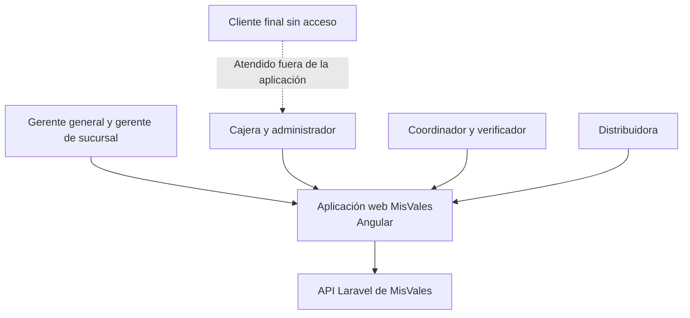

MisVales no modela el sistema bancario ni la generación externa del archivo bancario. Dentro de la aplicación únicamente se diseñan la recepción y procesamiento del archivo cargado por la cajera y las notificaciones internas dirigidas a los usuarios.

### 3.2 Arquitectura de la aplicación

#### 3.2.1 Vista general

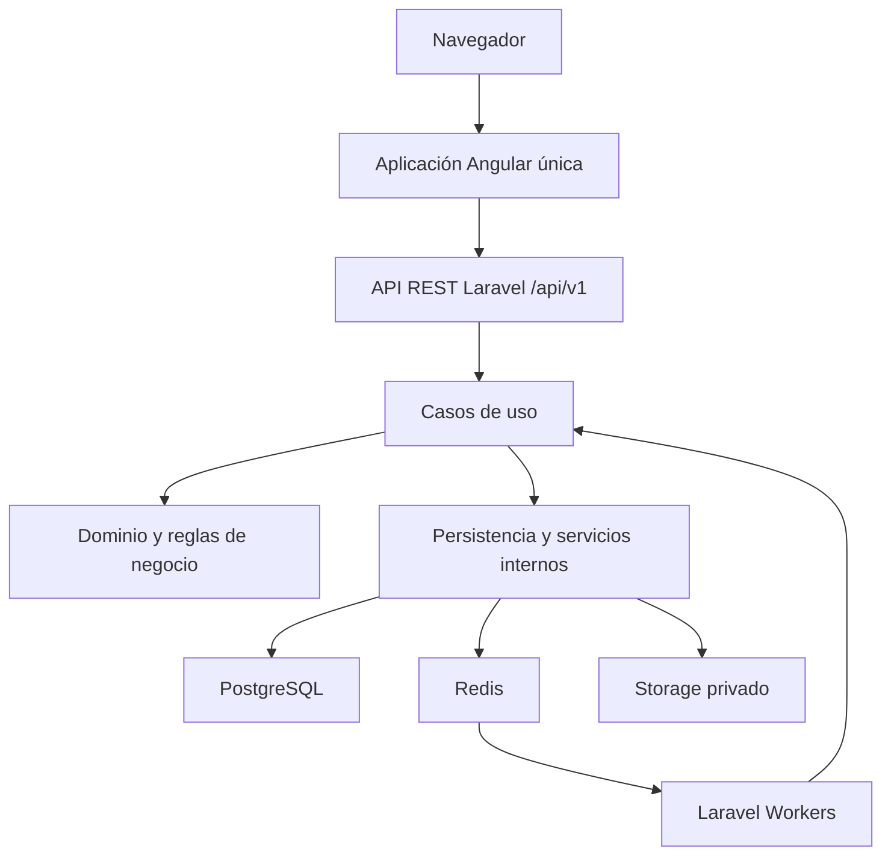

| Componente | Diseño |
| --- | --- |
| Angular | Una SPA con módulos cargados bajo demanda, navegación por permisos y layouts adaptativos. |
| Laravel | Una API REST organizada como monolito modular. Centraliza reglas, permisos, cálculos, estados y transacciones. |
| PostgreSQL | Fuente de verdad para datos operativos, financieros, históricos y de auditoría. |
| Redis | Sesiones de Sanctum, caché, colas, límites de solicitudes y candados temporales. |
| Laravel Workers | Ejecutan cortes, conciliaciones, archivos, documentos, notificaciones internas y procesos pesados. |
| Storage privado | Conserva evidencias, fotografías, comprobantes, relaciones generadas y respaldos autorizados. |

#### 3.2.2 Capas del backend

| Capa | Responsabilidad | Regla |
| --- | --- | --- |
| Presentación | Rutas, controladores, Form Requests, Resources, middleware y Policies. | No contiene cálculos ni decisiones de negocio. |
| Aplicación | Casos de uso, comandos, consultas, transacciones y coordinación de módulos. | Controla cada operación completa y sus efectos. |
| Dominio | Entidades, estados, reglas financieras, objetos de valor y eventos. | No depende de HTTP, Angular, Redis ni Storage. |
| Infraestructura | Eloquent, PostgreSQL, Redis, colas, Storage y generación de documentos. | Implementa los contratos requeridos por aplicación y dominio. |

Las operaciones financieras se ejecutan dentro de transacciones PostgreSQL. Redis puede coordinar o acelerar una operación, pero nunca será la única fuente de un saldo, autorización, pago, punto o movimiento de línea.

#### 3.2.3 Organización del backend Laravel

```
app/
├── Modules/
│   ├── IdentityAccess/
│   ├── Organization/
│   ├── Configuration/
│   ├── DistributorOnboarding/
│   ├── Distributor/
│   ├── Client/
│   ├── Credit/
│   ├── Voucher/
│   ├── Relation/
│   ├── Payment/
│   ├── Points/
│   ├── Risk/
│   ├── Mobility/
│   ├── Reporting/
│   ├── Notification/
│   ├── Media/
│   └── Audit/
├── Shared/
│   ├── Application/
│   ├── Domain/
│   ├── Infrastructure/
│   └── Presentation/
├── Console/
│   └── Commands/
├── Http/
│   └── Middleware/
└── Providers/
    ├── AppServiceProvider.php
    └── ModulesServiceProvider.php
```

Cada módulo contiene sus casos de uso, entidades, políticas, repositorios, eventos y rutas. Ningún controlador modifica saldos o estados directamente.

Estructura de cada modulo

```
app/Modules/{Module}/
├── Application/
│   ├── Commands/
│   │   └── {CasoDeUso}/
│   │       ├── Command.php
│   │       └── Handler.php
│   ├── Queries/
│   │   └── {Consulta}/
│   │       ├── Query.php
│   │       └── Handler.php
│   ├── DTOs/
│   ├── Contracts/
│   └── Services/
├── Domain/
│   ├── Aggregates/
│   ├── Entities/
│   ├── ValueObjects/
│   ├── Enums/
│   ├── Rules/
│   ├── Services/
│   ├── Events/
│   ├── Exceptions/
│   └── Repositories/
├── Infrastructure/
│   ├── Persistence/
│   │   └── Eloquent/
│   │       ├── Models/
│   │       ├── Repositories/
│   │       └── Mappers/
│   ├── Queue/
│   │   ├── Jobs/
│   │   └── Listeners/
│   ├── Cache/
│   ├── Storage/
│   └── Providers/
│       └── ModuleServiceProvider.php
├── Presentation/
│   ├── Http/
│   │   ├── Controllers/
│   │   ├── Requests/
│   │   ├── Resources/
│   │   └── Middleware/
│   ├── Authorization/
│   │   └── Policies/
│   └── Routes/
│       └── api.php
└── Tests/
    ├── Unit/
    ├── Integration/
    └── Feature/
```

### 3.3 Diseño de la aplicación Angular única

#### 3.3.1 Estructura

```
src/app/
├── core/
│   ├── auth/
│   ├── api/
│   ├── authorization/
│   ├── config/
│   ├── guards/
│   ├── interceptors/
│   ├── session/
│   ├── error-handling/
│   └── files/
├── layouts/
│   ├── auth/
│   ├── shell/
│   ├── desktop/
│   ├── tablet/
│   ├── mobile/
│   └── navigation/
├── features/
│   ├── auth/
│   ├── dashboard/
│   ├── organization/
│   ├── configurations/
│   ├── applications/
│   ├── verifications/
│   ├── distributors/
│   ├── clients/
│   ├── credit/
│   ├── vouchers/
│   ├── counter/
│   ├── relations/
│   ├── payments/
│   ├── reconciliation/
│   ├── points/
│   ├── delinquency/
│   ├── mobility/
│   ├── reports/
│   ├── notifications/
│   ├── audit/
│   └── system/
├── shared/
│   ├── components/
│   ├── forms/
│   ├── tables/
│   ├── dialogs/
│   ├── directives/
│   ├── pipes/
│   ├── validators/
│   ├── models/
│   ├── types/
│   └── utils/
├── app.component.ts
├── app.component.html
├── app.component.scss
├── app.config.ts
└── app.routes.ts
```

No existen proyectos Angular independientes para administración, tableta o móvil. Los tres layouts pertenecen al mismo proyecto, comparten componentes, autenticación, modelos, servicios y versión.

Estructura de un feature

```
src/app/features/{feature}/
├── pages/
│   ├── list/
│   │   ├── list-page.component.ts
│   │   ├── list-page.component.html
│   │   ├── list-page.component.scss
│   │   └── list-page.component.spec.ts
│   ├── detail/
│   │   ├── detail-page.component.ts
│   │   ├── detail-page.component.html
│   │   ├── detail-page.component.scss
│   │   └── detail-page.component.spec.ts
│   └── form/
│       ├── form-page.component.ts
│       ├── form-page.component.html
│       ├── form-page.component.scss
│       └── form-page.component.spec.ts
├── components/
│   ├── summary/
│   ├── filters/
│   ├── status/
│   └── actions/
├── forms/
│   ├── form.factory.ts
│   └── form.types.ts
├── data-access/
│   ├── api/
│   │   └── feature-api.service.ts
│   ├── dtos/
│   │   ├── request.dto.ts
│   │   └── response.dto.ts
│   ├── mappers/
│   │   └── feature.mapper.ts
│   └── services/
├── state/
│   ├── feature.store.ts
│   └── feature.facade.ts
├── models/
│   ├── feature.model.ts
│   ├── feature-status.model.ts
│   └── feature-filter.model.ts
├── validators/
│   └── feature.validators.ts
└── feature.routes.ts
```

#### 3.3.2 Resolución de la experiencia

1. Angular obtiene la cookie CSRF.
2. El usuario inicia sesión.
3. Laravel valida credenciales, estado y alcance.
4. Angular consulta el contexto efectivo mediante GET /api/v1/me.
5. La respuesta contiene usuario, rol, sucursal, asignaciones y permisos.
6. Angular construye el menú permitido y selecciona el layout apropiado.
7. Cada cambio de ruta usa un guard para experiencia de usuario.
8. Cada solicitud vuelve a ser autorizada por una Policy de Laravel.

La aplicación no confía en ocultar botones como mecanismo de seguridad. Una ruta o petición enviada manualmente debe ser rechazada por la API cuando el usuario no tenga permiso.

#### 3.3.3 Experiencia por perfil

| Perfil | Presentación principal | Inicio y navegación |
| --- | --- | --- |
| Gerente general | Escritorio | Tablero global, sucursales, personal, configuraciones, categorías, productos, solicitudes, distribuidoras, relaciones, pagos, puntos, morosidad, movilidad, reportes y auditoría. |
| Gerente de sucursal | Escritorio | Tablero de sucursal, personal operativo, solicitudes, distribuidoras, líneas, relaciones, conciliación, puntos, morosidad, reasignaciones y reportes de su sucursal. |
| Cajera | Escritorio responsivo | Caja, búsqueda de folios, validación, solicitudes de modificación, feriado, carga bancaria, conciliación, aclaraciones y devoluciones autorizadas. |
| Administrador | Escritorio responsivo | Consulta global, historiales, reportes, logs y auditoría en modo de solo lectura. |
| Coordinador | Tableta | Solicitudes, correcciones, distribuidoras asignadas, incrementos, autorizaciones permitidas, transferencias, alertas y retiros de morosidad. |
| Verificador | Tableta | Visitas asignadas, expediente, lista de comprobación, fotografías, diferencias y resultado. |
| Distribuidora | Teléfono | Línea, clientes, vales, relaciones, aclaraciones, incrementos, puntos, transferencias y notificaciones. |

#### 3.3.4 Comportamiento adaptativo

- El layout de escritorio prioriza tablas, filtros, paneles de detalle y comparación.
- El layout de tableta prioriza controles táctiles, formularios por secciones, cámara y evidencias.
- El layout móvil prioriza tarjetas, pasos cortos, acciones principales y resúmenes financieros.
- Una misma URL funcional puede representarse como tabla en escritorio y como tarjetas en teléfono.
- Los formularios conservan la misma validación y el mismo contrato de API en todos los layouts.
- La orientación o el ancho de pantalla no agregan permisos.
- Los datos sensibles no permanecen en almacenamiento local del navegador.

### 3.4 Módulos funcionales

| Módulo | Funciones dentro de la aplicación | Módulo Laravel |
| --- | --- | --- |
| Acceso | Inicio y cierre de sesión, recuperación, sesiones activas y contexto de permisos. | IdentityAccess |
| Organización | Sucursales, usuarios, roles, personal, coordinadores y asignaciones. | Organization |
| Configuraciones | Valores globales, vigencias, fechas, recargos, tolerancia y parámetros de puntos. | Configuration |
| Catálogos | Categorías, versiones de ganancia, productos y parámetros financieros. | Configuration |
| Solicitudes | Expediente de aspirante, revisión, correcciones, evaluación y autorización final. | DistributorOnboarding |
| Verificación | Visitas, fotografías, evidencia, diferencias y resultado físico. | DistributorOnboarding |
| Distribuidoras | Perfil, sucursal, coordinador, categoría, estado e historial. | Distributor |
| Clientes finales | Alta, CURP, domicilio, documentos, cuenta bancaria, asignación y cartera informativa opcional. | Client |
| Crédito | Línea total, utilizada, disponible, movimientos, restricciones e incrementos. | Credit |
| Vales | Prevale, vale digital, producto, folio, regla del 50 % y estados. | Voucher |
| Caja y feriado | Identidad, domicilio, token de modificación, liberación y transacción. | Voucher |
| Relaciones | Corte, parcialidades, referencias, cálculo, recargo, saldo y clasificación. | Relation |
| Pagos y conciliación | Carga bancaria, movimientos, abonos, liquidaciones, aplicación financiera y conciliación manual. | Payment |
| Excedentes | Decisión, saldo a favor, aplicación posterior y devolución autorizada. | Payment |
| Puntos | Generación, descuento, saldo, periodos y canjes. | Points |
| Riesgo y morosidad | Alertas, tres relaciones, aplicación manual, regularización y retiro de morosidad de distribuidoras. | Risk |
| Movilidad | Transferencias de clientes, reasignaciones, cambios de sucursal y coordinador. | Mobility |
| Reportes | Consultas por alcance sobre operación, cartera, pagos, puntos y movimientos. | Reporting |
| Notificaciones | Bandeja interna, estado de lectura y acceso al registro relacionado. | IdentityAccess |
| Auditoría y archivos | Historial inmutable, evidencias, comprobantes y descargas autorizadas. | Audit |

#### 3.4.1 Pantallas funcionales principales

| Pantalla | Contenido | Acciones |
| --- | --- | --- |
| Inicio | Indicadores y pendientes del rol y alcance vigentes. | Abrir alertas, solicitudes, relaciones o tareas relacionadas. |
| Solicitud de distribuidora | Secciones personales, familiares, domicilio, patrimonio, trabajo, comercio y evidencias. | Guardar, enviar, corregir, asignar visita, evaluar y remitir. |
| Verificación | Expediente, domicilio, lista de comprobación, fotografías y diferencias. | Iniciar visita, adjuntar evidencia y registrar resultado. |
| Distribuidora | Datos, sucursal, coordinador, categoría, línea, cartera, relaciones y puntos. | Autorizar alta, cambiar categoría, revisar incremento, morosidad o movilidad según permiso. |
| Cliente final | Identidad, domicilio, documentos, cuenta, distribuidora, vales y cartera informativa opcional. | Crear, consultar, corregir con token, registrar seguimiento informativo y transferir o reasignar según permiso. |
| Generación de vale | Cliente, producto, capital, saldo, rango permitido y resumen del cálculo. | Crear prevale o vale digital y obtener folio. |
| Caja | Búsqueda por folio o nombre, documentos, cuenta y comparación de datos. | Solicitar token, aplicar corrección, liberar, registrar transacción, rechazar o cancelar. |
| Relación | Corte, referencia, fechas, partidas, cálculos, pagos, saldo, clasificación y puntos. | Consultar detalle y descargar cuando el rol lo permita. |
| Conciliación | Importaciones, filas, coincidencias, abonos, liquidaciones y no conciliados. | Cargar, revisar, vincular aclaración, solicitar autorización y aplicar manualmente. |
| Excedentes | Importe, saldo disponible, aplicaciones y devolución. | Elegir saldo a favor, solicitar devolución, autorizar y registrar ejecución. |
| Puntos | Saldo, movimientos, valor, periodo y solicitudes. | Solicitar, autorizar, rechazar y completar canje. |
| Riesgo y morosidad | Alertas, relaciones consecutivas, saldos, bloqueos y regularización de distribuidoras. | Aplicar morosidad a distribuidoras, preparar el retiro y decidirlo. |
| Movilidad | Origen, destino, cliente o distribuidora, aceptaciones y autorización. | Transferir, reasignar o cambiar sucursal/coordinador. |
| Auditoría | Actor, acción, registro, antes, después, motivo, fecha y resultado. | Consultar y filtrar; nunca modificar. |

#### 3.4.2 Reportes

La pantalla de reportes ofrece filtros por fechas, sucursal, coordinador, distribuidora y estado conforme al alcance del usuario:

- Distribuidoras por sucursal y coordinador.
- Líneas totales, utilizadas, disponibles y recuperadas.
- Prevales y vales por estado.
- Relaciones por corte y saldo.
- Distribuidoras que liquidaron, abonaron o no pagaron.
- Distribuidoras morosas y cartera informativa de clientes finales con adeudo pendiente.
- Tres relaciones consecutivas que originaron alertas.
- Pagos conciliados y no conciliados.
- Conciliaciones manuales.
- Excedentes, saldos a favor y devoluciones.
- Puntos generados, descontados y canjeados.
- Solicitudes de distribuidora por resultado.
- Incrementos por estado e importe decidido.
- Transferencias, cambios de sucursal y reasignaciones.

El administrador puede consultar estos reportes, pero no modificar información ni descargar relaciones.

### 3.5 Acceso, permisos y separación de funciones

#### 3.5.1 Alcance efectivo

```
Acceso permitido =
    usuario activo
    AND sesión válida
    AND permiso del rol
    AND sucursal dentro del alcance
    AND relación jerárquica vigente
    AND estado compatible
    AND separación de funciones cumplida
```

| Perfil | Alcance |
| --- | --- |
| Gerente general | Todas las sucursales, usuarios y movimientos. |
| Gerente de sucursal | Únicamente su sucursal. |
| Coordinador | Su sucursal y las solicitudes o distribuidoras bajo su responsabilidad. |
| Verificador | Las solicitudes y visitas que le fueron asignadas. |
| Administrador | Consulta global de solo lectura. |
| Distribuidora | Su cuenta, línea, clientes, vales, relaciones, puntos y procesos propios. |
| Cajera | Operación de caja, pagos y casos de su sucursal. |

#### 3.5.2 Matriz de autorizaciones

| Operación | Solicita o prepara | Autoriza | Ejecuta |
| --- | --- | --- | --- |
| Alta final de distribuidora | Coordinador remite el expediente favorable. | Gerente general o gerente de sucursal. | Servicio de aplicación. |
| Línea inicial | Gerente registra el monto. | Gerente general o gerente de sucursal. | Servicio de aplicación. |
| Modificación de datos en caja | Cajera. | Coordinador de la misma sucursal, gerente de sucursal o gerente general. | Cajera con token. |
| Incremento de línea | Distribuidora; coordinador revisa y preautoriza. | Gerente general o gerente de sucursal. | Servicio de aplicación. |
| Conciliación manual | Cajera. | Coordinador responsable, gerente de sucursal o gerente general. | Cajera. |
| Transferencia de cliente | Distribuidora de origen. | Coordinador de origen, después de aceptación previa de la receptora. | Servicio de aplicación tras aceptación definitiva. |
| Reasignación de clientes | Gerente competente. | Gerente de sucursal en su alcance o gerente general. | Servicio de aplicación. |
| Cambio de sucursal | Gerente competente. | Gerente de sucursal en su alcance o gerente general. | Servicio de aplicación. |
| Aplicación de morosidad | Gerente revisa la alerta. | Gerente de sucursal o gerente general. | Servicio de aplicación. |
| Retiro de morosidad | Coordinador prepara. | Gerente de sucursal o gerente general. | Servicio de aplicación. |
| Canje de puntos | Distribuidora. | Gerente de sucursal o gerente general. | Usuario autorizado registra la entrega. |
| Devolución de excedente | Distribuidora. | Gerente de sucursal o gerente general. | Cajera registra la ejecución. |

Nadie puede autorizar su propia ejecución cuando el proceso exige separación. El administrador nunca puede crear, modificar, autorizar, reasignar, aplicar morosidad ni descargar relaciones.

### 3.6 Estados y transiciones

Los estados solo cambian por casos de uso explícitos. No se expone un endpoint genérico para editar el campo de estado. Cada transición valida actor, alcance, estado anterior, datos requeridos y reglas del proceso.

#### 3.6.1 Solicitud de distribuidora

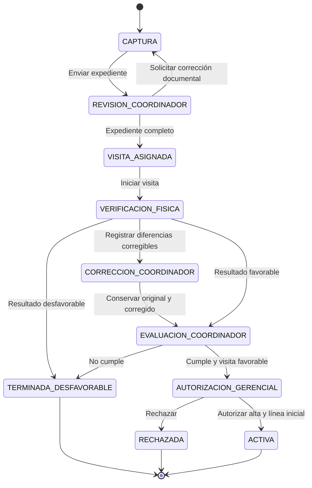

Una solicitud desfavorable termina. No entra en revisión, apelación ni autorización gerencial. La activación crea la distribuidora, su acceso, su asignación de sucursal y coordinador, la categoría asignada y la línea inicial autorizada. MisVales no genera contrato.

#### 3.6.2 Vale

El tipo se determina al crear el folio:

- PREVALE: primer vale del cliente dentro de todo MisVales.
- VALE_DIGITAL: cualquier vale posterior de un cliente existente, incluso después de una transferencia.

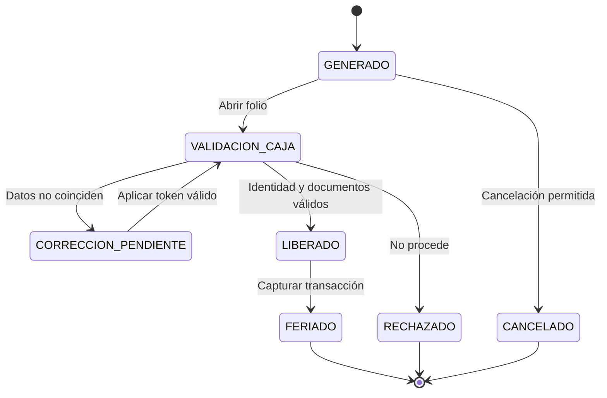

Al generar el folio y nuevamente al feriar se validan la asociación del cliente con la distribuidora, el producto vigente, el saldo disponible y la restricción del 50 %. El adeudo informativo del cliente final no se utiliza como condición de elegibilidad ni como bloqueo. La línea se utiliza únicamente cuando el vale queda FERIADO. Una transacción ya registrada no puede reutilizarse.

#### 3.6.3 Token de modificación

| Estado | Entrada | Salida permitida |
| --- | --- | --- |
| PENDIENTE | La cajera solicita campos y motivo. | AUTORIZADO o RECHAZADO. |
| AUTORIZADO | La autoridad emite un token vinculado al caso. | USADO o VENCIDO. |
| USADO | La cajera modifica únicamente los campos autorizados. | Terminal. |
| VENCIDO | Transcurrieron cinco minutos sin uso. | Terminal. |
| RECHAZADO | La autoridad no permite el cambio. | Terminal. |

El token se almacena como hash, es de un solo uso y se vincula con cajera, registro, campos, operación y sucursal.

Una corrección de CURP o domicilio vuelve a ejecutar las validaciones globales de unicidad antes de guardar.

#### 3.6.4 Incremento de línea

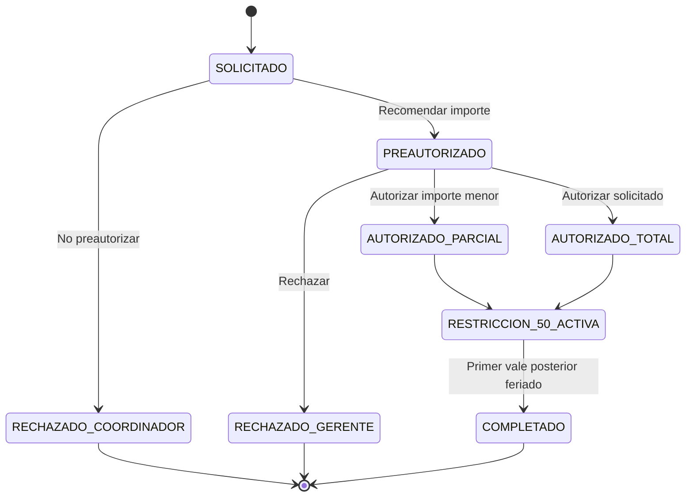

El coordinador no modifica la línea. La autorización gerencial crea un movimiento de incremento y una sola restricción del primer vale posterior.

#### 3.6.5 Relación

La relación conserva ejes separados para no mezclar saldo, revisión y comportamiento:

| Eje | Estados |
| --- | --- |
| Financiero | PENDIENTE, ABONADA, LIQUIDADA, VENCIDA. |
| Revisión | SIN_REVISION, ACLARACION_ABIERTA, REVISION_MANUAL, RESUELTA. |
| Clasificación de liquidación | SIN_CLASIFICAR, ANTICIPADA, PUNTUAL, FUERA_DE_TIEMPO. |
| Evaluación posterior | NO_EVALUADA, LIQUIDO, ABONO, NO_PAGO. |

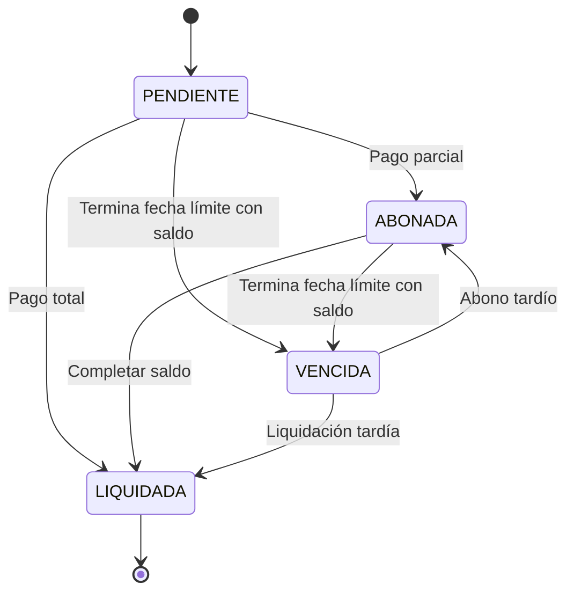

Abrir una aclaración no cambia el saldo. El recargo se agrega una sola vez a la relación vencida después de procesar la información bancaria requerida.

#### 3.6.6 Importación y conciliación

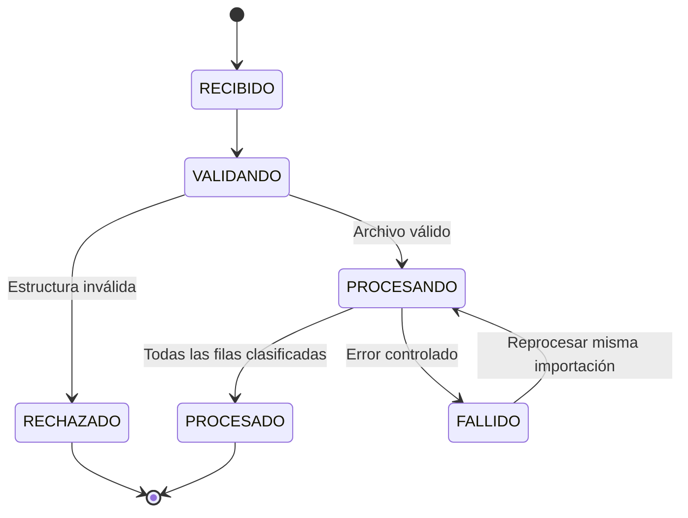

Cada movimiento queda como CONCILIADO, NO_CONCILIADO o DUPLICADO. Un movimiento NO_CONCILIADO puede pasar a REVISION_MANUAL y posteriormente a APLICADO cuando existe evidencia, autorización y ejecución de la cajera. Si no se demuestra la correspondencia, permanece sin conciliar.

#### 3.6.7 Excedente

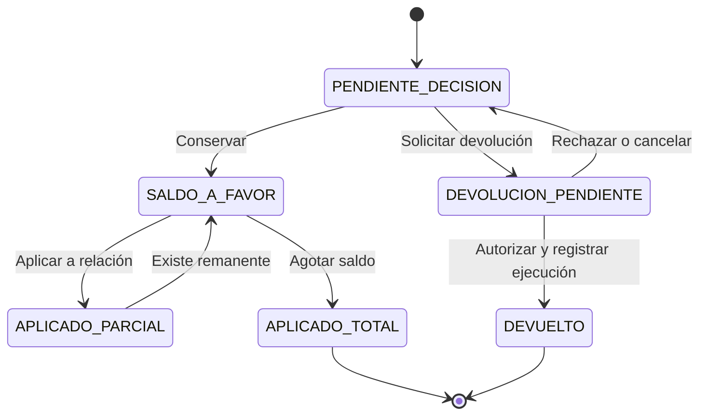

El mismo importe no puede estar disponible como saldo a favor y como devolución pendiente.

#### 3.6.8 Morosidad y retiro

Este control de estados se usa exclusivamente para la morosidad de distribuidoras. El cliente final no tiene estado gerencial de morosidad ni proceso de retiro.

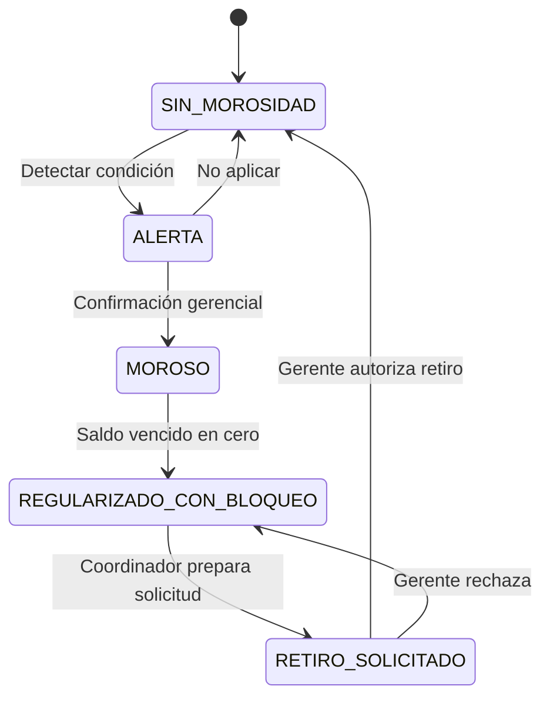

La detección, el pago y la conciliación no aplican ni retiran automáticamente la morosidad de una distribuidora. Una distribuidora marcada como morosa no puede otorgar vales. El cliente final no tiene morosidad, elegibilidad, bloqueo ni desbloqueo; su adeudo es informativo y no impide nuevos vales ni acciones de la distribuidora.

#### 3.6.9 Transferencia de cliente

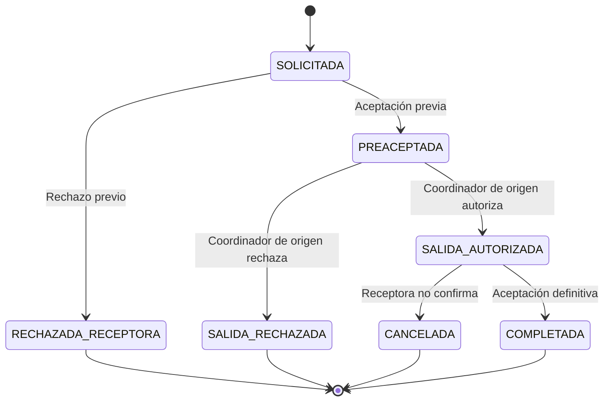

La transferencia solo inicia cuando el saldo registrado del cliente está completamente en cero. La finalización cierra la asignación anterior, abre la nueva y conserva todo el historial.

#### 3.6.10 Canje de puntos

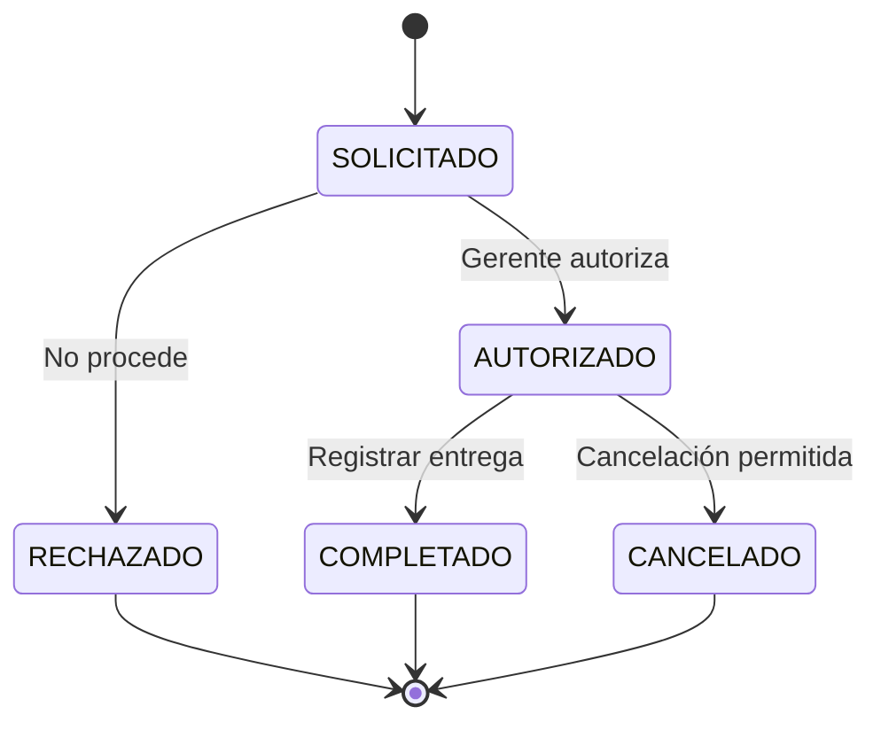

Los puntos se reservan al autorizar y se descuentan definitivamente al registrar la entrega. El valor monetario vigente queda congelado en el canje.

#### 3.6.11 Reasignaciones

| Proceso | Precondición | Resultado |
| --- | --- | --- |
| Reasignación administrativa de clientes | Autoridad gerencial, ausencia de restricciones y destino válido. | Se cierra la asignación anterior, se crea la nueva y se conserva el historial. |
| Cambio de sucursal de distribuidora | Autorización gerencial y clientes previamente reasignados. | La distribuidora conserva línea, categoría, relaciones, pagos y puntos; las operaciones nuevas usan la sucursal destino. |
| Cambio de coordinador | Todas las distribuidoras activas deben tener coordinador destino. | Se cierran las asignaciones anteriores y se crean las nuevas sin alterar movimientos históricos. |

### 3.7 Modelo lógico de datos

#### 3.7.1 Identidad y organización

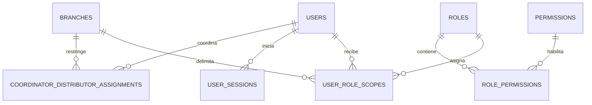

#### 3.7.2 Solicitud de distribuidora

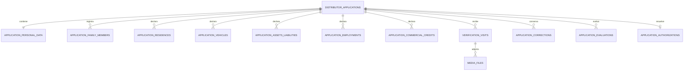

#### 3.7.3 Distribuidoras, clientes, crédito y vales

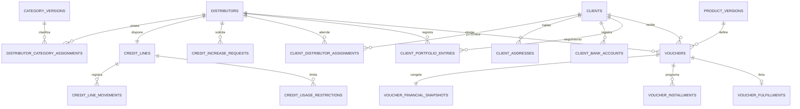

#### 3.7.4 Relaciones, pagos y excedentes

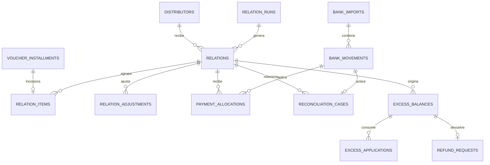

#### 3.7.5 Puntos, riesgo y movilidad

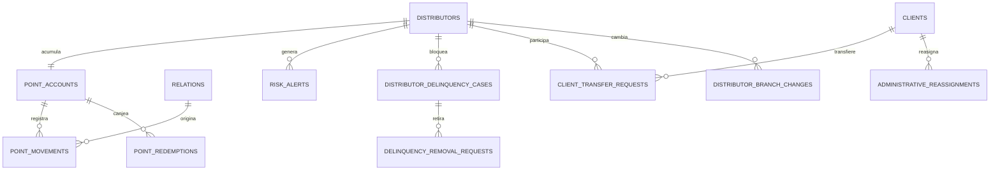

#### 3.7.6 Configuración y soporte

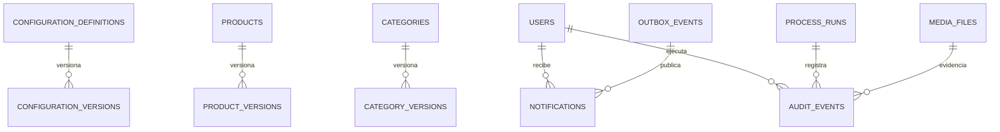

#### 3.7.7 Entidades principales

| Grupo | Entidades |
| --- | --- |
| Acceso | users, roles, permissions, role_permissions, user_role_scopes, user_sessions. |
| Organización | branches, coordinator_distributor_assignments. |
| Configuración | configuration_definitions, configuration_versions, products, product_versions, categories, category_versions, redemption_periods. |
| Solicitud | distributor_applications, application_personal_data, application_family_members, application_residences, application_vehicles, application_assets_liabilities, application_employments, application_commercial_credits. |
| Verificación | verification_visits, application_evaluations, application_corrections, application_authorizations, media_files. |
| Distribuidora | distributors, distributor_category_assignments. |
| Cliente | clients, client_addresses, client_bank_accounts, client_distributor_assignments, client_portfolio_entries. |
| Crédito | credit_lines, credit_line_movements, credit_usage_restrictions, credit_increase_requests. |
| Vale | vouchers, voucher_financial_snapshots, voucher_installments, voucher_fulfillments, data_change_requests, authorization_tokens. |
| Relación | relation_runs, relations, relation_items, relation_adjustments, relation_status_history, relation_documents. |
| Pagos | bank_imports, bank_movements, payment_allocations, reconciliation_cases. |
| Excedentes | excess_balances, excess_applications, refund_requests. |
| Puntos | point_accounts, point_movements, point_redemptions. |
| Riesgo | risk_alerts, distributor_delinquency_cases, delinquency_removal_requests. |
| Movilidad | client_transfer_requests, administrative_reassignments, distributor_branch_changes. |
| Control | notifications, audit_events, outbox_events, process_runs, idempotency_keys. |

### 3.8 Diseño de datos

#### 3.8.1 Convenciones

| Elemento | Convención |
| --- | --- |
| Identificadores internos | UUID. Los folios visibles se almacenan por separado. |
| Dinero | Decimal exacto; nunca float. Escala interna de cuatro decimales y presentación final de dos. |
| Porcentajes | Decimal entre 0 y 1, asociado a una versión vigente. |
| Fechas técnicas | timestamptz almacenado en UTC. |
| Fechas de negocio | Se interpretan y presentan en America/Monterrey. |
| Estados | Enumeraciones controladas; no texto libre. |
| Historial | Vigencias mediante inicio y fin; no se sobrescriben asignaciones anteriores. |
| Concurrencia | lock_version o bloqueo de fila en saldos y decisiones críticas. |
| Datos sensibles | Valor cifrado para lectura y HMAC normalizado para búsquedas exactas. |
| Archivos | Metadatos en PostgreSQL y contenido en Storage privado. |

No se eliminan físicamente vales, relaciones, pagos, movimientos de línea, movimientos de puntos, autorizaciones ni auditorías. Una corrección crea una nueva versión o movimiento compensatorio.

#### 3.8.2 Expediente de solicitud

| Sección | Datos |
| --- | --- |
| Personales | Nombre, apellido paterno, apellido materno, CURP, RFC, fecha de nacimiento, lugar, estado y ciudad de nacimiento, dirección e identificación oficial. |
| Familiares | Esposo o pareja, hijos, edades, escuela de hijos y referencias familiares. |
| Domicilio | Domicilio estructurado, tipo de vivienda, propia o rentada, liquidada o financiada, préstamo o Infonavit y dimensiones. |
| Vehículos y patrimonio | Cantidad de vehículos, datos de cada vehículo, bienes, préstamos y compromisos activos. |
| Laboral y comercial | Lugar de trabajo, referencias laborales, empresas donde otorga vales, líneas de crédito y cartas o comprobantes. |
| Verificación | Visita, fotografías, evidencias, diferencias, resultado y coordenadas capturadas durante la visita cuando correspondan. |

Los familiares, vehículos, bienes, pasivos, empleos y créditos comerciales se guardan como colecciones relacionadas, no como columnas repetidas dentro de la solicitud.

#### 3.8.3 Cliente final

El registro contiene:

- Nombre y apellidos.
- CURP y RFC.
- Fecha, lugar, estado y ciudad de nacimiento.
- Identificación oficial.
- Comprobante de domicilio para el prevale.
- Domicilio estructurado.
- Cuenta bancaria para el depósito manual.
- Distribuidora activa.
- Sucursal derivada de la distribuidora.
- Historial de asignaciones.
- Registros opcionales de cartera informativa administrados por la distribuidora.

El cliente final no tiene registro en users.

Los registros de cartera informativa conservan, según corresponda, tipo de movimiento, importe, estado informativo, fecha, nota, distribuidora y usuario que realizó el registro. No forman parte de la conciliación bancaria, no recuperan línea de crédito, no modifican relaciones y no crean bloqueos para nuevos vales.

La distribuidora puede omitir este seguimiento durante su operación normal. Si solicita transferir al cliente, debe actualizar o confirmar la cartera para que el saldo registrado esté en cero; esta es la única validación operativa que utiliza dicho saldo.

#### 3.8.4 Unicidad de CURP y domicilio

La CURP se normaliza, se cifra para consulta autorizada y genera un HMAC único global.

El domicilio se divide en calle, número exterior, número interior, colonia, código postal, municipio, ciudad y estado. El backend normaliza mayúsculas, espacios, acentos y abreviaturas admitidas; después genera un fingerprint HMAC con los componentes que identifican el domicilio.

Antes de crear un cliente se ejecutan dos validaciones globales dentro de la misma transacción:

1. No existe otro cliente con el HMAC de la CURP.
2. No existe otro cliente con el fingerprint activo del domicilio.

La base de datos mantiene restricciones únicas para impedir duplicados concurrentes. La transferencia reutiliza al cliente existente y cambia únicamente su asignación.

#### 3.8.5 Libros y snapshots

| Registro | Diseño |
| --- | --- |
| Línea de crédito | credit_lines conserva el saldo actual; credit_line_movements conserva el libro inmutable. |
| Puntos | point_accounts conserva el saldo actual; point_movements conserva cada generación, descuento y canje. |
| Vale | voucher_financial_snapshots congela producto, categoría, porcentajes, importes y versión de cálculo. |
| Relación | relations y relation_items congelan fechas, parámetros, parcialidades y totales del corte. |
| Pago | payment_allocations conserva la distribución por recargo, interés, seguro, comisión y capital. |
| Auditoría | audit_events conserva actor, autorización, cambios, motivo, contexto y resultado. |

Los saldos materializados se actualizan en la misma transacción que inserta el movimiento. Una validación posterior puede reconstruir el saldo desde el libro y detectar diferencias.

### 3.9 Configuraciones y catálogos

#### 3.9.1 Versionado

Toda configuración, producto y categoría tiene identidad estable y versiones con:

- Estado de borrador, publicada o inactiva.
- Inicio de vigencia.
- Fin de vigencia cuando corresponda.
- Valor o parámetros.
- Usuario responsable.
- Fecha y hora.
- Motivo.
- Número de versión.

Una versión publicada no se edita. El cambio crea una versión futura y cierra la vigencia anterior sin recalcular operaciones históricas.

Los valores de negocio se consultan desde estas versiones. No se escriben directamente en controladores, servicios, componentes Angular ni trabajos programados.

#### 3.9.2 Valores iniciales

| Clave | Valor inicial | Uso |
| --- | --- | --- |
| CUT_DAY_OF_MONTH | 25 | Día global de corte. |
| PAYMENT_DAYS_AFTER_CUT | 20 | Días posteriores al corte para la fecha límite. |
| BUSINESS_TIMEZONE | America/Monterrey | Zona operativa única. |
| CUT_TIME | 00:05 | Ejecución del corte. |
| PAYMENT_DEADLINE_TIME | 23:59:59 | Cierre de la fecha límite. |
| BANK_UPLOAD_DEADLINE_TIME | 08:00 | Límite de carga del día posterior. |
| POST_DUE_EVALUATION_TIME | 08:30 | Evaluación posterior al procesamiento. |
| CREDIT_TOLERANCE_AMOUNT | $500.00 | Tolerancia de la regla del 50 %. |
| LATE_FEE_AMOUNT | $300.00 | Recargo único inicial por relación. |
| POINTS_DIVISOR_AMOUNT | $1,200.00 | Divisor de puntos. |
| POINTS_MULTIPLIER | 3 | Multiplicador de puntos. |
| POINT_VALUE_AMOUNT | $2.00 | Valor inicial de un punto. |
| LATE_POINTS_REDUCTION_RATE | 20 % | Reducción por liquidación tardía. |
| MODIFICATION_TOKEN_TTL | 5 minutos | Vigencia exacta del token. |

Inician sin datos precargados:

- Categorías.
- Productos.
- Comisión del préstamo.
- Interés por quincena.
- Seguro.
- Número de quincenas.
- Periodo de pago anticipado.
- Periodos de canje.

El gerente general administra y publica todos los valores globales. El gerente de sucursal únicamente los consulta y opera con la versión vigente.

#### 3.9.3 Producto y categoría

Cada versión de producto contiene monto, comisión del préstamo, interés simple por quincena, seguro y número de quincenas. El monto debe ser múltiplo de 100.

Cada versión de categoría contiene el porcentaje de ganancia de la distribuidora. Un cambio de categoría afecta únicamente vales posteriores; los anteriores conservan la versión original.

### 3.10 Motor financiero

#### 3.10.1 Regla del 50 %

La restricción se crea:

- Al autorizar la línea inicial.
- Después de cada incremento autorizado.

No se crea cuando la línea se recupera mediante pagos.

```
Referencia = Línea total autorizada × 0.50

Límite inferior = máximo(0, Referencia − Tolerancia)

Límite superior = mínimo(Saldo disponible, Referencia + Tolerancia)
```

El capital del producto debe estar dentro del rango. Si el límite superior es menor que el inferior, no existe un producto admisible.

La restricción:

- Usa la línea total vigente, no únicamente el incremento.
- Se vincula con un solo vale pendiente.
- No se consume por cancelar o rechazar el folio.
- Se consume únicamente cuando el vale queda feriado.
- Mantiene bloqueada la liberación normal del saldo restante hasta completar ese feriado.

#### 3.10.2 Cálculo del vale

| Variable | Significado |
| --- | --- |
| P | Capital del producto. |
| C | Porcentaje de comisión del préstamo. |
| I | Porcentaje de interés simple por quincena. |
| Q | Número de quincenas. |
| S | Seguro. |
| G | Porcentaje de ganancia de la categoría. |

```
Comisión del préstamo = P × C

Interés total = P × I × Q

Total base para MisVales =
    P + Comisión del préstamo + S + Interés total

Pago base por quincena =
    Total base para MisVales ÷ Q

Ganancia total de la distribuidora =
    P × G

Ganancia por quincena =
    Ganancia total de la distribuidora ÷ Q

Total a cobrar al cliente por quincena =
    Pago base por quincena + Ganancia por quincena
```

La ganancia de categoría pertenece a la distribuidora y no forma parte del importe exigible a MisVales.

Cada vale guarda el snapshot completo del cálculo y materializa sus Q parcialidades. Cuando una división genera residuo, la última parcialidad absorbe la diferencia necesaria para que la suma de los componentes coincida exactamente con el total.

#### 3.10.3 Línea de crédito

Tipos de movimiento:

| Movimiento | Efecto |
| --- | --- |
| INITIAL_AUTHORIZATION | Establece la línea total inicial. |
| INCREASE | Aumenta la línea total autorizada. |
| VOUCHER_FULFILLED | Aumenta el saldo utilizado por el capital feriado. |
| CAPITAL_RECOVERED | Reduce el saldo utilizado por capital cubierto. |
| AUTHORIZED_CORRECTION | Registra un ajuste compensatorio autorizado. |

```
Saldo disponible = Línea total − Saldo utilizado

0 ≤ Saldo utilizado ≤ Línea total

0 ≤ Saldo disponible ≤ Línea total
```

Antes de feriar se bloquea la fila de credit_lines, se recalcula el saldo y se valida nuevamente la restricción aplicable. Así se evita que dos operaciones concurrentes excedan la línea.

#### 3.10.4 Generación de la relación

Cada corte incorpora las parcialidades cuyo ciclo corresponde a la relación de la distribuidora. No se limita a vales nuevos.

Cada registro muestra:

- Producto, cliente y folio.
- Número de parcialidad y total de quincenas.
- Capital, comisión del préstamo, interés y seguro.
- Ganancia de categoría.
- Pago base.
- Recargo asignado cuando corresponda.
- Total a cobrar al cliente.
- Importe exigible a la distribuidora.
- Saldo pendiente.

```
Total de cartera =
    suma(Pago base + Ganancia de categoría)
    + Recargo único

Total exigible a MisVales =
    suma(Pago base)
    + Recargo único
    − Pagos conciliados aplicables
```

El recargo se crea una sola vez por relación. Si se presenta distribuido entre filas, la suma de la columna debe ser exactamente igual al recargo único.

#### 3.10.5 Aplicación de pagos y recuperación de línea

Cada pago conciliado se aplica en este orden:

1. Recargo.
2. Interés.
3. Seguro.
4. Comisión del préstamo.
5. Capital.

```
Cargos previos =
    Recargo pendiente
    + Interés pendiente
    + Seguro pendiente
    + Comisión del préstamo pendiente

Importe aplicable a capital =
    máximo(0, Abono − Cargos previos)

Línea recuperada =
    mínimo(Capital pendiente, Importe aplicable a capital)
```

Solo el capital aplicado recupera línea. Un pago no conciliado, la ganancia de categoría y un excedente todavía no aplicado no recuperan línea.

Cuando una relación contiene varias partidas, cada componente se aplica primero a la parcialidad con vencimiento más antiguo y después por folio y número de parcialidad. Este orden se conserva en reintentos y conciliaciones manuales.

#### 3.10.6 Clasificación temporal, recargo y riesgo

- ANTICIPADA: la suma de pagos conciliados liquida la relación dentro del periodo anticipado publicado.
- PUNTUAL: la liquida durante la fecha límite, hasta las 23:59:59.
- FUERA_DE_TIEMPO: la liquida después de la fecha límite.
- ABONO: existe pago, pero no se liquida.
- NO_PAGO: no existe pago conciliado al evaluar.

A las 08:30 del día posterior al vencimiento, después de procesar la carga requerida:

1. Se clasifica la relación como liquidó, abonó o no pagó.
2. Si conserva saldo, se agrega un recargo único.
3. Se actualiza la secuencia de incumplimientos.
4. Al tercer corte consecutivo pendiente se genera una alerta de riesgo.
5. El gerente decide manualmente si aplica morosidad.

Cuando la distribuidora regulariza el saldo vencido requerido, la secuencia de cortes consecutivos vuelve a cero; si conserva un estado de morosidad, sus bloqueos continúan hasta el retiro autorizado.

#### 3.10.7 Puntos

La base utiliza la suma monetaria del capital P de los productos incluidos en el corte.

```
Base de puntos =
    piso(Total de capital de productos ÷ Divisor vigente)

Puntos generados =
    Base de puntos × Multiplicador vigente
```

| Comportamiento | Resultado |
| --- | --- |
| Liquidación anticipada | Genera puntos. |
| Liquidación puntual | No genera ni descuenta. |
| Liquidación fuera de tiempo | No genera y descuenta el porcentaje vigente del saldo acumulado. |
| Abono sin liquidación | No genera ni descuenta por sí solo. |
| Falta de pago | No genera una reducción adicional; se atiende mediante recargo y morosidad. |

```
Puntos descontados =
    piso(Saldo acumulado × Porcentaje de reducción)

Nuevo saldo =
    máximo(0, Saldo acumulado − Puntos descontados)

Importe de canje =
    Puntos canjeados × Valor vigente por punto
```

Cada relación puede generar como máximo un movimiento de puntos por clasificación aplicable.

### 3.11 Contrato de API

#### 3.11.1 Convenciones

- Base: /api/v1.
- Transporte: HTTPS y JSON UTF-8.
- Sesión SPA: Laravel Sanctum con cookie segura y protección CSRF.
- Fechas: ISO 8601 con zona.
- Importes: cadenas decimales.
- Nombres JSON: snake_case.
- Identificadores: UUID opacos y folios de negocio separados.
- Paginación, filtros y orden controlados en listados.
- Idempotency-Key obligatorio en escrituras financieras o repetibles.
- If-Match o lock_version para edición concurrente.
- X-Request-Id en cada respuesta.

Respuesta de error:

```json
{
  "error": {
    "code": "CREDIT_50_PERCENT_RULE_NOT_SATISFIED",
    "message": "El producto no se encuentra dentro del rango permitido.",
    "fields": {},
    "details": {},
    "request_id": "req_uuid"
  }
}
```

La API no devuelve trazas, consultas SQL, secretos ni información fuera del alcance del usuario.

#### 3.11.2 Rutas por módulo

| Grupo | Rutas principales |
| --- | --- |
| Sesión | POST /auth/login, POST /auth/logout, GET /me, GET /me/sessions, DELETE /me/sessions/{id}. |
| Organización | GET/POST /branches, GET/POST /users, POST /users/{id}/assignments, GET /roles. |
| Configuración | GET/POST /configurations/versions, POST /configurations/versions/{id}/publish. |
| Catálogos | GET/POST /categories, POST /categories/{id}/versions, GET/POST /products, POST /products/{id}/versions, GET/POST /redemption-periods. |
| Solicitudes | GET/POST /distributor-applications, PATCH /distributor-applications/{id}, POST /distributor-applications/{id}/submit. |
| Verificación | POST /distributor-applications/{id}/assign-verifier, POST /distributor-applications/{id}/visits, POST /distributor-applications/{id}/corrections, POST /distributor-applications/{id}/coordinator-decision, POST /distributor-applications/{id}/manager-decision. |
| Distribuidoras | GET /distributors, GET /distributors/{id}, POST /distributors/{id}/category-assignments. |
| Crédito | GET /distributors/{id}/credit-line, POST /distributors/{id}/credit-increase-requests, POST /credit-increase-requests/{id}/preauthorize, POST /credit-increase-requests/{id}/manager-decision. |
| Clientes | GET/POST /clients, GET /clients/{id}, GET/POST /clients/{id}/bank-accounts, GET/POST /clients/{id}/portfolio-entries, PATCH /clients/{id}/portfolio-entries/{entryId}. |
| Vales y caja | GET/POST /vouchers, GET /vouchers/{id}, POST /vouchers/{id}/open-at-counter, POST /vouchers/{id}/release, POST /vouchers/{id}/fulfill, POST /vouchers/{id}/reject. |
| Modificación | POST /vouchers/{id}/modification-requests, POST /modification-requests/{id}/authorize, POST /modification-requests/{id}/apply. |
| Relaciones | GET /relations, GET /relations/{id}, GET /relations/{id}/documents, GET /relation-documents/{id}/download. |
| Carga bancaria | POST /bank-imports, GET /bank-imports/{id}, GET /bank-movements. |
| Conciliación | GET/POST /clarifications, POST /clarifications/{id}/link-movement, POST /manual-reconciliations, POST /manual-reconciliations/{id}/authorize, POST /manual-reconciliations/{id}/apply. |
| Excedentes | GET /excess-balances, POST /excess-balances/{id}/choose-credit, POST /excess-balances/{id}/request-refund, POST /refunds/{id}/authorize, POST /refunds/{id}/complete. |
| Puntos | GET /distributors/{id}/points, GET/POST /point-redemptions, POST /point-redemptions/{id}/authorize, POST /point-redemptions/{id}/complete. |
| Morosidad | GET /risk-alerts, POST /distributors/{id}/delinquency/apply, POST /delinquency-removal-requests, POST /delinquency-removal-requests/{id}/decide. La morosidad aplica exclusivamente a distribuidoras. |
| Movilidad | GET/POST /client-transfers, POST /client-transfers/{id}/preaccept, POST /client-transfers/{id}/origin-decision, POST /client-transfers/{id}/final-acceptance, POST /client-reassignments, POST /distributor-branch-changes, POST /coordinator-reassignments. |
| Consulta | GET /dashboard, GET /reports/{code}, GET /audit-events, GET /process-runs. |
| Aplicación | GET /notifications, POST /notifications/{id}/read, POST /media, GET /media/{id}, GET /media/{id}/download. |

#### 3.11.3 Errores de dominio

| Código | Uso |
| --- | --- |
| AUTH_SCOPE_DENIED | Rol, sucursal o jerarquía sin permiso. |
| RESOURCE_VERSION_CONFLICT | El registro cambió desde que se consultó. |
| APPLICATION_TERMINAL | La solicitud ya terminó. |
| CLIENT_CURP_EXISTS | CURP ya registrada. |
| CLIENT_ADDRESS_EXISTS | Domicilio ya utilizado. |
| CLIENT_TRANSFER_BALANCE_NOT_ZERO | El saldo registrado del cliente impide exclusivamente su transferencia a otra distribuidora. |
| DISTRIBUTOR_DELINQUENT | Distribuidora con bloqueo de morosidad. |
| CREDIT_INSUFFICIENT | Producto mayor que el saldo disponible. |
| CREDIT_50_PERCENT_RULE_NOT_SATISFIED | Producto fuera del rango especial. |
| MODIFICATION_TOKEN_INVALID | Token vencido, utilizado o fuera de alcance. |
| BANK_FILE_SCHEMA_INVALID | Archivo sin la estructura requerida. |
| BANK_FOLIO_DUPLICATE | Folio bancario ya procesado. |
| PAYMENT_ALREADY_ALLOCATED | Movimiento ya aplicado. |
| RELATION_ALREADY_PAID | Relación sin saldo aplicable. |
| POINTS_INSUFFICIENT | Saldo de puntos insuficiente. |
| TRANSFER_NOT_ELIGIBLE | La transferencia no cumple el saldo cero u otra condición obligatoria del flujo. |

### 3.12 Procesos programados y workers

#### 3.12.1 Colas

| Cola | Procesos |
| --- | --- |
| financial | Cortes, relaciones, conciliación, aplicación de pagos, saldos a favor, puntos, recargos y riesgo. |
| files | Validación de fotografías, documentos, comprobantes y archivos bancarios. |
| documents | Generación de relaciones y documentos descargables. |
| notifications | Notificaciones internas y actualización de bandejas. |
| reports | Consultas pesadas y proyecciones autorizadas. |
| maintenance | Limpieza de sesiones, temporales y ejecuciones vencidas. |

Los workers se ejecutan separados de las solicitudes HTTP. Redis transporta las colas y Laravel Horizon supervisa ejecución, reintentos y trabajos fallidos.

#### 3.12.2 Calendario

| Momento | Proceso |
| --- | --- |
| 00:05 de la fecha global de corte | Generar una relación por distribuidora y corte. |
| Continuo | Procesar archivos y movimientos bancarios cargados. |
| Antes de las 08:00 posteriores al vencimiento | Verificar que la carga requerida sea válida y esté procesada. |
| 08:30 posteriores al vencimiento | Clasificar pago, aplicar recargo, actualizar riesgo y emitir alertas. |
| Al liquidar una relación | Determinar clasificación temporal y crear el movimiento de puntos aplicable. |
| Al generar una nueva relación | Aplicar saldos a favor disponibles. |
| Continuo | Publicar notificaciones internas confirmadas. |
| Según vigencia | Cerrar tokens, periodos y archivos temporales vencidos. |

Si la carga requerida no existe o falló, la evaluación de las 08:30 queda bloqueada hasta procesar un archivo válido. No se calcula recargo ni secuencia de riesgo con información incompleta.

#### 3.12.3 Idempotencia

- Una restricción única impide dos relaciones para la misma distribuidora y corte.
- El folio bancario identifica de forma única un movimiento.
- El número de transacción del feriado no puede repetirse.
- Un recargo se identifica por relación y tipo.
- Un movimiento de puntos se identifica por relación y regla.
- Una clave de negocio protege cada corrida y cada fila procesada.
- Un reintento completa la misma operación; no crea una operación nueva.
- PostgreSQL garantiza la unicidad definitiva y Redis aporta únicamente el candado temporal.

### 3.13 Archivos y documentos

#### 3.13.1 Carga privada

1. Angular solicita una carga para un expediente y tipo autorizado.
2. Laravel valida permiso, propietario, extensión y tamaño.
3. El archivo entra a una ubicación privada temporal.
4. Un worker verifica tipo real, extensión, hash e integridad.
5. El archivo válido se vincula con el expediente.
6. El archivo inválido se bloquea y registra su causa.

Las descargas usan autorización vigente y enlaces temporales. Los nombres enviados por el navegador no se usan como clave física de Storage.

#### 3.13.2 Archivo bancario

MisVales comienza su responsabilidad cuando la cajera carga el archivo. No diseña ni ejecuta la descarga desde la banca.

Columnas requeridas:

| Columna | Uso interno |
| --- | --- |
| Referencia de pago | Buscar la relación. |
| Monto | Determinar abono, liquidación o excedente. |
| Fecha | Clasificar temporalmente el pago. |
| Folio bancario | Evitar duplicados. |
| Concepto | Conservar descripción y auditoría. |

El archivo, su hash, la cajera, la fecha, cada fila y su resultado quedan registrados.

#### 3.13.3 Documentos de MisVales

- Las relaciones se generan desde datos congelados del corte.
- Cada versión conserva fecha, hash y relación de origen.
- Las fotografías y comprobantes se conservan como evidencia privada.
- MisVales no genera contrato de distribuidora.
- El administrador puede consultar datos, pero no descargar relaciones.

### 3.14 Seguridad y auditoría

#### 3.14.1 Autenticación

- Laravel Sanctum usa sesión SPA con cookie HttpOnly, Secure y SameSite.
- La sesión se conserva en Redis y puede revocarse.
- Cada escritura exige CSRF válido.
- Las contraseñas se almacenan con Argon2id.
- El inicio de sesión y las operaciones sensibles tienen límites de intentos.
- Deshabilitar un usuario revoca sus sesiones activas.
- Angular y la API utilizan un único origen autorizado o una lista cerrada de dominios del mismo sistema.

#### 3.14.2 Autorización

- Policies de Laravel validan cada recurso.
- Las consultas aplican el alcance desde su construcción.
- La API no confía en branch_id, coordinator_id o distributor_id enviados por Angular sin comprobar la asignación.
- Los estados terminales no admiten cambios.
- Las autorizaciones comparan los usuarios solicitante, autorizador y ejecutor.

#### 3.14.3 Protección de información

- Todo tráfico de usuario usa HTTPS.
- CURP, RFC, cuentas, identificaciones y valores sensibles se cifran.
- Las búsquedas exactas usan HMAC con una clave distinta.
- Storage permanece privado.
- La interfaz enmascara datos bancarios e identificadores.
- Los logs no contienen contraseñas, cookies, tokens, CURP, RFC, cuentas ni contenido de archivos.
- Desarrollo y pruebas utilizan datos sintéticos o anonimizados.

#### 3.14.4 Auditoría

Cada evento relevante conserva:

- Tipo de evento.
- Solicitante, autorizador y ejecutor.
- Rol y sucursal.
- Fecha UTC y fecha de negocio.
- Sesión, IP y dispositivo disponible.
- Entidad y folio afectados.
- Valor anterior y valor nuevo.
- Motivo y evidencia.
- Configuración o regla utilizada.
- Resultado, request_id y trace_id.

La auditoría es de inserción únicamente. Una corrección agrega otro evento y no reemplaza el anterior. El administrador puede consultar, pero no modificar.

### 3.15 Infraestructura de producción

La producción se aloja en DigitalOcean, región SFCO (San Francisco), dentro de una VPC privada.

#### 3.15.1 Aplicación, datos y acceso operativo


APP1 y APP2 atienden tráfico normal. APP3 conserva la misma versión preparada, se mantiene conectada a la réplica para su función de respaldo y entra al balanceador únicamente durante una contingencia controlada; al activarse utiliza los servicios primarios correspondientes. Las decisiones financieras leen y escriben en PostgreSQL Master; la réplica se usa para replicación y consultas que admitan retraso.

El Redis representado en la capa de producción es el mismo servicio privado usado por la aplicación y los workers para sesiones, caché, colas y candados; no es una segunda fuente financiera.

#### 3.15.2 Observabilidad

La observabilidad permanece privada. Todos los droplets incorporan Alloy Agent y envían logs al balanceador de observabilidad; este reparte la carga entre los dos Alloy Gateway. Loki centraliza los logs, Object Storage/Spaces conserva la retención y Grafana proporciona consulta, tableros y alertas.

#### 3.15.3 Responsabilidades

| Componente | Responsabilidad |
| --- | --- |
| Cloudflare | DNS, TLS perimetral, WAF y protección DDoS. |
| Balanceador de aplicación | Salud y distribución HTTPS entre APP1 y APP2; incorporación controlada de APP3. |
| APP1 y APP2 | Nginx, frontend Angular único y API Laravel. |
| APP3 | Reserva de aplicación para recuperación o sustitución. |
| Workers | Colas y procesos programados separados del tráfico HTTP. |
| Redis privado | Sesiones, caché, colas, rate limit y candados. |
| PostgreSQL Master | Escrituras y lecturas transaccionales. |
| PostgreSQL Replica | Replicación y consultas no transaccionales autorizadas. |
| Storage privado | Evidencias, comprobantes, relaciones y respaldos. |
| VPN y Bastion | Única ruta de administración hacia recursos privados. |
| Balanceador de observabilidad | Distribución privada de conexiones de logs. |
| Alloy Gateway 1 y 2 | Filtrado, etiquetado, agrupación y reintentos. |
| Loki | Ingesta y consulta central de logs. |
| Object Storage / Spaces | Retención de logs. |
| Grafana | Consulta, dashboards y alertas. |

#### 3.15.4 Tipos de tráfico

| Estilo | Tráfico |
| --- | --- |
| Línea negra continua | HTTPS entre usuarios, Cloudflare, balanceador y aplicaciones. |
| Línea azul continua | Tráfico interno dentro de la VPC. |
| Línea morada punteada | Envío y procesamiento de logs. |

Solo Cloudflare, el balanceador público de aplicación y el punto de entrada de VPN exponen los servicios estrictamente necesarios. PostgreSQL, Redis, Storage, Bastion y observabilidad permanecen en red privada.

---

## Parte IV. Especificación funcional canónica y reglas de negocio

### 1. Descripción del documento

Este documento define el alcance, funcionamiento, procesos, cálculos, permisos, configuraciones y reglas de negocio de MisVales. Debe utilizarse durante el análisis, diseño, desarrollo, pruebas, aceptación y operación del sistema.

Los nombres, personas, fechas, categorías, montos y porcentajes presentados como ejemplo sirven únicamente para demostrar un cálculo o proceso, salvo cuando se identifiquen expresamente como valores iniciales.

#### 1.1 Criterios de interpretación

- **Debe** o **debe impedir** indica una regla obligatoria.
- **Puede** indica una operación permitida por autorización o alcance.
- **No puede** indica una restricción obligatoria.
- Una configuración no debe escribirse directamente en el código.
- Todo valor usado en un cálculo debe conservar su versión y vigencia.

---

### 2. Propósito del sistema

MisVales administra un negocio que asigna líneas de crédito a distribuidoras para que otorguen productos denominados vales a clientes finales.

La distribuidora:

- Pertenece a una sucursal.
- Está asignada a un coordinador.
- Recibe una línea de crédito.
- Otorga vales a clientes finales.
- Cobra a sus clientes finales.
- Paga a MisVales las relaciones generadas.
- Responde por el pago aun cuando un cliente final no le pague.
- Conserva la ganancia que le corresponda por su categoría.
- Puede acumular y canjear puntos.

El núcleo financiero del sistema es el cálculo exacto de los vales y de las relaciones. Los cálculos deben utilizar la configuración vigente de cada operación y conservarla como evidencia histórica.

#### 2.1 Alcance funcional

El sistema incluye:

- Solicitud, verificación y autorización de distribuidoras.
- Asignación e incremento de línea de crédito.
- Alta y administración de clientes finales.
- Prevales, vales digitales y feriado de vales.
- Cálculo de préstamos y relaciones.
- Fechas globales de corte y pago.
- Pagos, abonos, liquidaciones y recargos.
- Recuperación de línea de crédito.
- Conciliación automática y manual.
- Categorías y ganancia de distribuidoras.
- Puntos y canjes.
- Alertas de riesgo y morosidad manual de distribuidoras.
- Transferencias y reasignaciones.
- Configuraciones, catálogos, notificaciones y reportes.
- Autorizaciones, auditoría, logs, seguridad y respaldos.

#### 2.2 Exclusiones del sistema

MisVales no incluye:

- Aplicación, portal, usuario o contraseña para el cliente final.
- Integración o API bancaria para realizar depósitos.
- Generación de contrato para la distribuidora.
- Firma de contrato digital.
- Configuraciones distintas por sucursal para valores globales.
- Eliminación física de movimientos financieros o históricos.
- Aplicación o retiro automático de la morosidad.
- Una cuarta aplicación exclusiva para cajera o administrador.

La entrega de documentos físicos y la aceptación realizada por la solicitante al darse de alta ocurren fuera del sistema. MisVales administra la solicitud, sus evidencias y su autorización, pero no genera un contrato.

---

### 3. Modelo operativo

#### 3.1 Sucursales

Existe una sucursal matriz en Torreón y pueden existir múltiples sucursales adicionales.

- El gerente general opera desde la matriz y tiene alcance global.
- Cada gerente de sucursal tiene alcance únicamente sobre su sucursal.
- Cada distribuidora pertenece a una sola sucursal.
- Cada distribuidora está asignada a un coordinador.
- Los clientes finales se atienden en la sucursal de su distribuidora.
- La matriz y las demás sucursales pueden tener coordinadores, verificadores, distribuidoras y cajeras.
- El gerente general crea sucursales y administra la estructura global.

#### 3.2 Responsabilidad de pago

La obligación frente a MisVales corresponde a la distribuidora.

- El cliente final paga a la distribuidora.
- La distribuidora paga la relación a MisVales.
- La falta de pago del cliente final no elimina ni reduce la obligación de la distribuidora.
- La distribuidora puede cubrir con recursos propios el importe que un cliente final no le haya pagado.

#### 3.3 Separación por alcance

Toda consulta, autorización o modificación debe validar:

- Rol del usuario.
- Sucursal del usuario.
- Sucursal del registro.
- Relación jerárquica aplicable.
- Estado actual del proceso.
- Permiso específico para la acción.

El gerente general puede actuar en cualquier sucursal. Los demás roles se limitan a su sucursal y, cuando corresponda, a sus distribuidoras o solicitudes asignadas.

---

### 4. Conceptos principales

#### 4.1 Producto o vale

En MisVales:

> Producto = vale.

Cada producto define un monto y sus parámetros financieros. Los importes de los productos deben ser múltiplos de 100.

#### 4.2 Distribuidora

Persona autorizada para utilizar una línea de crédito y otorgar vales a clientes finales. Tiene acceso al layout móvil para distribuidoras dentro de la aplicación web.

#### 4.3 Cliente final

Persona que recibe un vale por medio de una distribuidora.

El cliente final:

- Es un registro interno, no un usuario del sistema.
- No inicia sesión.
- No accede a la aplicación.
- No ejecuta solicitudes, autorizaciones ni otras acciones dentro de MisVales.
- Solo puede estar asociado a una distribuidora a la vez.
- No puede compartir domicilio registrado con otro cliente final.
- Puede recibir vales digitales después de su primer registro.
- Puede aparecer en el apartado complementario y opcional de cartera de su distribuidora.
- Su adeudo es informativo y no crea morosidad, elegibilidad, bloqueo ni desbloqueo.
- Puede recibir nuevos vales aunque tenga adeudo pendiente; la distribuidora decide si continúa prestándole con su línea disponible.
- Solo puede transferirse cuando su saldo registrado esté completamente en cero.

#### 4.4 Prevale

Primer vale de un cliente final dentro de todo MisVales.

El primer vale con una nueva distribuidora no es un prevale si el cliente ya existía en el sistema. Después de una transferencia, los nuevos vales son digitales.

#### 4.5 Vale digital

Vale otorgado a un cliente final que ya existe en MisVales. No requiere repetir el alta completa, pero sí validar identidad, asociación con la distribuidora, estado de la distribuidora, línea disponible y domicilio. El adeudo informativo del cliente no es una condición de elegibilidad.

#### 4.6 Feriado

Estado alcanzado cuando la cajera valida el vale, libera la operación, realiza manualmente el depósito fuera de MisVales y captura el número de transacción.

El sistema no mueve dinero ni se conecta al banco.

#### 4.7 Línea total, saldo utilizado y saldo disponible

- **Línea total autorizada:** importe máximo vigente autorizado a la distribuidora.
- **Saldo utilizado:** capital de vales vigente que todavía no se ha recuperado.
- **Saldo disponible:** línea total autorizada menos saldo utilizado.
- **Línea recuperada:** capital efectivamente cubierto por pagos conciliados, con el límite del capital pendiente.

#### 4.8 Relación

Estado de cuenta generado para una distribuidora en cada corte. Agrupa los registros que debe atender, muestra los cálculos, el saldo, la referencia de pago y la configuración aplicada.

#### 4.9 Conciliación

Proceso que relaciona movimientos bancarios con relaciones de distribuidoras para determinar si existe un abono, una liquidación o un pago no conciliado.

#### 4.10 Comisión del préstamo

Cargo financiero configurado para el producto. Se representa con la variable C y forma parte del importe que corresponde a MisVales.

#### 4.11 Ganancia de categoría

Beneficio de la distribuidora según la categoría vigente al otorgar el vale. Se representa con la variable G.

La ganancia de categoría:

- No es la comisión del préstamo.
- Pertenece a la distribuidora.
- La distribuidora la conserva.
- No recupera línea de crédito.
- No se descuenta como cargo al distribuir un abono.

#### 4.12 Recargo

Multa fija por falta de pago. Su valor inicial es de $300.00 y se agrega una sola vez al adeudo total de la relación que conserva saldo pendiente al finalizar su fecha límite. No se genera un recargo por cada vale o fila. Se cubre antes que el capital y no recupera línea.

#### 4.13 Abono y liquidación

- **Abono:** pago conciliado menor que el saldo pendiente de la relación.
- **Liquidación:** pago o suma de pagos conciliados que deja el saldo exigible de la relación en cero.

#### 4.14 Regularización de una distribuidora

Una distribuidora está financieramente regularizada cuando el saldo vencido de sus relaciones queda en cero, aunque todavía existan obligaciones futuras no vencidas.

- **Liquidar** significa dejar en cero el saldo total aplicable.
- **Regularizar** significa dejar en cero el saldo vencido.

La regularización financiera no retira por sí sola el estado de morosidad de la distribuidora ni sus bloqueos.

---

### 5. Aplicación y acceso

MisVales se implementa como una sola aplicación web Angular, con un único inicio de sesión, un solo despliegue y una sola conexión a la API Laravel. La presentación se resuelve mediante tres experiencias adaptativas según el rol y el dispositivo.

| Experiencia o layout | Usuarios | Forma de uso |
| --- | --- | --- |
| Layout administrativo de escritorio | Gerente general, gerente de sucursal, cajera y administrador | Escritorio para gerentes; las interfaces de cajera y administrador deben ser responsivas. |
| Layout adaptado para tableta | Coordinador y verificador | Operación de revisión, visita, evidencias, validación y seguimiento. |
| Layout móvil para distribuidoras | Distribuidora | Diseñado específicamente para teléfono dentro de la misma aplicación; no reutiliza sin adaptación la presentación administrativa. |

El cliente final no aparece en esta tabla porque no tiene acceso al sistema.

---

### 6. Roles y responsabilidades

MisVales tiene los seis roles principales definidos para la operación: gerente general, gerente de sucursal, coordinador, administrador, distribuidora y verificador. Además, la cajera es un perfil operativo obligatorio con credenciales, alcance y permisos propios dentro del layout administrativo.

#### 6.1 Gerente general

Tiene alcance global y puede:

- Consultar todas las sucursales.
- Crear sucursales.
- Administrar configuraciones y catálogos globales.
- Crear y publicar categorías y productos.
- Administrar la definición global de roles y permisos.
- Asignar personal con alcance global.
- Autorizar altas de distribuidoras.
- Autorizar líneas iniciales e incrementos.
- Autorizar un importe menor al solicitado.
- Autorizar modificaciones y conciliaciones manuales.
- Asignar una categoría existente a una distribuidora.
- Autorizar transferencias y reasignaciones globales.
- Aplicar y retirar morosidad de distribuidoras.
- Autorizar canjes de puntos.
- Autorizar devoluciones de excedentes.
- Consultar relaciones, pagos, reportes, auditoría y logs.

#### 6.2 Gerente de sucursal

Tiene alcance sobre una sola sucursal y puede:

- Consultar y operar con la configuración global vigente.
- Autorizar altas de distribuidoras de su sucursal.
- Autorizar líneas iniciales e incrementos de su sucursal.
- Autorizar un importe menor al solicitado.
- Autorizar modificaciones y conciliaciones manuales de su sucursal.
- Asignar a una distribuidora una categoría activa ya publicada.
- Reasignar clientes entre distribuidoras de su sucursal.
- Reasignar distribuidoras entre coordinadores de su sucursal.
- Asignar personal operativo dentro de su sucursal, conforme a los roles definidos globalmente.
- Revisar alertas.
- Aplicar y retirar morosidad de distribuidoras.
- Autorizar canjes de puntos.
- Autorizar devoluciones de excedentes de su sucursal.
- Consultar relaciones, pagos y reportes de su sucursal.

No puede crear, modificar, publicar ni desactivar configuraciones o catálogos globales.

#### 6.3 Coordinador

Puede:

- Tener varias distribuidoras asignadas.
- Revisar solicitudes de distribuidoras.
- Corregir información cuando el verificador detecte diferencias.
- Conservar en auditoría la información original y la corregida.
- Determinar si una solicitud cumple o no cumple.
- Revisar historial, reportes y comportamiento de pago.
- Preautorizar solicitudes de incremento.
- Autorizar modificaciones de datos dentro de su misma sucursal.
- Autorizar conciliaciones manuales de sus distribuidoras.
- Autorizar la salida de un cliente en una transferencia.
- Preparar solicitudes para retirar morosidad de distribuidoras.
- Recibir alertas y notificaciones de sus casos.

No realiza la autorización final de una distribuidora, línea inicial, incremento, morosidad de distribuidora o canje.

#### 6.4 Verificador

Puede:

- Consultar las solicitudes que le sean asignadas.
- Acudir al domicilio.
- Tomar fotografías.
- Verificar la información.
- Registrar diferencias y evidencias.
- Registrar un resultado favorable o desfavorable de la visita.

No corrige la solicitud, no asigna línea y no realiza la autorización final.

#### 6.5 Administrador

Tiene consulta global de solo lectura.

Puede:

- Consultar historiales, movimientos, logs y auditorías.
- Consultar distribuidoras, clientes, pagos y autorizaciones.
- Apoyar a los gerentes con información.

No puede:

- Autorizar.
- Crear o modificar información.
- Asignar roles.
- Transferir o reasignar.
- Aplicar o retirar morosidad de distribuidoras.
- Descargar relaciones.

#### 6.6 Distribuidora

Puede:

- Consultar su línea, saldo disponible, relaciones y puntos.
- Registrar clientes finales.
- Generar prevales y vales digitales.
- Utilizar opcionalmente la cartera informativa para registrar pagos, abonos, estados y notas de seguimiento de sus clientes.
- Solicitar incrementos.
- Iniciar transferencias.
- Aceptar previamente o definitivamente una transferencia.
- Presentar aclaraciones.
- Adjuntar comprobantes.
- Solicitar canjes de puntos.
- Elegir si un excedente se conserva como saldo a favor o se solicita en devolución.

Decide si continúa prestándole a un cliente final con adeudo, utiliza para ello su propia línea de crédito disponible y debe pagar sus relaciones aun cuando dicho cliente no le pague.

#### 6.7 Cajera

Puede:

- Buscar vales por folio y nombre.
- Validar identificación y comprobante de domicilio.
- Liberar un vale.
- Realizar el depósito manual fuera del sistema.
- Capturar el número de transacción.
- Solicitar autorización para corregir datos.
- Ejecutar una modificación con token válido.
- Descargar el Excel bancario.
- Cargar el Excel a MisVales.
- Revisar aclaraciones.
- Ejecutar conciliaciones manuales autorizadas.
- Registrar la ejecución de devoluciones autorizadas.

No puede autorizar sus propias modificaciones ni conciliaciones manuales.

---

### 7. Configuraciones y catálogos

#### 7.1 Autoridad

La administración de configuraciones y catálogos corresponde exclusivamente al gerente general porque sus valores aplican a todas las sucursales.

El gerente general puede:

- Crear.
- Modificar.
- Publicar.
- Activar.
- Desactivar.
- Definir vigencia.

El gerente de sucursal únicamente consulta y opera con los valores publicados.

Asignar a una persona una categoría, sucursal o rol ya existente no equivale a administrar el catálogo. Esa asignación puede realizarse conforme al alcance de cada rol.

#### 7.2 Prohibición de hardcodeo

No deben escribirse directamente en el código:

- Fechas de corte o pago.
- Días posteriores al corte.
- Montos de productos.
- Quincenas.
- Comisión del préstamo.
- Interés.
- Seguro.
- Ganancia por categoría.
- Recargos.
- Tolerancia de crédito.
- Parámetros y valor de puntos.
- Periodos de canje.
- Reglas de comportamiento de pago.

#### 7.3 Vigencia e historial

Toda configuración publicada debe tener:

- Identificador.
- Valor.
- Alcance global.
- Estado.
- Inicio de vigencia.
- Fin de vigencia cuando aplique.
- Usuario que la creó o modificó.
- Fecha y hora.
- Motivo.
- Versión.

Los cambios solo afectan operaciones futuras. Los vales y relaciones deben conservar una copia de los valores utilizados.

#### 7.4 Valores iniciales

| Configuración o catálogo | Valor o estado inicial | Regla |
| --- | --- | --- |
| Categorías | Vacío | El gerente general crea y publica las necesarias. |
| Productos | Vacío | El gerente general crea y publica los necesarios. |
| Comisión del préstamo por producto | Sin valor precargado | Se define al crear o publicar el producto. |
| Interés por producto | Sin valor precargado | Se define al crear o publicar el producto. |
| Seguro por producto | Sin valor precargado | Se define al crear o publicar el producto. |
| Número de quincenas por producto | Sin valor precargado | Se define al crear o publicar el producto. |
| Día global de corte | Día 25 de cada mes | Configurable globalmente. |
| Días para la fecha límite | 20 días posteriores al corte | Configurable globalmente. |
| Periodo de pago anticipado | Sin duración precargada | El gerente general configura su inicio y fin respecto de la fecha límite; la ventana resultante se muestra y se congela en cada relación. |
| Zona horaria | America/Monterrey | Única zona operativa. |
| Hora de ejecución del corte | 00:05 | Se interpreta en America/Monterrey. |
| Cierre de fecha límite | 23:59:59 | Se interpreta en America/Monterrey. |
| Carga bancaria final | Antes de las 08:00 del día siguiente al vencimiento | Se interpreta en America/Monterrey. |
| Alertas posteriores al vencimiento | 08:30 del día siguiente al vencimiento | Se ejecutan después del archivo bancario. |
| Tolerancia del 50 % | Más o menos $500.00 | Valor global configurable; no puede superar el saldo disponible. |
| Divisor de puntos | 1,200.00 MXN | Configurable globalmente. |
| Multiplicador de puntos | 3 | Configurable globalmente. |
| Valor monetario del punto | $2.00 por punto | Configurable globalmente. |
| Reducción por pago fuera de tiempo | 20 % del saldo acumulado | Configurable globalmente. |
| Comportamiento que genera puntos | Liquidación dentro del periodo anticipado indicado en la relación | El pago puntual no genera ni descuenta puntos; el pago fuera de tiempo no genera y reduce puntos. |
| Recargo por falta de pago | $300.00 | Multa fija inicial aplicada una sola vez a la relación que finaliza su fecha límite con saldo pendiente. El valor se conserva como configuración global y no se escribe directamente en el código. |
| Periodos de canje | Sin periodo precargado | El canje permanece cerrado hasta que el gerente general publique un periodo. |

El sistema no puede operar un producto mientras falten sus parámetros financieros obligatorios.

#### 7.5 Categorías

Cada categoría debe incluir:

- Nombre.
- Descripción.
- Porcentaje de ganancia.
- Estado.
- Vigencia.
- Historial.

Una categoría utilizada no se elimina físicamente. Se desactiva.

Cuando cambia la categoría de una distribuidora:

- La nueva categoría aplica a vales nuevos.
- Los vales existentes conservan su categoría y porcentaje originales.
- Las relaciones históricas no se recalculan.

#### 7.6 Productos

- Solo el gerente general crea o modifica productos.
- El importe debe ser múltiplo de 100.
- Cada producto publicado debe tener monto, comisión, interés, seguro y número de quincenas válidos.
- La desactivación impide usarlo en vales nuevos y conserva el historial.

---

### 8. Solicitud y autorización de una distribuidora

#### 8.1 Información de la solicitud

La solicitud puede incluir:

##### Datos personales

- Nombre.
- Apellido paterno.
- Apellido materno.
- CURP.
- RFC.
- Fecha de nacimiento.
- Lugar, estado y ciudad de nacimiento.
- Dirección.
- Identificación oficial.

##### Información familiar

- Datos de esposo, pareja e hijos.
- Edades.
- Escuela de los hijos.
- Referencias familiares.

##### Domicilio

- Tipo de vivienda.
- Propia o rentada.
- Liquidada, con préstamo o Infonavit.
- Dimensiones.
- Fotografías y evidencia de la visita.

##### Vehículos y patrimonio

- Cantidad de vehículos.
- Datos de cada vehículo.
- Bienes.
- Préstamos y compromisos activos.

##### Información laboral y comercial

- Lugar de trabajo.
- Referencias laborales.
- Empresas en las que ya otorga vales.
- Límites de crédito en esas empresas.
- Cartas o comprobantes de esas empresas.

#### 8.2 Flujo

1. Se captura la solicitud.
2. El coordinador revisa la información.
3. El verificador recibe la solicitud terminada.
4. El verificador realiza la visita física.
5. Registra fotografías, evidencias, diferencias y resultado.
6. Si existen datos incorrectos, el coordinador realiza la corrección.
7. MisVales conserva el dato original, el corregido, el motivo y los responsables.
8. El coordinador determina si la solicitud cumple.
9. Para avanzar, la revisión del coordinador y la validación física deben ser favorables.
10. Si el resultado es desfavorable o el coordinador determina que no cumple, la solicitud termina.
11. Una solicitud desfavorable no pasa a revisión, apelación ni autorización del gerente.
12. Si ambos resultados son favorables, el gerente general o de sucursal realiza la autorización final.
13. El gerente define la línea inicial.
14. MisVales crea el acceso de la distribuidora y activa su registro.

#### 8.3 Línea inicial

La línea inicial se define mediante análisis de la información personal, familiar, patrimonial, laboral, comercial y crediticia proporcionada por la solicitante.

- No existe una fórmula automática confirmada para determinarla.
- MisVales presenta la información y evidencia necesarias.
- El gerente general o el gerente de sucursal introduce y autoriza el importe, conforme a su alcance.
- La decisión, el monto, el gerente, la fecha, la hora y el motivo quedan auditados.

#### 8.4 Contrato

MisVales no genera contrato.

La entrega física de INE y demás documentación, así como la aceptación de condiciones para darse de alta, se realizan fuera del sistema. No debe agregarse un módulo de contrato digital sin una decisión posterior expresa.

---

### 9. Alta de cliente final, prevale y feriado

#### 9.1 Datos del cliente final

El registro interno debe permitir capturar, según corresponda:

- Nombre y apellidos.
- CURP.
- RFC.
- Fecha de nacimiento.
- Lugar, estado y ciudad de nacimiento.
- Domicilio.
- Identificación.
- Comprobante de domicilio.
- Cuenta bancaria necesaria para el depósito.
- Distribuidora responsable.
- Sucursal.

#### 9.2 Prevención de duplicados

Antes de crear el cliente, MisVales debe verificar:

1. Si la CURP ya existe.
2. Si el domicilio o ubicación ya está registrado para otro cliente final.

El registro se rechaza cuando se cumpla cualquiera de las dos condiciones.

Regla firme:

- Solo puede existir un cliente final por domicilio.
- Una CURP no puede registrarse más de una vez.
- Una persona con CURP distinta tampoco puede registrarse en un domicilio ya ocupado por otro cliente final.
- La transferencia es la única vía para cambiar a un cliente existente de distribuidora.

#### 9.3 Generación del prevale

1. La distribuidora captura al nuevo cliente.
2. MisVales valida CURP y domicilio.
3. Valida que la distribuidora tenga línea disponible.
4. Valida la regla del 50 % cuando corresponda.
5. La distribuidora selecciona un producto activo.
6. MisVales genera un folio único.
7. El cliente se presenta físicamente en la sucursal de la distribuidora.
8. La cajera busca el folio y valida el nombre.
9. Solicita identificación y comprobante de domicilio.
10. Compara los documentos con la información capturada.
11. Si todo coincide, libera el vale.
12. Realiza el depósito manual.
13. Captura el número de transacción.
14. El vale queda feriado y se notifica a la distribuidora.

#### 9.4 Depósito

El depósito se realiza manualmente por fuera de MisVales.

- La cajera libera el vale.
- Deposita el importe en la cuenta bancaria registrada.
- Captura el número de transacción como comprobante.
- MisVales registra quién liberó, fecha, hora, sucursal, folio y número de transacción.
- No existe conexión, integración ni API bancaria.

El número de transacción no puede reutilizarse en otro vale.

#### 9.5 Modificación mediante token

La cajera no puede modificar directamente datos que no coincidan.

Pueden autorizar:

- Coordinador de la misma sucursal.
- Gerente de sucursal para su sucursal.
- Gerente general para cualquier sucursal.

Flujo:

1. La cajera detecta la diferencia.
2. Selecciona los campos y registra el motivo.
3. Solicita autorización.
4. La autoridad revisa y genera el token.
5. El token se vincula con usuaria, registro, campos, operación y sucursal.
6. La cajera utiliza el token.
7. MisVales habilita únicamente la modificación autorizada.
8. Guarda el valor anterior y el nuevo.
9. Invalida el token.

El token:

- Es de un solo uso.
- Tiene vigencia exacta de 5 minutos.
- No puede utilizarse para otra persona, acción o sucursal.
- Caduca al utilizarse o al concluir los 5 minutos.
- Debe quedar registrado en auditoría.

El mismo proceso aplica si la cajera detecta un cambio de domicilio en la identificación.

---

### 10. Vale digital

#### 10.1 Flujo

1. La distribuidora busca al cliente existente.
2. MisVales valida que siga asociado a esa distribuidora.
3. Valida que la distribuidora esté habilitada.
4. Valida línea disponible y la regla del 50 % cuando corresponda.
5. La distribuidora selecciona un producto.
6. Se genera un folio.
7. El cliente se presenta en la sucursal.
8. La cajera solicita identificación.
9. Verifica identidad y domicilio.
10. Si el domicilio cambió, utiliza el proceso de token.
11. La cajera libera, deposita manualmente y captura la transacción.

#### 10.2 Restricciones

El adeudo del cliente final es únicamente informativo:

- No impide generar un nuevo vale.
- No impide generar el prevale que corresponda a un cliente nuevo.
- No genera morosidad, elegibilidad, bloqueo ni desbloqueo.
- No restringe las acciones operativas de la distribuidora.
- No modifica ni reduce la obligación de la distribuidora frente a MisVales.

La distribuidora decide si continúa prestándole al cliente, utiliza para ello su propia línea de crédito disponible y asume el pago de las relaciones correspondientes.

Un cliente existente no se registra nuevamente debido a las reglas de unicidad de CURP y domicilio, independientemente de que tenga o no adeudo.

La transferencia a otra distribuidora es la única operación que requiere que el saldo registrado del cliente esté completamente en cero. Después de una transferencia, los vales son digitales porque el cliente ya existe en MisVales.

---

### 11. Línea de crédito y regla del 50 %

#### 11.1 Primer vale con la línea inicial

Cuando se autoriza por primera vez la línea de crédito y se encuentra completamente disponible, el primer vale debe respetar la referencia del 50 % y la tolerancia configurada.

    Referencia = Línea total autorizada × 0.50

    Límite inferior = máximo(0, Referencia − Tolerancia)

    Límite superior = mínimo(Saldo disponible, Referencia + Tolerancia)

El producto del primer vale debe encontrarse dentro del rango permitido y nunca superar el saldo disponible. Si el límite superior queda por debajo del límite inferior, no existe un producto admisible hasta que haya saldo suficiente para cumplir la regla.

La recuperación normal de crédito mediante pagos no reactiva esta regla, aunque el saldo disponible vuelva a ser igual a la línea total.

#### 11.2 Línea parcialmente utilizada sin incremento

Cuando la línea ya fue utilizada y no acaba de recibir un incremento:

- La regla especial del primer vale no vuelve a activarse.
- Puede otorgarse un vale de hasta el saldo disponible.
- Deben cumplirse el catálogo, el estado del cliente y las demás reglas.

#### 11.3 Incremento

Flujo:

1. La distribuidora solicita el incremento al coordinador.
2. El coordinador revisa historial, reportes, pagos y atrasos.
3. El coordinador rechaza la petición operativa o emite una preautorización.
4. Cuando existe preautorización, la solicitud llega al gerente.
5. El gerente general o de sucursal puede:
   - Autorizar el importe solicitado.
   - Autorizar un importe menor.
   - Rechazar.
6. Si se autoriza, MisVales actualiza la línea total.
7. Se notifica la decisión.
8. Se activa la regla del primer vale posterior al incremento.

El coordinador no actualiza la línea por sí mismo.

#### 11.4 Primer vale posterior al incremento

Después de cualquier incremento:

    Referencia = Nueva línea total autorizada × 0.50

    Límite inferior = máximo(0, Referencia − Tolerancia)

    Límite superior = mínimo(Saldo disponible, Referencia + Tolerancia)

El producto debe encontrarse entre el límite inferior y el límite superior. Si el límite superior queda por debajo del límite inferior, no puede generarse el primer vale posterior al incremento hasta que exista saldo suficiente para cumplir la regla.

La regla:

- Se aplica una sola vez.
- Se aplica al primer vale generado después del incremento.
- No usa como base únicamente el incremento solicitado.
- No usa como base únicamente el incremento autorizado.
- Usa la nueva línea total autorizada y el saldo disponible.
- Requiere que el primer vale sea validado, feriado y descontado.

Mientras ese vale no quede feriado, la distribuidora no puede liberar como operación normal el saldo restante.

Después de feriarlo:

- El saldo restante queda disponible.
- Debe utilizarse mediante uno o más vales nuevos.
- La regla especial del 50 % no se repite en cada vale posterior.

#### 11.5 Solicitud de vale mayor al disponible

Si un producto supera el saldo disponible:

1. MisVales impide generar el vale.
2. Calcula la diferencia entre el producto y el saldo disponible.
3. Permite a la distribuidora iniciar una solicitud de incremento.
4. El incremento sigue la preautorización del coordinador y la decisión final del gerente.
5. La aprobación de un incremento no garantiza que el primer vale pueda tomar toda la nueva línea; primero aplica la regla del 50 %.

---

### 12. Motor de cálculo

#### 12.1 Variables

| Variable | Significado |
| --- | --- |
| P | Capital o monto nominal del producto. |
| C | Porcentaje de comisión del préstamo. |
| I | Porcentaje de interés simple por quincena. |
| Q | Número de quincenas. |
| S | Seguro. |
| G | Porcentaje de ganancia de la categoría. |
| R | Recargo aplicable. |

C, I, Q y S pertenecen a la versión del producto. G pertenece a la categoría vigente cuando se otorga el vale.

#### 12.2 Componentes

    Comisión del préstamo = P × C

    Interés total = P × I × Q

    Total base para MisVales = P + (P × C) + S + (P × I × Q)

    Pago base por quincena = Total base para MisVales ÷ Q

    Ganancia total de la distribuidora = P × G

    Ganancia por quincena = (P × G) ÷ Q

    Total a cobrar al cliente por quincena =
        Pago base por quincena + Ganancia por quincena

    Importe a entregar a MisVales por quincena =
        Pago base por quincena + Recargo aplicable

La distribuidora conserva la ganancia por categoría. La ganancia no forma parte del importe que debe depositar a MisVales.

El recargo inicial es una multa fija de $300.00. Se agrega una sola vez al adeudo total de la relación cuando termina la fecha límite y la relación conserva saldo pendiente. No se genera un recargo independiente por cada fila o vale de la relación.

#### 12.3 Registro dentro de la relación

Cada registro debe mostrar por separado:

- Producto.
- Cliente.
- Número de pago y total de quincenas.
- Capital correspondiente.
- Comisión del préstamo.
- Seguro.
- Interés.
- Ganancia de la distribuidora.
- Pago base.
- Recargo asignado, cuando corresponda.
- Total a cobrar al cliente.
- Importe exigible a la distribuidora.
- Saldo pendiente.

Cuando exista recargo, la suma de la columna de recargos de todos los registros debe ser exactamente igual al importe fijo configurado para esa relación, cuyo valor inicial es $300.00. La multa se aplica una sola vez a la relación y no una vez por cada registro.

MisVales no debe utilizar la palabra **comisión** sin indicar si se trata de:

- Comisión del préstamo.
- Ganancia de categoría de la distribuidora.
- Recargo o multa.

#### 12.4 Totales de la relación

La relación debe presentar al menos dos totales diferentes:

    Total de cartera del corte =
        suma(Pago base + Ganancia de la distribuidora)
        + Recargo único de la relación

    Total exigible o conciliable con MisVales =
        suma(Pago base)
        + Recargo único de la relación
        − pagos conciliados aplicables

La referencia bancaria corresponde al total exigible a MisVales, no a la ganancia que conserva la distribuidora.

#### 12.5 Ejemplo de cálculo

Valores de ejemplo:

| Concepto | Valor |
| --- | ---: |
| P | $15,000.00 |
| C | 10 % |
| I | 5 % por quincena |
| Q | 8 |
| S | $100.00 |
| G | 6 % |

Cálculo:

    Comisión del préstamo = 15,000 × 0.10 = 1,500.00

    Interés total = 15,000 × 0.05 × 8 = 6,000.00

    Total base para MisVales =
        15,000 + 1,500 + 100 + 6,000
        = 22,600.00

    Pago base por quincena =
        22,600 ÷ 8
        = 2,825.00

    Ganancia total de la distribuidora =
        15,000 × 0.06
        = 900.00

    Ganancia por quincena =
        900 ÷ 8
        = 112.50

    Total a cobrar al cliente por quincena =
        2,825.00 + 112.50
        = 2,937.50

En cada quincena sin recargo:

- La distribuidora entrega $2,825.00 a MisVales.
- La distribuidora conserva $112.50.
- El cliente cubre $2,937.50.

Los valores del ejemplo no se precargan como productos o parámetros.

#### 12.6 Precisión y redondeo

- Todos los cálculos monetarios se realizan con precisión interna de 4 decimales.
- No se utiliza punto flotante binario para dinero.
- Los valores intermedios no se redondean a 2 decimales.
- El resultado monetario final que se guarda o presenta se redondea a 2 decimales.
- Se utiliza redondeo aritmético: si el tercer decimal es 5 o mayor, el segundo decimal aumenta una unidad.
- Los totales se obtienen a partir de importes internos con 4 decimales y se redondean al final.
- Cada concepto se calcula por separado para evitar dobles cobros.

#### 12.7 Aplicación de un abono y recuperación de línea

La distribuidora conserva su ganancia.

Cada abono conciliado se aplica en este orden:

1. Recargos pendientes.
2. Intereses pendientes.
3. Seguro pendiente.
4. Comisión del préstamo pendiente.
5. Capital pendiente.

Definiciones:

    Cargos previos =
        Recargos pendientes
        + Intereses pendientes
        + Seguro pendiente
        + Comisión del préstamo pendiente

    Importe aplicable a capital =
        máximo(0, Abono − Cargos previos)

    Línea recuperada =
        mínimo(Capital pendiente, Importe aplicable a capital)

Por lo tanto:

    Línea recuperada =
        máximo(
            0,
            mínimo(
                Capital pendiente,
                Abono − Recargos − Intereses − Seguro − Comisión del préstamo
            )
        )

Reglas:

- Si el abono no alcanza a cubrir los cargos anteriores al capital, no se recupera línea.
- Solo el importe aplicado a capital recupera línea.
- La recuperación no puede superar el capital pendiente.
- La ganancia de categoría no se descuenta del abono porque pertenece a la distribuidora.
- Un pago no conciliado no recupera línea.
- Un excedente no aumenta la línea por encima de la línea total autorizada.

---

### 13. Relaciones, cortes y comportamiento de pago

#### 13.1 Generación

El día global de corte, a las 00:05 en America/Monterrey, MisVales genera una relación para cada distribuidora que corresponda.

El periodo que integra una relación es el corte o ciclo de cobro que reúne todas las quincenas de los vales que deben pagarse en una misma fecha límite. La relación no se limita a los vales nuevos del periodo: incorpora las parcialidades que correspondan a ese ciclo conforme al calendario de cada vale.

La generación debe ser idempotente:

- La misma distribuidora no puede recibir dos relaciones del mismo corte.
- Un reintento completa o corrige el mismo proceso sin duplicar registros.

#### 13.2 Fecha límite

    Fecha límite = Fecha de corte + Días posteriores configurados

Valor inicial:

    Fecha límite = Fecha de corte + 20 días

La fecha límite termina a las 23:59:59 de ese día en America/Monterrey.

#### 13.3 Contenido mínimo

Cada relación debe incluir:

- Identificador único.
- Distribuidora.
- Sucursal.
- Coordinador.
- Fecha y hora de corte.
- Fecha y hora límite.
- Referencia única de pago.
- Vales y clientes incluidos.
- Configuración y versiones aplicadas.
- Desglose financiero por registro.
- Total de cartera.
- Total exigible a MisVales.
- Pagos y abonos conciliados.
- Saldo pendiente.
- Estado.
- Comportamiento de pago.
- Movimientos de puntos relacionados.

#### 13.4 Estados financieros

| Estado | Condición |
| --- | --- |
| Pendiente | No existen pagos conciliados suficientes y el saldo es mayor que cero. |
| Abonada | Existen pagos conciliados, pero el saldo continúa mayor que cero. |
| Liquidada | El saldo exigible queda en cero. |
| Vencida | Finalizó la fecha límite y el saldo continúa mayor que cero. |
| En revisión | Existe una aclaración o conciliación manual pendiente; no modifica el saldo financiero. |

#### 13.5 Clasificación temporal

La clasificación se determina con la fecha y hora en que la suma de pagos conciliados deja la relación liquidada.

- **Pago anticipado:** la relación queda liquidada dentro del periodo de pago anticipado mostrado expresamente en la relación y antes de la fecha límite.
- **Pago puntual:** la relación queda liquidada entre las 00:00:00 y las 23:59:59 de la fecha límite.
- **Pago fuera de tiempo:** la relación queda liquidada después de las 23:59:59 de la fecha límite.
- **Abono:** existe al menos un pago, pero la relación no queda liquidada.
- **Falta de pago:** no existe ningún pago conciliado al momento de la evaluación.

Si existen varios abonos, el comportamiento final se determina cuando la relación queda liquidada.

El inicio y fin del periodo anticipado deben obtenerse de la configuración global vigente y mostrarse en cada relación. No deben deducirse ni escribirse directamente en el código.

Ejemplo de clasificación, sin convertir estas fechas en valores predeterminados:

- Periodo anticipado: 13, 14 y 15 de febrero de 2026.
- Fecha límite: 16 de febrero de 2026.
- Una liquidación entre el 13 y el 15 se clasifica como anticipada.
- Una liquidación el 16 se clasifica como puntual.
- Una liquidación posterior al 16 se clasifica como fuera de tiempo.

#### 13.6 Secuencia posterior al vencimiento

1. La fecha límite termina a las 23:59:59.
2. La cajera carga el Excel bancario antes de las 08:00 del día siguiente.
3. MisVales procesa la conciliación.
4. A las 08:30 genera las alertas posteriores al vencimiento.
5. Las alertas utilizan los pagos ya conciliados para clasificar:
   - Liquidó.
   - Abonó.
   - No pagó.
6. Si la relación conserva saldo pendiente, MisVales agrega una sola multa conforme al importe fijo vigente, cuyo valor inicial es $300.00, al adeudo total.

Si el archivo obligatorio no fue cargado o terminó con error:

- MisVales genera una alerta crítica de operación.
- No concluye la clasificación posterior al vencimiento con información bancaria incompleta.
- La evaluación se reanuda después de que el archivo válido haya sido procesado.
- El retraso y el reproceso quedan auditados.

---

### 14. Conciliación

#### 14.1 Estructura obligatoria del Excel

El archivo bancario debe contener estas columnas:

| Campo | Uso |
| --- | --- |
| Referencia de pago | Identificar la relación. |
| Monto | Determinar abono o liquidación. |
| Fecha | Clasificar temporalmente el pago. |
| Folio bancario | Evitar que el movimiento se procese dos veces. |
| Concepto | Conservar información descriptiva y de auditoría. |

Si falta una columna obligatoria, el archivo no debe procesarse hasta corregirse.

#### 14.2 Conciliación automática

Por cada movimiento:

1. Valida formato y campos obligatorios.
2. Comprueba que el folio bancario no haya sido procesado.
3. Busca primero una coincidencia exacta de la referencia de pago.
4. Si la referencia existe, obtiene la relación y su saldo pendiente.
5. Valida el monto.
6. Si el monto es menor que el saldo, registra un abono.
7. Si el monto es igual al saldo, registra una liquidación.
8. Si el monto es mayor que el saldo, liquida la relación únicamente por el saldo pendiente, calcula el excedente y lo deja pendiente de decisión.
9. Si la referencia no existe, registra el movimiento como pago no conciliado.
10. Conserva fecha, folio, concepto, archivo, fila y resultado.

El folio bancario es la clave de idempotencia del movimiento. Un mismo folio no puede aplicarse dos veces.

#### 14.3 Pago no conciliado

Cuando la referencia no coincide:

- El movimiento queda como pago no conciliado.
- No se aplica a una distribuidora ni a una relación.
- No recupera línea.
- Se conserva como saldo sin asignar de la sucursal.
- Permanece disponible para aclaración y conciliación manual.

#### 14.4 Aclaración

1. La distribuidora crea una aclaración desde su aplicación.
2. Adjunta el comprobante.
3. MisVales genera un folio de aclaración.
4. La cajera revisa referencia, monto, fecha, folio bancario y comprobante.
5. Vincula el movimiento no conciliado encontrado.
6. Solicita autorización.

#### 14.5 Conciliación manual

Pueden autorizar:

- Coordinador responsable de la distribuidora.
- Gerente de sucursal.
- Gerente general.

La cajera ejecuta la aplicación después de la autorización.

Debe registrarse:

- Movimiento bancario original.
- Relación destino.
- Motivo.
- Evidencia.
- Solicitante.
- Autorizador.
- Ejecutora.
- Fecha y hora.
- Valores antes y después.

Si no puede demostrarse la correspondencia, el movimiento continúa sin conciliar.

#### 14.6 Pago mayor que el saldo

Cuando un pago conciliado supera el saldo pendiente:

1. MisVales aplica únicamente el importe necesario para liquidar la relación.
2. Calcula el excedente.
3. Registra el excedente como **pendiente de decisión**.
4. Notifica a la distribuidora.
5. La distribuidora elige saldo a favor o devolución.

##### Saldo a favor

Si la distribuidora elige conservar el excedente:

- El estado cambia a **saldo a favor**.
- Se aplica automáticamente a la siguiente relación.
- Si cubre toda la relación siguiente, esta queda liquidada.
- Si cubre solo una parte, se registra como abono y la distribuidora paga la diferencia.
- Si todavía existe remanente, continúa acumulado como saldo a favor.
- La aplicación a una relación se registra como pago conciliado y sigue las reglas de recuperación de línea.

##### Devolución

Si la distribuidora solicita la devolución:

- El estado cambia a **devolución pendiente**.
- El importe deja de estar disponible para aplicarse a relaciones.
- El gerente de sucursal o el gerente general autoriza conforme a su alcance.
- La cajera registra la ejecución de la devolución.
- Al completarse, el estado cambia a **devuelto**.

La devolución debe registrar:

- Importe.
- Fecha.
- Método de devolución.
- Referencia o comprobante.
- Usuario responsable.
- Usuario autorizador.

Un mismo excedente no puede estar simultáneamente como saldo a favor y como devolución pendiente.

| Estado del excedente | Significado |
| --- | --- |
| Pendiente de decisión | La relación quedó liquidada por su saldo y la distribuidora todavía no elige el destino del excedente. |
| Saldo a favor | El importe está disponible únicamente para aplicarse a relaciones posteriores. |
| Devolución pendiente | La distribuidora solicitó el regreso del dinero y el importe ya no puede aplicarse a relaciones. |
| Devuelto | La devolución fue ejecutada y documentada. |

---

### 15. Puntos

#### 15.1 Unidad de cálculo

El **total de productos otorgados en el corte** es la suma monetaria en MXN del capital nominal P de los vales incluidos en la relación o corte. No es la cantidad de filas, ni incluye comisión, interés, seguro, ganancia o recargos.

#### 15.2 Generación

Solo una relación liquidada de forma anticipada genera puntos.

Con los valores iniciales:

    Base de puntos =
        piso(Total monetario de productos otorgados ÷ 1,200)

    Puntos generados =
        Base de puntos × 3

El redondeo hacia abajo ocurre antes de multiplicar.

Ejemplo:

    Total de productos = $5,000.00

    5,000 ÷ 1,200 = 4.1666…

    piso(4.1666…) = 4

    4 × 3 = 12 puntos

    Valor equivalente = 12 × $2.00 = $24.00

#### 15.3 Comportamientos

| Comportamiento | Genera puntos | Reduce puntos |
| --- | ---: | ---: |
| Pago anticipado | Sí | No |
| Pago puntual | No | No |
| Pago fuera de tiempo | No | Sí, 20 % del saldo total acumulado |
| Abono sin liquidación | No | No por sí solo; la clasificación se completa al liquidar o vencer. |
| Falta de pago | No | Se atiende mediante recargo y el proceso de morosidad; no produce una reducción adicional de puntos por sí sola. |

La penalización inicial por pago fuera de tiempo es:

    Puntos descontados = piso(Saldo total acumulado × 0.20)

    Nuevo saldo = Saldo total acumulado − Puntos descontados

La penalización:

- Se ejecuta una sola vez por relación.
- No puede dejar un saldo negativo.
- Conserva la regla y porcentaje aplicados.
- Redondea hacia abajo cualquier resultado decimal.
- Mantiene el saldo en puntos enteros.

#### 15.4 Valor monetario

Valor inicial:

    1 punto = $2.00

    Importe del canje = Puntos canjeados × Valor vigente por punto

El valor usado debe quedar congelado en el canje.

#### 15.5 Saldo y auditoría

Cada movimiento registra:

- Saldo anterior.
- Puntos generados, descontados o canjeados.
- Saldo nuevo.
- Relación.
- Motivo.
- Regla y versión.
- Fecha y hora.
- Usuario o proceso.

#### 15.6 Canje

1. El gerente general publica un periodo de canje.
2. La distribuidora consulta saldo y valor.
3. Solicita el canje.
4. MisVales valida puntos disponibles, periodo y ausencia de reutilización.
5. El gerente de sucursal autoriza dentro de su sucursal o el gerente general autoriza globalmente.
6. MisVales calcula el importe.
7. Se registra la entrega de efectivo.
8. Se descuentan los puntos.
9. El movimiento queda auditado.

No existe un mes obligatorio de canje. Diciembre fue únicamente un ejemplo.

---

### 16. Morosidad y regularización

#### 16.1 Regla común

MisVales nunca aplica ni retira morosidad automáticamente.

El sistema:

- Detecta condiciones.
- Genera alertas.
- Muestra relaciones, pagos, saldos y conciliaciones.
- Mantiene los bloqueos hasta una confirmación autorizada.

El gerente:

- Revisa.
- Decide.
- Confirma la aplicación o el retiro.

#### 16.2 Morosidad de la distribuidora

Se genera alerta de riesgo cuando una distribuidora acumula tres relaciones consecutivas con saldo pendiente después de su fecha límite, ya sea porque:

- No realizó ningún pago.
- Solo realizó abonos y no liquidó.
- Combinó ambas situaciones.

Proceso:

1. A las 08:30 posteriores al vencimiento, MisVales evalúa la relación ya conciliada.
2. Actualiza la secuencia de relaciones pendientes.
3. En la tercera relación consecutiva, alerta al gerente.
4. El gerente revisa las tres relaciones.
5. Si confirma la morosidad, ejecuta el cambio manual.
6. MisVales bloquea nuevos vales.

“Perdonar” una o dos relaciones significa únicamente no aplicar todavía la morosidad. No elimina deuda, recargos ni historial.

#### 16.3 Seguimiento del adeudo del cliente final

El cliente final no tiene cuenta, credenciales, acceso, acciones, estado gerencial de morosidad, elegibilidad ni proceso de bloqueo o desbloqueo.

La distribuidora puede utilizar de manera opcional un apartado complementario de cartera para:

- Consultar vales otorgados e importes.
- Registrar pagos o abonos informados por el cliente.
- Marcar estados informativos como pendiente, abonado o pagado.
- Registrar la fecha del último pago y notas de seguimiento o cobranza.

La información de cartera no genera conciliaciones bancarias, no recupera automáticamente línea de crédito, no modifica las relaciones que la distribuidora debe pagar a MisVales y no impide nuevos vales, prevales, registros o acciones de la distribuidora.

La distribuidora decide si continúa prestándole al cliente utilizando su propia línea disponible y conserva la obligación de pagar a MisVales aun cuando el cliente no le pague.

La única operación condicionada por el saldo del cliente es la transferencia a otra distribuidora, para la cual el saldo registrado debe estar completamente en cero.

#### 16.4 Bloqueo y retiro de morosidad de la distribuidora

Una distribuidora morosa:

- No puede otorgar nuevos vales.
- Conserva acceso de consulta y a procesos de pago o aclaración necesarios para regularizarse.

La condición financiera para solicitar el retiro es que el saldo vencido de sus relaciones quede en cero por liquidación o regularización.

1. MisVales detecta la regularización después de conciliar los pagos.
2. Reinicia la secuencia de relaciones consecutivas con incumplimiento.
3. Alerta al coordinador responsable.
4. El coordinador prepara la solicitud de retiro.
5. El gerente de sucursal o el gerente general revisa pagos y saldos.
6. El gerente confirma o rechaza el retiro.
7. Si confirma, MisVales elimina el bloqueo y audita la decisión.

Después del retiro, la distribuidora vuelve a poder generar vales. Ninguna liquidación, conciliación o regularización quita por sí sola el estado de morosidad.

---

### 17. Transferencias y reasignaciones

#### 17.1 Transferencia de cliente final

Condiciones:

- El cliente debe existir.
- Debe estar asociado a una distribuidora.
- Su saldo total exigible y su saldo vencido deben estar en cero.
- No debe existir otra transferencia activa que impida iniciar el cambio.

Flujo:

1. La distribuidora actual inicia la transferencia.
2. Selecciona a la distribuidora receptora.
3. La receptora acepta previamente.
4. Se notifica al coordinador de la distribuidora actual.
5. El coordinador de origen revisa y autoriza la salida.
6. Se habilita la aceptación definitiva.
7. La receptora acepta definitivamente.
8. MisVales cambia la asociación.
9. Se conserva todo el historial.
10. Los nuevos vales son digitales.

La transferencia no crea un cliente nuevo.

#### 17.2 Reasignación administrativa

El gerente de sucursal puede reasignar clientes entre distribuidoras de su sucursal. El gerente general tiene alcance global.

La reasignación debe:

- Conservar el historial y la información de cartera sin crear bloqueos automáticos por adeudos del cliente. Si la operación corresponde a una transferencia entre distribuidoras, debe exigir saldo en cero.
- Identificar motivo.
- Conservar origen y destino.
- Notificar a los responsables.
- Quedar auditada.

#### 17.3 Cambio de sucursal de una distribuidora

1. Se solicita o determina el cambio.
2. El gerente de sucursal o el gerente general autoriza según su alcance.
3. Se revisan los clientes asociados.
4. Antes de completar el cambio, los clientes se reasignan a otras distribuidoras.
5. La distribuidora cambia de sucursal.
6. La sucursal destino asigna un coordinador.
7. Las operaciones nuevas pertenecen a la nueva sucursal.

No se trasladan automáticamente los clientes junto con la distribuidora.

Se conservan:

- Línea de crédito.
- Categoría, salvo cambio autorizado.
- Historial.
- Relaciones.
- Pagos.
- Puntos.
- Auditoría.
- Sucursal original de cada movimiento anterior.

#### 17.4 Cambio de coordinador

Cuando un coordinador deja el cargo:

1. El gerente identifica todas sus distribuidoras activas.
2. Debe reasignarlas a uno o más coordinadores.
3. Puede reasignar bloques de clientes si la reorganización lo requiere.
4. No puede quedar una distribuidora activa sin coordinador.
5. El gerente de sucursal actúa en su sucursal.
6. El gerente general puede actuar globalmente.
7. Cada cambio conserva historial y auditoría.

---

### 18. Autorizaciones

| Acción | Solicitante o ejecutor | Autoridad |
| --- | --- | --- |
| Alta final de distribuidora | Coordinador remite | Gerente general o gerente de sucursal. |
| Línea inicial | Gerente registra | Gerente general o gerente de sucursal. |
| Modificación de datos | Cajera ejecuta | Coordinador de la misma sucursal, gerente de sucursal o gerente general. |
| Conciliación manual | Cajera ejecuta | Coordinador responsable, gerente de sucursal o gerente general. |
| Incremento | Distribuidora solicita y coordinador preautoriza | Gerente general o gerente de sucursal. |
| Salida en transferencia | Distribuidora actual inicia | Coordinador de la distribuidora actual, con aceptación previa y definitiva de la receptora. |
| Reasignación de sucursal | Gerente ejecuta | Gerente de sucursal dentro de su alcance. |
| Reasignación global | Gerente general ejecuta | Gerente general. |
| Asignación de categoría activa | Gerente ejecuta | Gerente de sucursal en su alcance o gerente general. |
| Administración de categorías | Gerente general ejecuta | Gerente general. |
| Alta de producto | Gerente general ejecuta | Gerente general. |
| Alta de sucursal | Gerente general ejecuta | Gerente general. |
| Aplicación de morosidad de una distribuidora | Gerente ejecuta | Gerente de sucursal o gerente general. |
| Retiro de morosidad de una distribuidora | Coordinador prepara | Gerente de sucursal o gerente general. |
| Canje de puntos | Distribuidora solicita | Gerente de sucursal o gerente general. |
| Devolución de excedente | Distribuidora solicita y cajera ejecuta | Gerente de sucursal dentro de su alcance o gerente general. |

Nadie puede autorizar su propia acción cuando el flujo exige separación entre solicitud, autorización y ejecución.

---

### 19. Notificaciones

#### 19.1 Reglas generales

- Todas las notificaciones se entregan dentro de la aplicación correspondiente al rol.
- Todos los eventos críticos también se envían por correo electrónico.
- Una aspirante que todavía no tenga acceso recibe por correo los eventos que le correspondan.
- El cliente final no recibe notificaciones directas porque no tiene acceso; se notifica a la distribuidora y a los responsables internos.
- Cada notificación registra evento, destinatario, fecha, hora, estado de lectura y enlace al movimiento.
- Cada correo registra destinatario, fecha, hora, resultado del envío y relación con el evento.
- Los reintentos no deben producir notificaciones o correos duplicados.

#### 19.2 Solicitud y autorización de distribuidoras

| # | Evento crítico | Definición | Destinatarios |
| ---: | --- | --- | --- |
| 1 | Presolicitud terminada | La captura inicial quedó completa y puede pasar a verificación física. | Verificador asignado y coordinador. |
| 2 | Verificación asignada | Un verificador fue designado para realizar la visita, revisar datos y capturar evidencias. | Verificador. |
| 3 | Verificación realizada | El verificador terminó la visita y registró fotografías, documentos y resultado. | Coordinador responsable. |
| 4 | Información inconsistente | Se encontraron diferencias entre la solicitud y lo observado durante la visita. | Coordinador y gerente correspondiente. |
| 5 | Evaluación favorable del coordinador | El coordinador determinó que la aspirante cumple y remitió la solicitud para autorización final. | Gerente de sucursal o gerente general. |
| 6 | Evaluación desfavorable | El coordinador o el verificador determinó que la solicitud no cumple. El proceso termina y no pasa a revisión ni autorización. | Aspirante, coordinador y gerente correspondiente. |
| 7 | Solicitud lista para autorización | La revisión del coordinador y la verificación física concluyeron favorablemente. | Gerente responsable. |
| 8 | Distribuidora autorizada | El gerente aprobó el alta, la línea inicial y la sucursal de pertenencia. | Distribuidora, coordinador y verificador. |
| 9 | Distribuidora rechazada | El gerente rechazó definitivamente una solicitud que había llegado a autorización final. | Aspirante y coordinador. |
| 10 | Cuenta de distribuidora activada | Se generaron el acceso, el número de distribuidora y la línea inicial. MisVales no genera contrato. | Distribuidora y coordinador. |

La auditoría conserva la información original, correcciones, evidencias, resultado de cada participante y autorización final.

#### 19.3 Línea de crédito e incrementos

| # | Evento crítico | Definición | Destinatarios |
| ---: | --- | --- | --- |
| 11 | Línea inicial autorizada | El gerente asignó la primera línea de crédito. | Distribuidora y coordinador. |
| 12 | Regla inicial del 50 % activada | Al estar disponible toda la línea inicial, el primer vale queda sujeto aproximadamente al 50 % de la línea total, con tolerancia de ±$500. | Distribuidora y coordinador. |
| 13 | Solicitud de incremento registrada | La distribuidora solicitó aumentar su línea. | Coordinador. |
| 14 | Incremento preautorizado | El coordinador revisó historial y pagos y recomendó un importe. | Gerente correspondiente. |
| 15 | Incremento autorizado completo | El gerente aprobó el importe solicitado. | Distribuidora y coordinador. |
| 16 | Incremento autorizado parcialmente | El gerente aprobó un importe menor al solicitado. | Distribuidora y coordinador. |
| 17 | Incremento rechazado | El gerente decidió mantener la línea vigente. | Distribuidora y coordinador. |
| 18 | Regla del 50 % reactivada | Después del incremento, el primer vale queda sujeto nuevamente al 50 % de la nueva línea total autorizada, con tolerancia de ±$500. | Distribuidora y coordinador. |

La regla se activa con la autorización inicial y con cada incremento autorizado. La recuperación normal de crédito mediante pagos no la reactiva.

#### 19.4 Prevales, vales y modificación de datos

| # | Evento crítico | Definición | Destinatarios |
| ---: | --- | --- | --- |
| 19 | Prevale generado | Se registró el primer vale del cliente y se creó el folio para acudir a la sucursal. | Distribuidora y cajera. |
| 20 | Prevale rechazado por duplicidad | La CURP ya existe o el domicilio ya está ocupado por otro cliente final. | Distribuidora y coordinador. |
| 21 | Prevale o vale no elegible | La operación no continúa por morosidad de la distribuidora, crédito insuficiente o incumplimiento de la regla del 50 %. El adeudo del cliente final no afecta la operación. | Distribuidora. |
| 22 | Solicitud de modificación de datos | La cajera encontró información incorrecta y solicitó autorización. | Coordinador de la sucursal, gerente de sucursal o gerente general. |
| 23 | Token de modificación emitido | Un usuario autorizado generó el token de un solo uso. | Cajera solicitante. |
| 24 | Token rechazado o vencido | La modificación no fue autorizada o el token dejó de ser válido. | Cajera y solicitante. |
| 25 | Datos modificados con token | La cajera utilizó el token y concluyó la corrección autorizada. | Autorizador y gerente correspondiente. |
| 26 | Vale feriado | La cajera validó la identidad, liberó el importe y registró el número de transacción. | Distribuidora. |
| 27 | Feriado rechazado | La operación no se liberó por documentos, identidad, cuenta bancaria o información inconsistente. | Distribuidora, cajera y coordinador. |

#### 19.5 Generación de relaciones y cortes

| # | Evento crítico | Definición | Destinatarios |
| ---: | --- | --- | --- |
| 28 | Inicio del corte | Comenzó el proceso que integra las parcialidades del periodo. | Gerente responsable. |
| 29 | Relación generada | Se creó el estado de cuenta con referencia única, periodo anticipado, fecha límite y total a pagar. | Distribuidora. |
| 30 | Corte de relaciones terminado | Todas las relaciones del periodo fueron calculadas y quedaron disponibles. | Gerente y distribuidoras. |
| 31 | Error en la generación | Una o más relaciones no pudieron calcularse o presentan una diferencia con la configuración vigente. | Gerente general, gerente de sucursal y responsable operativo. |
| 32 | Relación recalculada | Una relación fue corregida mediante un proceso autorizado. | Distribuidora, gerente y cajera. |
| 33 | Fecha límite próxima | La relación continúa pendiente y se acerca su fecha límite. | Distribuidora. |
| 34 | Fecha límite vencida | Terminó el plazo sin que la relación quedara liquidada. | Distribuidora, coordinador, cajera y gerente. |

#### 19.6 Pagos y conciliación

| # | Evento crítico | Definición | Destinatarios |
| ---: | --- | --- | --- |
| 35 | Archivo bancario recibido | La cajera cargó el archivo de movimientos para iniciar la conciliación. | Cajera. |
| 36 | Conciliación automática terminada | MisVales comparó referencias, fechas e importes y clasificó los pagos. | Cajera y gerente. |
| 37 | Pago conciliado como abono | El pago cubrió solo una parte del saldo. | Distribuidora. |
| 38 | Relación liquidada | El pago cubrió completamente el saldo pendiente. | Distribuidora. |
| 39 | Pago no conciliado | La referencia es inexistente, incorrecta, duplicada o no corresponde con la relación. | Cajera y gerente. |
| 40 | Aclaración de pago registrada | La distribuidora presentó un comprobante para identificar un pago no conciliado. | Cajera y coordinador. |
| 41 | Conciliación manual solicitada | La cajera comprobó el pago y solicitó autorización para asociarlo manualmente. | Coordinador de la distribuidora, gerente de sucursal o gerente general. |
| 42 | Conciliación manual autorizada | El autorizador permitió aplicar el movimiento a la relación correcta. | Cajera y distribuidora. |
| 43 | Conciliación manual rechazada | No existen elementos suficientes para aplicar el pago. | Cajera y distribuidora. |
| 44 | Pago duplicado | El mismo folio bancario intenta aplicarse más de una vez. | Cajera y gerente. |
| 45 | Pago fuera de tiempo | El pago se concilió después de la fecha límite y deben aplicarse las consecuencias correspondientes. | Distribuidora, cajera y gerente. |
| 46 | Recargo generado | Se agregó una sola multa fija al adeudo total por incumplimiento de la relación; su valor inicial es $300. | Distribuidora y cajera. |

#### 19.7 Pago mayor que el saldo

| # | Evento crítico | Definición | Destinatarios |
| ---: | --- | --- | --- |
| 47 | Excedente detectado | El pago supera el saldo; la relación se liquida únicamente por lo pendiente. | Distribuidora, cajera y gerente. |
| 48 | Decisión pendiente sobre excedente | El excedente queda retenido hasta que la distribuidora indique su destino. | Distribuidora. |
| 49 | Excedente aceptado como saldo a favor | La distribuidora decidió conservarlo para una relación futura. | Distribuidora y cajera. |
| 50 | Saldo a favor aplicado | MisVales utilizó total o parcialmente el saldo a favor en una nueva relación. | Distribuidora. |
| 51 | Devolución solicitada | La distribuidora pidió el regreso del excedente; el importe deja de estar disponible para relaciones. | Cajera y gerente. |
| 52 | Devolución autorizada | El gerente correspondiente aprobó devolver el importe. | Distribuidora y cajera. |
| 53 | Devolución completada | El dinero fue regresado y se registraron importe, fecha, método, referencia y responsables. | Distribuidora y gerente. |
| 54 | Devolución rechazada o cancelada | La solicitud no procedió o fue cancelada antes de entregar el dinero. | Distribuidora y cajera. |

#### 19.8 Morosidad y regularización

| # | Evento crítico | Definición | Destinatarios |
| ---: | --- | --- | --- |
| 55 | Primer corte con incumplimiento | La relación terminó sin pago o únicamente con un abono insuficiente. | Distribuidora y coordinador. |
| 56 | Segundo corte consecutivo con incumplimiento | La distribuidora acumula dos cortes consecutivos sin regularizarse. | Distribuidora, coordinador y gerente. |
| 57 | Alerta por tercer corte | Se alcanzaron tres cortes consecutivos sin pago completo o únicamente con abonos. | Gerente y coordinador. |
| 58 | Distribuidora marcada como morosa | El gerente confirmó la morosidad y se bloquearon nuevos vales. | Distribuidora, coordinador y cajera. |
| 59 | Distribuidora deshabilitada | La cuenta fue desactivada mediante una decisión autorizada. | Distribuidora, coordinador y cajera. |
| 60 | Pago de regularización recibido | Se recibió un pago destinado a cubrir el saldo vencido. | Cajera y gerente. |
| 61 | Distribuidora regularizada | Después de conciliar el pago ya no existe el adeudo vencido requerido. | Distribuidora, coordinador y gerente. |
| 62 | Morosidad retirada | El gerente autorizó retirar el estado moroso y habilitar nuevamente la operación. | Distribuidora, coordinador y cajera. |
El adeudo del cliente final puede consultarse en la cartera informativa y los reportes de su distribuidora cuando esta utilice dicho apartado. No genera eventos de elegibilidad, bloqueo, aplicación, regularización o retiro de morosidad del cliente.

La alerta por tercer corte no aplica la morosidad. El gerente debe confirmar manualmente el cambio. El pago conciliado tampoco retira automáticamente la morosidad.

#### 19.9 Puntos y canjes

| # | Evento crítico | Definición | Destinatarios |
| ---: | --- | --- | --- |
| 66 | Inicio del corte de puntos | Comenzó el cálculo correspondiente al periodo. | Gerente. |
| 67 | Puntos generados | Se calcularon puntos por una liquidación anticipada conforme al total monetario de productos y la configuración. | Distribuidora. |
| 68 | Reducción por pago tardío | Se descontó el 20 % del saldo total acumulado, redondeado hacia abajo. | Distribuidora. |
| 69 | Corte de puntos terminado | El saldo acumulado fue actualizado y quedó disponible. | Distribuidora y gerente. |
| 70 | Solicitud de canje | La distribuidora pidió utilizar puntos acumulados. | Gerente de sucursal o gerente general. |
| 71 | Canje autorizado | El gerente aprobó el importe y la cantidad de puntos. | Distribuidora. |
| 72 | Canje rechazado | El canje no procedió por saldo insuficiente, incumplimiento o decisión del gerente. | Distribuidora. |
| 73 | Canje completado | Se entregó el beneficio y se descontaron definitivamente los puntos. | Distribuidora y gerente. |

#### 19.10 Transferencia de clientes finales

| # | Evento crítico | Definición | Destinatarios |
| ---: | --- | --- | --- |
| 74 | Transferencia solicitada | Se inició el cambio de un cliente sin adeudos hacia otra distribuidora. | Distribuidora receptora. |
| 75 | Aceptación previa | La receptora aceptó evaluar la recepción del cliente. | Coordinador de la distribuidora de origen. |
| 76 | Transferencia rechazada previamente | La receptora no desea recibir al cliente. | Distribuidora de origen. |
| 77 | Autorización de salida solicitada | La aceptación previa fue obtenida y el coordinador de origen debe decidir. | Coordinador de origen. |
| 78 | Salida autorizada | El coordinador permitió que el cliente deje a la distribuidora de origen. | Ambas distribuidoras. |
| 79 | Salida rechazada | El coordinador no autorizó continuar. | Ambas distribuidoras. |
| 80 | Aceptación definitiva | Después de la autorización, la receptora confirmó que recibirá al cliente. | Distribuidora de origen y coordinador. |
| 81 | Transferencia completada | El cliente quedó asignado a la nueva distribuidora y se conservó el historial. | Ambas distribuidoras y gerente. |
| 82 | Transferencia cancelada | El proceso terminó antes de la asignación definitiva. | Ambas distribuidoras y coordinador. |

#### 19.11 Cambios de sucursal y reasignaciones

| # | Evento crítico | Definición | Destinatarios |
| ---: | --- | --- | --- |
| 83 | Cambio de sucursal solicitado | Se pidió mover una distribuidora a otra sucursal. | Gerentes involucrados. |
| 84 | Cambio de sucursal autorizado | El gerente con alcance aprobó el movimiento. | Distribuidora, coordinadores y cajeras involucradas. |
| 85 | Clientes pendientes de reasignación | El cambio requiere reasignar los clientes de la distribuidora antes de completarse. | Gerente responsable. |
| 86 | Cambio de sucursal completado | La distribuidora quedó asignada a la nueva sucursal y coordinador. | Distribuidora y responsables involucrados. |
| 87 | Salida de coordinador registrada | Un coordinador dejará de administrar sus distribuidoras. | Gerente de sucursal o gerente general. |
| 88 | Reasignación obligatoria pendiente | Existen distribuidoras que todavía no tienen un nuevo coordinador. | Gerente responsable. |
| 89 | Distribuidoras reasignadas | Las distribuidoras fueron transferidas al nuevo coordinador. | Coordinador anterior, nuevo coordinador y distribuidoras. |
| 90 | Bloque de clientes reasignado | Uno o varios clientes fueron movidos a otra distribuidora mediante autorización gerencial. | Distribuidoras involucradas y gerente. |

#### 19.12 Configuraciones, categorías y accesos

| # | Evento crítico | Definición | Destinatarios |
| ---: | --- | --- | --- |
| 91 | Configuración financiera modificada | El gerente general cambió comisión, interés, seguro, quincenas, recargo, divisor, multiplicador o valor de puntos. | Gerente general y gerentes de sucursal. |
| 92 | Fecha de corte modificada | El gerente general cambió la fecha global de relaciones futuras. | Gerentes, cajeras y coordinadores. |
| 93 | Fecha límite modificada | El gerente general alteró el plazo de pago de relaciones futuras. | Gerentes, cajeras y distribuidoras afectadas. |
| 94 | Categoría de distribuidora modificada | La distribuidora cambió de categoría; las condiciones nuevas aplican a vales posteriores. | Distribuidora y coordinador. |
| 95 | Producto activado o desactivado | El gerente general cambió la disponibilidad de un producto. | Gerentes y coordinadores. |
| 96 | Usuario deshabilitado | Se revocó el acceso de un usuario. | Usuario afectado y gerente responsable. |
| 97 | Rol o alcance modificado | Cambiaron los permisos, la sucursal o la jerarquía de un usuario. | Usuario afectado y gerente general. |
| 98 | Acción no autorizada detectada | Un usuario intentó modificar o autorizar fuera de su alcance. | Gerente general y responsable técnico de seguridad. |

#### 19.13 Contenido obligatorio de los correos críticos

Cada correo debe contener:

- Nombre exacto del evento.
- Folio, referencia o identificador.
- Distribuidora, cliente o solicitud afectada.
- Sucursal.
- Fecha y hora en America/Monterrey.
- Estado anterior y estado nuevo.
- Importe, saldo, línea o puntos involucrados.
- Usuario que ejecutó la acción.
- Usuario que autorizó, cuando corresponda.
- Motivo o comentario.
- Enlace directo al registro dentro del sistema.

No debe incluir:

- Contraseñas.
- Tokens completos.
- Documentos completos.
- Números bancarios completos.
- Información personal innecesaria.

Cada envío debe quedar registrado para demostrar cuándo se envió, a quién, con qué resultado y evitar duplicados.

---

### 20. Reportes

El sistema debe incluir, según el alcance del rol:

- Distribuidoras por sucursal y coordinador.
- Líneas totales, utilizadas, disponibles y recuperadas.
- Vales y prevales por estado.
- Relaciones por corte.
- Saldo de relaciones.
- Distribuidoras que liquidaron, abonaron o no pagaron.
- Distribuidoras morosas y saldos.
- Cartera informativa de clientes finales con adeudo pendiente, cuando la distribuidora utilice el apartado.
- Tres relaciones consecutivas involucradas en alertas.
- Pagos conciliados.
- Pagos no conciliados.
- Conciliaciones manuales.
- Excedentes pendientes de decisión.
- Saldos a favor y aplicaciones.
- Devoluciones pendientes, completadas, rechazadas o canceladas.
- Puntos por distribuidora.
- Puntos generados, descontados y canjeados.
- Solicitudes pendientes, favorables y desfavorables.
- Incrementos solicitados, preautorizados, aprobados, reducidos o rechazados.
- Transferencias y reasignaciones.

El administrador puede consultar reportes, pero no descargar relaciones ni modificar información.

---

### 21. Auditoría y logs

#### 21.1 Información obligatoria

Cada movimiento relevante debe registrar:

- Identificador.
- Tipo de evento.
- Usuario que solicitó.
- Usuario que autorizó.
- Usuario o proceso que ejecutó.
- Rol.
- Sucursal.
- Fecha y hora en America/Monterrey.
- Sesión y dispositivo disponible.
- Registro afectado.
- Valor anterior.
- Valor nuevo.
- Motivo.
- Evidencia.
- Resultado.
- Regla o configuración utilizada.

#### 21.2 Eventos auditables

Como mínimo:

- Solicitudes y resultados.
- Correcciones del coordinador.
- Evidencias del verificador.
- Líneas iniciales e incrementos.
- Generación y feriado de vales.
- Tokens.
- Depósitos y números de transacción.
- Configuraciones y catálogos.
- Cambios de categoría.
- Generación de relaciones.
- Pagos y conciliaciones.
- Detección y decisión de excedentes.
- Aplicación de saldos a favor.
- Solicitudes, autorizaciones y ejecución de devoluciones.
- Recuperación de línea.
- Puntos y canjes.
- Alertas.
- Aplicación y retiro de morosidad de distribuidoras.
- Transferencias.
- Cambios de sucursal.
- Reasignaciones.
- Inicio de sesión y fallos de acceso relevantes.

#### 21.3 Integridad histórica

- No se eliminan relaciones, pagos, vales ni auditorías.
- Una corrección crea historial; no borra el valor original.
- Una configuración nueva no recalcula movimientos anteriores.
- El administrador puede consultar la auditoría, pero no alterarla.

---

### 22. Seguridad y buenas prácticas

#### 22.1 Acceso

- Control de acceso por rol, sucursal y relación jerárquica.
- Principio de mínimo privilegio.
- Contraseñas protegidas mediante hash seguro.
- Sesiones con expiración y revocación.
- Protección contra intentos repetidos de acceso.
- Separación entre solicitud, autorización y ejecución.

#### 22.2 Protección de datos

- Cifrado de comunicaciones.
- Protección de CURP, RFC, cuentas bancarias, documentos y fotografías.
- Restricción de consultas y descargas.
- No mostrar información de otra sucursal sin alcance.
- Registro de accesos a información sensible.

#### 22.3 Integridad financiera

- Tipos decimales exactos para dinero.
- Transacciones de base de datos en operaciones financieras.
- Idempotencia en cortes, folios, pagos y conciliaciones.
- Unicidad de CURP, domicilio, referencia, folio bancario y número de transacción según corresponda.
- Bloqueo de operaciones duplicadas.
- Validación del estado antes de cada cambio.

#### 22.4 Operación

- Separar desarrollo, pruebas y producción.
- Validar archivos antes de procesarlos.
- Registrar errores.
- Permitir reintentos controlados.
- Monitorear procesos programados.
- Realizar respaldos y verificar restauración.
- Mantener logs de aplicación, seguridad y auditoría.
